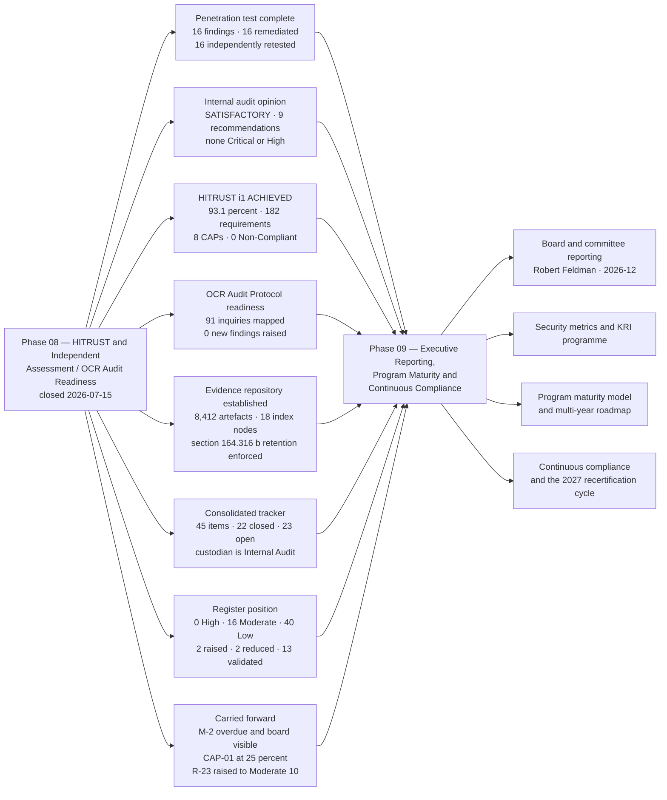

# 08.12 — Phase Summary &amp; Transition

| Field | Value |
|---|---|
| Document ID | MBH-IAA-SUM-2026-812 |
| Version | 1.0 |
| Date | 2026-07-15 |
| Classification | Confidential — Electronic Protected Health Information (ePHI) // Illustrative Portfolio Sample |
| Owner | Daniel Cho, Chief Information Security Officer &amp; HIPAA Security Official |
| Co-Owner | Karen Boyd, Chief Compliance Officer · Priya Anand, Director of Internal Audit |
| Author | Advisory Team (Healthcare GRC / HIPAA) |
| Status | Approved |

## Purpose

Phases 01 to 07 built a HIPAA security programme and said it worked. Phase 08 was the phase in which somebody else decided whether that was true.

This document closes it. It records what was committed and delivered, states the quantified outcome of each of the four independent lenses, confirms the assurance baseline, lists the items travelling forward, and hands over to **Phase 09 — Executive Reporting, Program Maturity &amp; Continuous Compliance**, where the results stop being findings and start being how the Board understands the organisation's exposure.

> **The result of the phase, in one line: 16 penetration test findings, all remediated and independently re-tested · Internal Audit opinion SATISFACTORY with 9 recommendations, none Critical or High · HITRUST i1 Validated Assessment ACHIEVED at 93.1% with 8 corrective action plans and 0 Non-Compliant requirements · 91 OCR Audit Protocol inquiries mapped with 0 new findings raised · 8,412 artefacts in a §164.316(b) evidence repository.**

And the result that is not on the certificate: **three independent assessors, working separately, produced the same short list.** Restoration validation, SIEM completeness, business associate oversight below the critical tier, and consistency at ambulatory sites. MercyBridge had already named, dated and assigned all four before any of them arrived.

## 1. What the Phase Committed To, and What It Delivered

| Commitment made at phase opening (08.01) | Delivered | Evidence |
|---|---|---|
| Define why independent validation is a regulatory obligation, and set four distinct lenses with a stated cadence | Four lenses defined with their blind spots named; independence tested on four criteria against each assessor; annual cadence set to exceed the 2025 NPRM proposal before it is in force | 08.01 |
| Scope an external penetration test with safety rules appropriate to a live clinical estate | Grey-box scope across 6 domains; **passive-only** rule for patient-connected devices; 7 stop conditions; BAA executed with Ironwood | 08.02 |
| Run the test and report it honestly, including what it found | **16 findings — 3 High, 7 Medium, 6 Low. 0 Critical.** No ePHI extracted. The negative results and a **48% detection rate** reported alongside | 08.03 |
| Remediate every finding and prove it | **16 of 16 remediated; 16 of 16 independently re-tested by Ironwood.** No self-certified closures. **KEV-listed vulnerabilities 148 → 0** | 08.04 |
| Obtain independent internal audit assurance reporting to the Board Committee | **IA-2026-14**, opinion **SATISFACTORY**; 9 recommendations, none Critical or High; private session with the Committee Chair without management present | 08.05 |
| Select and prepare for a certifiable external assessment | i1 selected over r2 with the reasoning recorded; Beacon Assurance engaged as Authorized External Assessor; scope declared and validated | 08.06 |
| Achieve HITRUST certification | **i1 Validated Assessment ACHIEVED. 182 requirements · 93.1% · 174 at or above threshold · 8 CAPs · 0 Non-Compliant. Certified 2026-11-30, valid to 2027-11-29** | 08.07 |
| Establish readiness against the regulator's own question set | **91 Security Rule and Breach Notification inquiries mapped**; 78 fully evidenced, 10 with a dated gap, 3 not evidenced; unannounced data-request drill run | 08.08 |
| Build an evidence repository that satisfies §164.316(b) | **8,412 artefacts across 18 index nodes**; 100% indexed to a Security Rule standard; 64% automated capture; retention model audited at 0 exceptions | 08.09 |
| Consolidate all findings into a single tracker with owners and dates | **45 tracked items, 22 closed, 23 open, 1 overdue**; convergence mapped — 33 findings resolve to 26 distinct issues | 08.10 |
| Re-score the risk register on independent evidence | 13 residuals validated, 10 held, 2 reduced, **2 raised**; register closes at **0 High / 16 Moderate / 40 Low** | 08.11 |

## 2. Deliverables Register

| # | Document | Owner | Status |
|---|---|---|---|
| 08.01 | Independent Assessment Strategy | Daniel Cho | Approved |
| 08.02 | Penetration Test Scope &amp; Rules of Engagement | Marcus Reed | Approved |
| 08.03 | Penetration Test Results | Marcus Reed | Approved |
| 08.04 | Vulnerability Assessment &amp; Remediation | Marcus Reed | Approved |
| 08.05 | Internal Audit of the Security Program | Priya Anand | Approved |
| 08.06 | HITRUST CSF Assessment Approach | Daniel Cho | Approved |
| 08.07 | HITRUST i1 Assessment Results | Daniel Cho | Approved |
| 08.08 | OCR Audit Protocol Readiness | Karen Boyd | Approved |
| 08.09 | Evidence Repository &amp; Documentation | Karen Boyd | Approved |
| 08.10 | Findings Remediation Tracker | Priya Anand | Approved |
| 08.11 | Control-to-Risk Traceability | Daniel Cho | Approved |
| 08.12 | Phase Summary &amp; Transition | Daniel Cho | Approved |

| Supporting artefact | Location |
|---|---|
| Consolidated findings register — all 45 items across four lenses | `trackers/consolidated-findings-register.xlsx` |
| Ironwood report, retest letters and evidence pack | `governance/ironwood-2026/` |
| Internal audit file IA-2026-14, workpapers and Committee pack | `governance/ia-2026-14/` |
| HITRUST i1 certificate, MyCSF export and CAP schedule | `governance/hitrust-i1-2026/` |
| OCR Audit Protocol mapping workbook — 91 inquiries | `trackers/ocr-protocol-mapping.xlsx` |
| Standing production set (the nine first-request items) | `governance/ocr-readiness/standing-production-set/` |
| RFI-DRILL-2026-01 request, responses and scoring | `governance/ocr-readiness/rfi-drill-2026-01/` |
| Evidence repository index — 18 nodes, 8,412 artefacts | `governance/evidence-repository/index.md` |
| Vulnerability exception register with expiries | `trackers/vulnerability-exceptions.xlsx` |
| Purple-team validation records (device boundary, exfiltration) | `logs/purple-team/` |

## 3. Quantified Outcomes

| Measure | Baseline (phase opening) | **At phase close** |
|---|---|---|
| Independent penetration tests conducted | **0** | **1 — Ironwood, 2026-09-07 → 2026-09-25** |
| Penetration test findings raised | — | **16** (3 High · 7 Medium · 6 Low · **0 Critical**) |
| Findings remediated | — | **16 of 16 (100%)** |
| Findings **independently re-tested** | — | **16 of 16 (100%)** |
| Findings closed on management assertion alone | — | **0** |
| High findings closed inside the 30-day SLA | — | **3 of 3** (21, 26 and 29 days) |
| ePHI records extracted by the tester | — | **0** |
| Detection rate against tester actions | Not measured | **48%** at test → **74%** re-measured 2026-12 |
| KEV-listed vulnerability instances | 148 (2026-03) | **0 (100% closed)** |
| Total distinct vulnerability instances | 40,119 (2026-03) | **16,583 (−58.7%)** |
| Independent internal audit of the programme | None | **IA-2026-14 — opinion SATISFACTORY** |
| Internal audit recommendations / Critical or High | — | **9 / 0** |
| Four-factor assessments independently re-performed by audit | 0 | **3 of 3 — same conclusion on each** |
| HITRUST requirement statements assessed | 0 | **182** |
| HITRUST overall implementation score | — | **93.1%** |
| Requirements at or above the 75% threshold | — | **174 of 182 (95.6%)** |
| Requirements scored **Non-Compliant** | — | **0** |
| Corrective action plans | — | **8**, all dated in H1 2027 |
| **HITRUST i1 certification** | None | **ACHIEVED — issued 2026-11-30, valid to 2027-11-29** |
| OCR Audit Protocol inquiries mapped (Security + Breach) | 0 | **91** |
| Inquiries fully evidenced / with a dated gap / not evidenced | — | **78 / 10 / 3** |
| New findings raised by the OCR readiness review | — | **0** — all gaps mapped to existing IDs |
| Simulated data request items produced in a 10-day window | Never tested | **38 of 42 (90.5%)**, median **1.5 business days** |
| Controlled evidence artefacts | ~900 uncontrolled | **8,412 controlled** |
| Artefacts indexed to a Security Rule standard | Not measured | **100%** |
| ePHI systems forwarding to the SIEM | 62 of 68 | **65 of 68** (68 by 2027-01-31) |
| ePHI systems encrypted at rest | 68 of 68 | **68 of 68 — verified by two independent lenses** |
| Consolidated tracked items / closed / open / overdue | — | **45 / 22 / 23 / 1** |
| **High risks in the 56-risk register** | **0** | **0 — third consecutive phase** |

## 4. Risk Outcome

| Risk | Entering | **Residual** | Movement | Disposition |
|---|---|---|---|---|
| **R-23** — enterprise ransomware disabling Tier 1 clinical systems | Moderate (8), conditional | **Moderate (10)** | **RAISED** | The joint Halcyon restoration test slipped; the conditional claim lapsed exactly as 07.11 said it would |
| **R-41** — unaccounted ePHI outside the governed inventory | Low (6) | **Moderate (8)** | **RAISED — Low → Moderate** | PT-03 disproved the completeness assumption; returns to Low on two clean quarterly reconciliations |
| **R-43** — integrity loss on post-downtime reconciliation | Moderate (9) | **Low (6)** | **REDUCED — Moderate → Low** | F-3 closed 2026-11-20 and verified by Internal Audit; the Phase 07 disproof, corrected |
| **R-24** — double-extortion exfiltration of ePHI | Moderate (9) | **Moderate (8)** | Reduced within band | Detection measured 48% → 74%; no data was extracted at any point in the test |
| **R-47** — Tier 1 restoration time unvalidated | Moderate (8) | **Moderate (8)** | Held | CAP-01 at 25% — the lowest requirement score in the i1 assessment |
| **R-17 / R-10** — segmentation and device boundary | Moderate (8) each | **Moderate (8)** | Held | PT-01 remediated and retested; two clean quarterly validations required before the score moves |
| **R-02 / R-06** — shared credentials and vendor remote access | Moderate (8) each | **Moderate (8)** | Held | PT-02 remediated; the privileged-access broker mandate has no operating history yet |
| **R-30** — subcontractor chain visibility | Moderate (8) | **Moderate (8)** | Held | IA-F-03 and CAP-02 found the same thin layer below the 24 critical BAs |
| **R-35 / R-36** — dwell time; activity-review evidence | Moderate (8) each | **Moderate (8)** | Held | Improved but not closed; 6 of 68 SIEM gap and IA-F-02 attestation retention |
| **R-09 / R-11 / R-28** — device estate and EHR concentration | Moderate (8 / 10 / 10) | **Unchanged** | **Validated** | Structural risks, correctly stated; no lens disputed the scores |
| **R-01 / R-31 / R-34 / R-37 / R-40 / R-49 / R-51 / R-52 / R-54 / R-55** | Low | **Unchanged** | **Validated** | Ten Low residuals now carry independent evidence rather than self-assertion |

| Register position | High | Moderate | Low | Total |
|---|---|---|---|---|
| Entering Phase 08 | 0 | 16 | 40 | 56 |
| **At Phase 08 close** | **0** | **16** | **40** | **56** |

**The totals are identical and the composition is not.** One risk left the Moderate band on closed, audited evidence; one entered it because a penetration tester proved an assumption false. A validation phase that produced a large net reduction would be a validation phase that had not validated anything.

## 5. Baseline Confirmation

The Independent Assessment and Audit Readiness baseline is **confirmed as of 2026-07-15**, with assessment evidence appended through 2026-12-31. These are the fixed reference points; future variance is a finding, not drift.

| Baseline element | Confirmed position | Custodian | Re-baselined |
|---|---|---|---|
| Independent assessment cadence | Annual penetration test; monthly/weekly scanning; annual internal audit; annual HITRUST cycle; quarterly purple-team validation | Daniel Cho | Annually |
| Penetration test position | 2026 test complete; **16 of 16 findings closed and retested**; next full-scope test **2027-09** | Marcus Reed | Annually |
| Vulnerability position | 16,583 open instances; KEV at 0; 1,284 exceptions all with named owner and expiry | Marcus Reed | Continuous |
| Internal audit opinion | **SATISFACTORY** (IA-2026-14); follow-up audit **Q2 2027** | Priya Anand | Annually |
| **HITRUST certification** | **i1 Validated Assessment, 2026-11-30 → 2027-11-29, 93.1%, 8 CAPs** | Daniel Cho | At recertification |
| OCR readiness | 91 inquiries mapped; standing production set live; **twice-yearly** unannounced drills | Karen Boyd | Semi-annually |
| Evidence repository | 8,412 artefacts, 18 nodes, §164.316(b) retention model enforced by the platform | Marcus Reed | Continuous |
| Consolidated findings register | 45 items; single custodian in Internal Audit; one re-baseline permitted per item | Priya Anand | Monthly |
| Risk position | **0 High / 16 Moderate / 40 Low** | Michelle Tran | Annual re-analysis under 03.10 |
| §164.308(a)(8) evaluation | Discharged for 2026 by the technical and non-technical components of this phase | Daniel Cho | Annually |

## 6. Open Items Carried Forward

| # | Open item | Why it remains open | Owner | Due |
|---|---|---|---|---|
| **M-2** | Joint full-scale restoration test with Halcyon | **Overdue — re-baselined once.** Vendor sequencing. Blocks CAP-01 and holds R-23 at 10. **A second slip goes to the Board with a recovery plan, not a new date** | Anthony Ruiz | **2027-02-28** |
| **CAP-01** | Validated 24-hour restoration for the remaining 5 of 12 Tier 1 systems | Scored **25%** — the lowest in the i1 assessment and the only OCR protocol inquiry MercyBridge cannot answer | Anthony Ruiz | 2027-03-31 |
| **CAP-03 / IA-F-05 / D-3** | SIEM onboarding for the final 3 of 68 ePHI systems | 65 of 68 at 2026-12-15; compensating local review documented | Marcus Reed | 2027-01-31 |
| **CAP-02 / IA-F-03** | BA monitoring and §164.314(a)(2)(iii) flow-down below the critical tier | ~180-BA population; 62 reviewed at year end | Lisa Coleman | 2027-04-30 |
| **CAP-07 / IA-F-01** | HR-to-IAM automation for per-diem and affiliated worker types | 6 of 412 terminations late; **0 accesses used post-termination** | Marcus Reed / HR Director | 2027-03-31 |
| **CAP-08 / IA-F-04** | Physical consistency at ambulatory sites — alarm testing, electronic visitor logging | Found by **three** lenses; the hardest class of defect to close permanently | Facilities Director | 2027-02-28 |
| **CAP-04 / IA-F-07** | Provisioning approval capture; manual bypass disabled 2026-12-11 | Needs an operating period before evidence exists | Marcus Reed | 2027-02-28 |
| **CAP-05** | Retire or replace the 214-device legacy wireless PSK remnant | 41 of 214 replaced; interim isolation evidenced | Anthony Ruiz | 2027-06-30 |
| **CAP-06** | Assessment path for 72 hosts that cannot accept credentialed scanning | Vendor dependency; 18 of 72 agreed | Anthony Ruiz | 2027-06-30 |
| IA-F-02 / IA-F-06 / IA-F-08 / IA-F-09 | Attestation retention, procedure currency, disposal certificates, break-glass review alerts | All workflow changes deployed or in test; evidence periods running | Marcus Reed / Karen Boyd / Anthony Ruiz / Dr. Samuel Ortega | 2027-01-31 → 2027-02-28 |
| D-14 | Median detect → escalate of 41 minutes against a 30-minute target | Triage automation in progress | Marcus Reed | 2027-02-28 |
| F-2a | Read-only clinical viewer at the remaining 4 outpatient sites | Kits and drill complete; viewer rollout sequenced | Ambulatory Director | 2027-03-31 |
| V-24 / MIN-1 / O-6 | Tier 2–3 immutability (6 of 9 done); mailbox PHI minimisation; customer-managed keys at Halcyon | Capital, scope and contractual sequencing | Anthony Ruiz / Rebecca Stern / Lisa Coleman | Q1 2027 → 2027-03-31 |
| **R-41 condition** | Two consecutive clean quarterly inventory reconciliations under IV-05 | Returns R-41 to Low; first due 2027-03-31 | Marcus Reed | 2027-06-30 |

## 7. Transition to Phase 09

| What Phase 09 inherits | From | Why it matters to executive reporting |
|---|---|---|
| An **externally validated** control position rather than a self-assessed one | 08.03, 08.05, 08.07 | The Board can be told *how we know*, not only *what we believe* |
| A certificate with a hard expiry — **2027-11-29** | 08.07 | Certification is a recurring obligation with a date, and it belongs on the Board calendar |
| The **honest limits** of that certificate, written to be quoted | 08.07 §6 | Prevents the single most common executive over-claim: *"HITRUST certified, therefore HIPAA compliant"* |
| A consolidated tracker owned by Internal Audit, not by Security | 08.10 | Closure reporting that is not attested by the function being measured |
| A risk register in which **two risks went up** | 08.11 | A Board pack in which risk only ever falls trains the Board to disbelieve it |
| The **48% → 74%** detection story, with the bad number reported first | 08.03 §6, 08.04 §6 | The strongest available demonstration that the programme reports its own worst metric |
| An evidence repository that can answer a regulator in 1.5 business days | 08.09 | Turns readiness from a project into a standing capability |
| 8 CAPs, 9 recommendations and 23 open items with owners and dates | 08.10 | The 2027 workplan is already written; Phase 09 sequences and funds it |
| **0 High risks sustained across three phases**, now under external test | 08.11 | The single clearest statement of programme trajectory available to the Board |

| Phase 09 scope, as handed over | Owner |
|---|---|
| Board and Audit &amp; Compliance Committee reporting pack — **2026-12** | Daniel Cho with Karen Boyd |
| Security metrics, KRI and KPI programme with reporting thresholds | Marcus Reed |
| Programme maturity assessment and the multi-year roadmap to 2029 | Daniel Cho |
| Continuous compliance operating model — evidence, cadence, ownership | Karen Boyd |
| HITRUST **Rapid Recertification** readiness for the 2027 cycle; r2 evaluation for 2028 | Daniel Cho |
| §164.308(a)(8) annual evaluation report and the 03.10 risk re-analysis | Daniel Cho with Michelle Tran |
| Closure oversight of the 23 open items and the follow-up audit | Priya Anand |
| 2025 NPRM finalisation watch and gap-to-proposed-rule tracking | Karen Boyd with Lisa Coleman |

## 8. Assurance Statement

The MercyBridge HIPAA Security Programme has been **independently tested, independently audited and externally certified** as of 2026-12-31.

An adversarial third party spent three weeks attempting to reach ePHI across 68 systems, 6,120 medical devices, four hospitals and roughly thirty clinics. It found **sixteen ways in which the organisation was weaker than it believed**, took **none** of the 2.1 million patient records, could not defeat encryption, could not obtain Domain Administrator, could not reach the backups, and did not touch a single patient-connected device. Every finding was fixed and every fix was re-tested by the people who found it. An internal auditor reporting to the Board — not to the CISO — sampled eleven months of control operation across three hospitals, seven clinics and two data centres, re-performed all three breach determinations, and returned an opinion of **Satisfactory**. An accredited external assessor validated **182 requirement statements**, HITRUST quality-reviewed the work, and issued an **i1 certification at 93.1%** with zero requirements scored Non-Compliant.

Four things are deliberately not claimed. **First**, MercyBridge is not "HIPAA compliant because it is HITRUST certified" — OCR neither endorses nor recognises any certification as a compliance determination, and 08.07 §6 says so at length. **Second**, the organisation still cannot prove it can restore its Tier 1 clinical systems at enterprise scale; the test that would prove it slipped, the risk went **up** rather than being quietly left where it was, and the item is overdue and visible to the Board. **Third**, every remediation delivered in this phase is less than three months old, and time is the only test for durability — which is why ten residuals are held rather than reduced. **Fourth**, a penetration test found an internet-facing application holding 6,880 patient records that appeared in no inventory, and the correct response to that was to **raise** a risk that had been rated Low on an assumption the test destroyed.

What has changed is the basis of every claim in this portfolio. Before Phase 08, MercyBridge's answer to *how do you know your controls work?* was a well-documented opinion. After it, the answer is a penetration test report with retest letters, an audit file with sampling evidence, a certificate with a quality review behind it, a regulator-shaped question set with 91 mapped answers, and 8,412 dated artefacts that can be produced in a day and a half.

That is the position Phase 09 reports to the Board — and the only version of it worth reporting is the one that includes the two risks that went up.

## Cross-References

| Reference | Relevance |
|---|---|
| 01.02 — Program Charter | The assurance obligations this phase discharges |
| 03.10 — Risk Analysis Maintenance | The annual re-analysis that will absorb this phase's findings |
| 04.09 — Evaluation | The §164.308(a)(8) programme for which this phase supplies the technical half |
| 07.12 — Phase Summary &amp; Transition | The 0 High / 16 Moderate / 40 Low position received, and the carried items closed here |
| 08.01 — Independent Assessment Strategy | The commitments assessed in §1 |
| 08.03 — Penetration Test Results | The 16 findings and the detection position |
| 08.04 — Vulnerability Assessment &amp; Remediation | The remediation and retest evidence |
| 08.05 — Internal Audit of the Security Program | The Satisfactory opinion and the 9 recommendations |
| 08.07 — HITRUST i1 Assessment Results | The certification, the 8 CAPs, and what the certificate does not mean |
| 08.08 — OCR Audit Protocol Readiness | The regulator-facing position and the 10 readiness gaps |
| 08.09 — Evidence Repository &amp; Documentation | The §164.316(b) baseline confirmed in §5 |
| 08.10 — Findings Remediation Tracker | The 45-item consolidated position behind §6 |
| 08.11 — Control-to-Risk Traceability | The keystone matrix behind §4 |
| Phase 09 — Executive Reporting, Program Maturity &amp; Continuous Compliance | The receiving phase |

---
[⬅ Previous](08.11-control-to-risk-traceability.md) · [🏠 Phase README](08.00-README.md) · [Next ➡](../09-executive-reporting-program-maturity/09.00-README.md)
