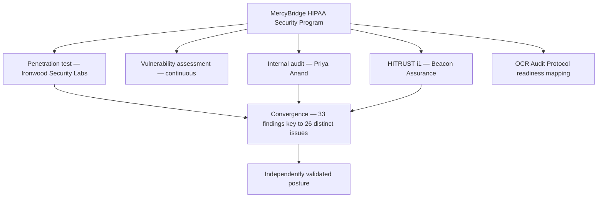

# Diagram — Four Independent Lenses

| Field | Value |
|---|---|
| Version | 1.0 |
| Date | 2026-07-15 |
| Classification | Confidential — Electronic Protected Health Information (ePHI) // Illustrative Portfolio Sample |
| Organization | MercyBridge Health Network (HIPAA covered entity) |
| Regulator | HHS Office for Civil Rights (OCR) |
| Phase | 08 — Independent Assessment & Audit Readiness |
| Author | Advisory Team (Healthcare GRC / HIPAA) |
| Status | Approved |

Where three lenses find the same issue independently, that is the strongest signal in the set.

## Cross-References
`08.01-independent-assessment-strategy.md`.
