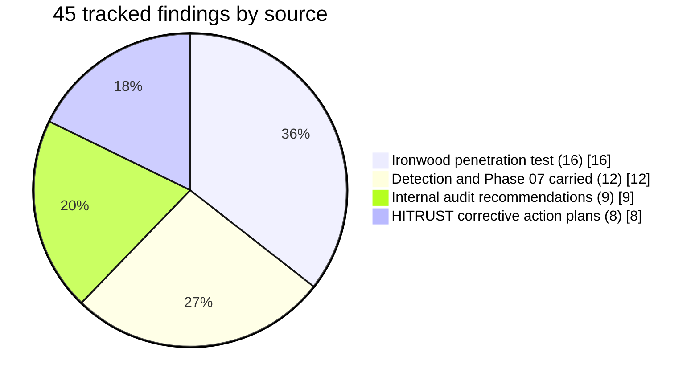

# Diagram — Findings by Source

| Field | Value |
|---|---|
| Version | 1.0 |
| Date | 2026-07-15 |
| Classification | Confidential — Electronic Protected Health Information (ePHI) // Illustrative Portfolio Sample |
| Organization | MercyBridge Health Network (HIPAA covered entity) |
| Regulator | HHS Office for Civil Rights (OCR) |
| Phase | 08 — Independent Assessment & Audit Readiness |
| Author | Advisory Team (Healthcare GRC / HIPAA) |
| Status | Approved |

22 closed · 23 open · 1 overdue. OCR Audit Protocol readiness raised **no new findings**.

## Cross-References
`08.10-findings-remediation-tracker.md`.
