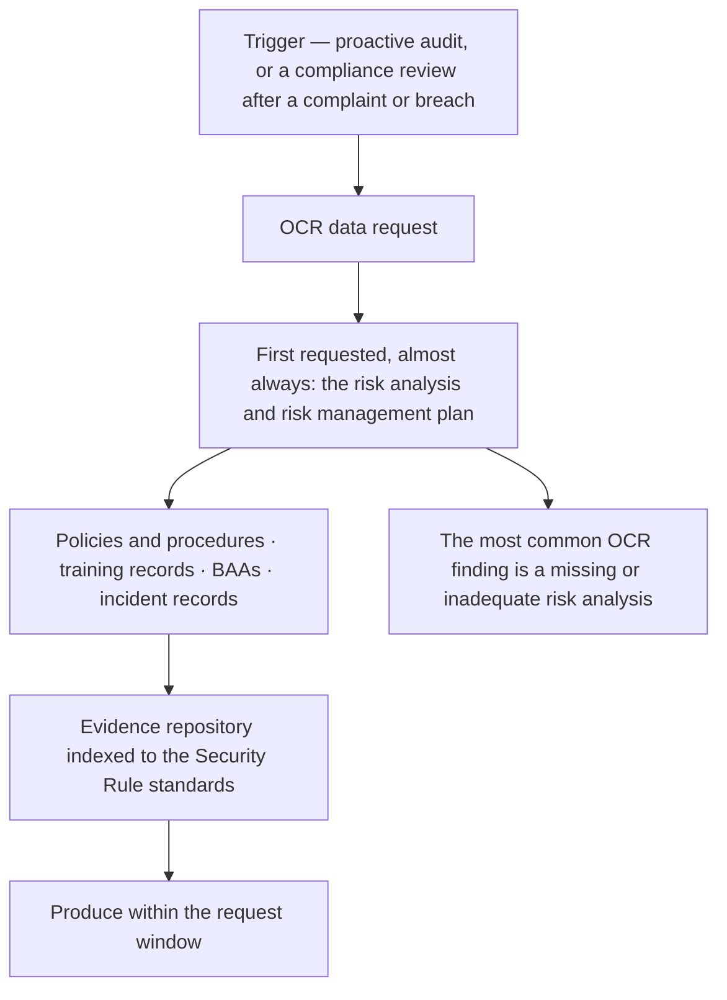

# Diagram — OCR Audit Protocol Readiness

| Field | Value |
|---|---|
| Version | 1.0 |
| Date | 2026-07-15 |
| Classification | Confidential — Electronic Protected Health Information (ePHI) // Illustrative Portfolio Sample |
| Organization | MercyBridge Health Network (HIPAA covered entity) |
| Regulator | HHS Office for Civil Rights (OCR) |
| Phase | 08 — Independent Assessment & Audit Readiness |
| Author | Advisory Team (Healthcare GRC / HIPAA) |
| Status | Approved |

91 in-scope inquiries mapped: 78 evidenced, 10 with a dated gap, 3 not yet evidenced.

## Cross-References
`08.08-ocr-audit-protocol-readiness.md`.
