# 09.01 — Executive Summary

| Field | Value |
|---|---|
| Document ID | MBH-ERM-EXS-2026-901 |
| Program | MercyBridge Health Network — HIPAA Security Program |
| Phase | 09 — Executive Reporting, Program Maturity &amp; Continuous Compliance |
| Version | 1.0 |
| Date | 2026-07-15 |
| Classification | Confidential — Electronic Protected Health Information (ePHI) // Illustrative Portfolio Sample |
| Owner | Daniel Cho, Chief Information Security Officer &amp; HIPAA Security Official |
| Co-Owner | Karen Boyd, Chief Compliance Officer |
| Approver | Dr. Helen Marsh, President &amp; CEO · Robert Feldman, Board Audit &amp; Compliance Committee Chair |
| Author | Advisory Team (Healthcare GRC / HIPAA) |
| Status | Approved |

## Purpose

This is the report the Board reads. Everything else in this portfolio exists to make it defensible.

It states, for the eleven months from kickoff on **2026-02-02** to the December 2026 board cycle, what the MercyBridge HIPAA Security Program set out to do, what it achieved, what it cost, what it explicitly does **not** claim, and what remains open with a name and a date against it. It is written to be read in full by a non-technical director in about ten minutes, and to survive being read line by line afterwards by a regulator, an auditor or a plaintiff's counsel.

---

## 1. The One-Page Summary

**MercyBridge began 2026 with a HIPAA security programme that existed mostly as an assertion. It ends 2026 with one that has been tested by three independent parties, certified by a fourth, and can produce dated evidence for any claim it makes in about a day and a half.**

| The question a director actually asks | The answer, at 2026-12-31 |
|---|---|
| Do we know where our ePHI is? | **Yes, with one documented failure.** 68 of 210 systems handle ePHI, 6,120 medical devices are catalogued, and ~2.1 million patient records are in scope. A penetration tester found one internet-facing application holding **6,880 records** that appeared in no inventory. It is gone; the risk rating went **up** because of it |
| Have we done the risk analysis the law requires? | **Yes.** §164.308(a)(1)(ii)(A) analysis completed 2026-04 across all 68 systems — **56 risks**, maintained quarterly, re-analysed annually, independently traced by Internal Audit |
| Are the safeguards actually in place? | **Yes.** All **18 Security Rule standards** and ~50 implementation specifications implemented — including every *addressable* specification, not documented around. MFA, encryption at rest and encryption in transit are at **68 of 68** ePHI systems |
| Has anyone outside the organisation checked? | **Four times.** Penetration test, vulnerability assessment, internal audit reporting to this Committee, and a HITRUST i1 validated assessment quality-reviewed by HITRUST itself |
| What did they find? | **16 penetration test findings** (3 High, 7 Medium, 6 Low, **0 Critical**) — all remediated, all independently re-tested. **9 internal audit recommendations**, none Critical or High. **8 HITRUST corrective action plans**, **0** requirements scored Non-Compliant |
| Did anyone reach patient data? | **No.** Zero of 2.1 million records were extracted. Encryption was not defeated, Domain Administrator was not obtained, the backups were not reachable, and no patient-connected medical device was touched |
| Are we certified? | **Yes — HITRUST i1, 93.1%, issued 2026-11-30, valid to 2027-11-29.** And certification is **not** a finding of HIPAA compliance; see §5 |
| Has risk gone down? | **Substantially, and not uniformly.** From **11 High · 27 Moderate · 18 Low** to **0 High · 16 Moderate · 40 Low**. Two risks went **up** this year, and that is reported here first rather than last |
| Did anything go wrong? | **Three security incidents**, all investigated under the statutory four-factor test, **0 reportable breaches**. One remediation item is **overdue** and is on this agenda because it is overdue, not because management chose to raise it |
| What does it cost to keep? | **$5.12M** in 2026 (0.28% of net patient revenue); an indicative **~$3.19M** planned for 2027, of which **~$2.05M is already funded and ~$1.14M requires new approval** |

**The one sentence the Board should take away:** *MercyBridge can now show a regulator how it knows its controls work, rather than telling a regulator that it believes they do — and the strongest evidence for that is that two risk ratings went up this year on the basis of testing the organisation paid for itself.*

---

## 2. What the Programme Delivered, Phase by Phase

Nine phases, eleven months, one continuous evidence chain. Each phase closed against a stated baseline before the next opened.

| Phase | Window | What it produced | The number that matters |
|---|---|---|---|
| **01 — Program Foundation &amp; Scoping** | 2026-02 | Covered-entity determination; **Daniel Cho designated HIPAA Security Official** under §164.308(a)(2); governance, charter, RACI, obligations calendar | 1 named, accountable individual — the requirement OCR checks first |
| **02 — ePHI Asset Inventory &amp; Data Flows** | 2026-03 | Discovery across **210 systems**; ePHI scope set at **68**; 6,120 medical devices catalogued; four-tier data classification; designated record set | **68 of 210** systems in scope |
| **03 — Risk Analysis** | 2026-04 | The §164.308(a)(1)(ii)(A) analysis and register; treatment plan under (ii)(B); maintenance cycle | **56 risks — 11 High · 27 Moderate · 18 Low** |
| **04 — Administrative Safeguards** | 2026-05 → 2026-07 | 9 of 9 §164.308 standards; 21 of 21 specifications; 15 of 24 policies; the §164.308(a)(8) evaluation programme | Standing elevated EHR accounts **214 → 63** |
| **05 — Physical &amp; Technical Safeguards** | 2026-06 → 2026-07 | §164.310 and §164.312 in full; policies 16–24 completing the 24-policy suite | MFA **44 → 68 of 68**; encryption at rest **51 → 68 of 68** |
| **06 — Business Associate &amp; Third-Party Risk** | 2026-07 | ~180 BAs governed and tiered; BAA coverage **47 of 47**; nine-measure treatment of the Halcyon EHR concentration | **The last High risk closed** — register reaches 0 High |
| **07 — Incident Response &amp; Breach Notification** | 2026-08 | IR plan, ransomware playbook, four-factor breach apparatus, notification instruments; tabletop TTX-2026-01 | 4,118 events → 138 escalations → **3 incidents → 0 reportable breaches** |
| **08 — Independent Assessment &amp; Audit Readiness** | 2026-09 → 2026-11 | Penetration test, vulnerability remediation, internal audit, HITRUST i1, OCR Audit Protocol readiness, evidence repository | **HITRUST i1 at 93.1%**; **8,412** controlled artefacts |
| **09 — Executive Reporting &amp; Maturity** | 2026-12 | This report; the metrics programme; the maturity assessment; the §164.308(a)(8) annual evaluation; the 2027–2029 roadmap | Programme maturity **1.6 → 3.1** on a five-level scale |

```mermaid
flowchart LR
    K["Kickoff 2026-02-02<br/>no risk analysis<br/>no designated official record<br/>legacy policy suite"]
    K --> F1["Phases 01 and 02<br/>scope and inventory<br/>210 systems · 68 with ePHI"]
    F1 --> F2["Phase 03<br/>risk analysis<br/>56 risks · 11 High"]
    F2 --> F3["Phases 04 and 05<br/>safeguards implemented<br/>18 standards · 24 policies"]
    F3 --> F4["Phase 06<br/>business associates<br/>last High risk closed"]
    F4 --> F5["Phase 07<br/>incident and breach capability<br/>3 incidents · 0 breaches"]
    F5 --> F6["Phase 08<br/>four independent lenses<br/>HITRUST i1 at 93.1 percent"]
    F6 --> F7["Phase 09<br/>board reporting · metrics<br/>maturity · annual evaluation"]
    F7 --> OUT["Position at 2026-12-31<br/>0 High · 16 Moderate · 40 Low<br/>certified to 2027-11-29<br/>23 open items · 1 overdue"]
```

---

## 3. What It Cost

The programme cost of record for calendar 2026, as reported to the Finance Committee and reconciled to the general ledger.

| Category | 2026 | Note |
|---|---|---|
| Technology — MFA extension, encryption, SIEM expansion, EDR, micro-segmentation, immutable backup | **$2,940,000** | Capital; the majority is the Phase 05 safeguard build |
| Internal labour — 6.4 FTE-equivalent security, plus ~2,100 hours from IT, HIM, Facilities, Legal and Clinical Engineering | **$1,180,000** | Operating; excludes clinical time absorbed into normal duty |
| Advisory and programme delivery | **$610,000** | Phases 01–09 |
| External assurance — Ironwood penetration test, Beacon Assurance validated assessment, HITRUST fees | **$385,000** | The cost of not marking your own homework |
| Notification readiness retainers, forensics and counsel | **$5,000** | Retainers only; no incident invoked them |
| **Total 2026** | **$5,115,000** | **0.28% of ~$1.8B net patient revenue** |

| 2027 plan — summary | Amount | Position |
|---|---|---|
| Closure of the 23 open items — restoration validation, SIEM completion, legacy wireless retirement, unassessable-host assessment path, BA monitoring, IAM automation, ambulatory physical consistency | **~$2,385,000** | Mixed: partly funded, partly requested |
| Recurring assurance — 2027 penetration test, HITRUST rapid recertification, internal audit, quarterly purple-team validation | **~$360,000** | Funded; the cadence set in 08.01 |
| Evidence automation from 64% to 80% | **~$150,000** | **Requested** |
| Contingency at 10% | **~$290,000** | **Requested** |
| **Indicative 2027 total** | **~$3,190,000** | **~$2,050,000 funded · ~$1,140,000 requiring new approval** |

Full sequencing, funding status and the items whose dates depend on capital release are in **09.08**.

**The honest framing of the cost.** The 2026 number is a build number and will not recur in that shape. The 2027 number is closer to what running this programme actually costs each year, and roughly three quarters of it is closing work this year created rather than starting anything new. Any executive reading a declining security budget as a sign of success should read §6 first.

---

## 4. What Was Achieved, in the Terms the Rule Uses

| Security Rule requirement | Position at 2026-12-31 | Evidence |
|---|---|---|
| §164.308(a)(1)(ii)(A) Risk analysis | Complete, current, enterprise-wide, retained; 56 risks with named owners; independently traced by Internal Audit | 03.07, 03.09, 08.05 |
| §164.308(a)(1)(ii)(B) Risk management | Three-wave treatment plan executed; **11 High risks reduced to 0** | 03.08, 04.12, 05.12, 06.11 |
| §164.308(a)(2) Assigned security responsibility | Designated, documented, with authority, budget and a line to the Board | 01.05, 09.02 |
| §164.308(a)(3)–(a)(7) Administrative safeguards | All standards and all 21 specifications implemented, including every addressable one | Phase 04 |
| §164.308(a)(8) Evaluation | Programme established; **2026 evaluation performed, technical and non-technical, and signed** | 04.09, **09.06** |
| §164.310 Physical safeguards | All 4 standards implemented; consistency across ambulatory sites remains the weak point | Phase 05, CAP-08 |
| §164.312 Technical safeguards | All 5 standards; MFA, encryption at rest, encryption in transit at 68 of 68 | Phase 05, 08.05 |
| §164.314 Organisational requirements | ~180 BAAs governed; 24 of 24 critical assured; flow-down sweep open below that tier | Phase 06, CAP-02 |
| §164.316 Policies and documentation | 24-policy suite approved; **8,412 artefacts** under six-year retention control | 04.11, 08.09 |
| §164.400–414 Breach notification | Apparatus built and exercised; 3 incidents assessed; **0 reportable breaches**; all three determinations independently re-performed by Internal Audit and confirmed | Phase 07, 08.05 |

---

## 5. Four Things This Programme Does Not Claim

Executive reporting fails most often not by lying but by allowing a true statement to be heard as a larger one. These four are stated in the Board pack, in the minutes, and here.

**First — we are not "HIPAA compliant because we are HITRUST certified."** HITRUST is a private framework. HHS Office for Civil Rights does not certify, endorse or recognise any certification as a determination of HIPAA compliance, and a certificate confers no protection against an investigation, a compliance review or a civil money penalty. What the certificate is worth is real and narrower: an accredited outsider validated 182 requirement statements, HITRUST quality-reviewed that work, and the result is evidence of a diligent programme. It is evidence, not a verdict. Any MercyBridge communication that shortens this to "we are compliant" is wrong and will be corrected.

**Second — we still cannot prove we can restore our Tier 1 clinical systems at enterprise scale.** Restoration procedures are documented for **12 of 12** Tier 1 systems and validated for **7**. The joint full-scale restoration test with Halcyon Health, our EHR business associate, was scheduled for 2026-09 and did not happen. It slipped for vendor sequencing reasons and is now dated **2027-02-28**. Because the Phase 07 reduction of the enterprise ransomware risk was written down as *conditional on that test*, the condition lapsed and **R-23 was raised from 8 to 10** rather than quietly left alone. The corresponding HITRUST requirement scored **25%** — the lowest single score in the assessment. This is the largest unproven assertion in the programme and it is the item the Board should ask about first.

**Third — every remediation delivered in 2026 is less than three months old, and time is the only test for durability.** Sixteen penetration test findings were closed and re-tested between October and December. A fix that passes a retest proves the fix existed on a date; it does not prove the control operates through a year of staff turnover, vendor changes and clinical pressure. That is why **ten residual risks are recorded as *held* rather than *reduced***, and why the Q2 2027 follow-up audit matters more than the 2026 audit did.

**Fourth — testing found something we believed and could not defend.** A penetration tester found an internet-facing appointment application, live since 2018, superseded in 2023, never decommissioned, holding **6,880 patient records** — with no owner, no inventory entry, no logging and no patching path. The application is gone and quarterly inventory reconciliation against DNS, certificate transparency and external attack-surface data now runs. None of that justifies keeping the old rating, because the old rating expressed a belief about completeness and the belief was wrong. **R-41 was raised from Low to Moderate.** Under **ADR-0021**, that is now the standing rule: testing that disproves an assumption raises the rating, it does not merely close a finding.

---

## 6. What Remains Open

**45 tracked items · 22 closed · 23 open · 1 overdue.** Every open item has a single named owner and a date, and every date falls inside the first half of 2027 — before the HITRUST certificate expires on 2027-11-29.

| Priority | Item | Owner | Due | Why the Board sees it |
|---|---|---|---|---|
| **1 — Overdue** | **M-2** joint full-scale restoration test with Halcyon Health | Anthony Ruiz | **2027-02-28** | Re-baselined once already. **A second slip goes to the Board with a recovery plan, not a new date.** Blocks CAP-01 and holds R-23 at 10 |
| **2** | **CAP-01** validated 24-hour restoration for the remaining 5 of 12 Tier 1 systems | Anthony Ruiz | 2027-03-31 | Scored **25%** in the HITRUST assessment; the only OCR Audit Protocol inquiry MercyBridge cannot currently answer |
| 3 | **CAP-02 / IA-F-03** business associate monitoring and §164.314(a)(2)(iii) flow-down below the critical tier | Lisa Coleman | 2027-04-30 | 62 of ~180 BAs reviewed; two independent lenses found the same thin layer |
| 4 | **CAP-03 / IA-F-05** SIEM onboarding for the final 3 of 68 ePHI systems | Marcus Reed | 2027-01-31 | Four separate sightings of one gap; compensating local review documented |
| 5 | **CAP-07 / IA-F-01** HR-to-IAM automation for per-diem and affiliated workers | Marcus Reed / HR Director | 2027-03-31 | 6 of 412 terminations late; **0 accesses used post-termination** |
| 6 | **CAP-08 / IA-F-04** physical consistency at ambulatory sites | Facilities Director | 2027-02-28 | Found by **three** independent lenses — the hardest class of defect to close permanently |
| 7 | **CAP-05 / CAP-06** legacy wireless remnant (173 of 214 devices remaining) and 72 hosts that cannot accept credentialed assessment | Anthony Ruiz | 2027-06-30 | Both vendor- and capital-constrained; flagged as at risk of their dates |
| 8 | **R-41 condition** — two consecutive clean quarterly inventory reconciliations | Marcus Reed | 2027-03-31 and 2027-06-30 | Returns R-41 to Low **on evidence, not on schedule** |
| 9 | Residual workflow items — attestation retention, procedure currency, disposal certificates, break-glass alerting, detection escalation time | Marcus Reed / Karen Boyd / Anthony Ruiz / Dr. Samuel Ortega | 2027-01-31 → 2027-02-28 | All deployed or in test; each needs an operating period before evidence exists |

**Three items are flagged as at risk of their dates** — CAP-01 (dependency on M-2), CAP-05 (device replacement lead time) and CAP-06 (vendor dependency). None is at risk because nobody is working on it.

---

## 7. Risk Position and Trajectory

| Register position | High | Moderate | Low | Total | Posture |
|---|---|---|---|---|---|
| Baseline — Phase 03, 2026-04 | **11** | 27 | 18 | 56 | Moderate |
| Phase 04 close | 9 | 27 | 20 | 56 | Moderate |
| Phase 05 close | 1 | 20 | 35 | 56 | Low-to-Moderate |
| Phase 06 close | **0** | 20 | 36 | 56 | Low-to-Moderate |
| Phase 07 close | 0 | 16 | 40 | 56 | Low-to-Moderate |
| Phase 08 close | 0 | 16 | 40 | 56 | Low-to-Moderate |
| **At programme close, 2026-12-31** | **0** | **16** | **40** | **56** | **Low-to-Moderate** |

Eleven High risks were eliminated. Three residuals sit **outside** the Board's stated risk appetite and are carried under explicit, dated acceptance: **R-11** (ePHI at rest on medical device platforms that cannot encrypt), **R-23** (enterprise ransomware) and **R-28** (concentration of the entire 2.1M-record clinical archive with one business associate). All three are scored **Moderate (10)** and all three are structural — they are not closeable by anything in a one-year workplan.

**Two risks were raised in the closing phase.** R-23 from 8 to 10, because a conditional claim lapsed. R-41 from Low to Moderate, because a test disproved an assumption. The Board should treat these as the strongest available evidence that the register is describing reality: **a risk register in which everything only ever falls is a register nobody should trust, and it is usually the last artefact to tell an organisation that it has a problem.**

Full detail, including the heat map and the 2027 outlook, is in **09.05**.

---

## 8. Programme Maturity

Measured against an explicit five-level model derived from NIST PRISMA — the same maturity ladder the HITRUST CSF applies — across 23 programme domains.

| Measure | At Phase 01 baseline | At programme close | Movement |
|---|---|---|---|
| Weighted mean maturity | **1.6** | **3.1** | +1.5 levels |
| Domains at Level 4 (Measured) | 0 | **7** | — |
| Domains at Level 3 (Implemented) | 0 | **11** | — |
| Domains at Level 2 (Procedure) | 14 | **5** | — |
| Domains at Level 1 (Policy) | 9 | **0** | — |
| Domains at Level 5 (Managed / Optimising) | 0 | **0** | **None, and none is claimed** |

**Nothing is at Level 5, and saying so is the point.** Level 5 requires measurement-driven self-correction demonstrated across multiple cycles. An eleven-month-old programme has not had multiple cycles. Any maturity assessment of a first-year programme that reports Optimising domains is describing an ambition, not a state. The five domains still at Level 2 — audit logging and activity review, contingency and recovery, physical safeguards, medical device security, and the metrics programme itself — are exactly where the open items sit, which is the correct correlation and a useful check that the maturity assessment was not scored to flatter. Detail in **09.04**.

---

## 9. What the Board Is Being Asked To Do

| # | Ask | Decision required |
|---|---|---|
| 1 | **Receive** the 2026 §164.308(a)(8) annual evaluation report (09.06) and the management response | Note |
| 2 | **Approve** the unfunded portion of the 2027 plan — **~$1,140,000** within an indicative **~$3,190,000** programme (09.08 §7) | Approve |
| 3 | **Re-affirm** the risk appetite statement and the three named residuals accepted outside it — R-11, R-23, R-28 | Approve, annually |
| 4 | **Note** that M-2 is overdue, that a second re-baseline is not authorised, and that a further slip returns to this Committee with a recovery plan | Note, with standing escalation |
| 5 | **Note** the HITRUST i1 certificate expiry of **2027-11-29** and the recertification decision point in Q2 2027 | Note; calendar item |
| 6 | **Note** that the 2025 HIPAA Security Rule NPRM remains proposed and not in force, and receive the gap-to-proposed-rule position semi-annually | Note |

---

## 10. Closing Statement

Eleven months ago MercyBridge could not have answered an OCR data request without a scramble, could not have said with evidence where all of its ePHI was, had never had an outsider test whether its network segmentation was what its diagrams said, and had a formal evaluation programme rated **Not Implemented**.

It can now produce **8,412 controlled artefacts** with a median turnaround of **1.5 business days**, has had an adversarial third party spend three weeks failing to reach any of 2.1 million patient records, holds an independent internal audit opinion of **Satisfactory** issued to this Committee rather than to management, and carries a **HITRUST i1 certification at 93.1%** with zero requirements scored Non-Compliant.

It also cannot prove it can restore its clinical estate at scale, has one overdue item, raised two risk ratings on its own testing, and has five programme domains still sitting at the second of five maturity levels.

Both halves of that paragraph are the report. A version containing only the first half would be shorter, more comfortable, and worth considerably less.

## Cross-References

| Reference | Relevance |
|---|---|
| 01.05 — Security Official Designation &amp; Governance | The §164.308(a)(2) accountability line this report is delivered under |
| 01.06 — Program Charter &amp; Objectives | The objectives measured in §2 |
| 03.07 — Risk Register | The 56-risk baseline behind §7 |
| 03.09 — Risk Analysis Report | The first formal report to this Committee |
| 04.09 — Evaluation | The §164.308(a)(8) programme discharged in 09.06 |
| 06.12 — Phase Summary &amp; Transition | The phase in which the last High risk closed |
| 07.10 — Incident Register | The 4,118 → 138 → 3 → 0 funnel cited in §2 |
| 08.07 — HITRUST i1 Assessment Results | The certificate and, in §6, what it does not mean |
| 08.10 — Findings Remediation Tracker | The 45-item position behind §6 |
| 08.12 — Phase Summary &amp; Transition | The four non-claims in §5, carried forward verbatim in substance |
| 09.02 — Board &amp; Committee Reporting | How this report reaches the Board and how bad news escalates |
| 09.03 — Security Metrics, KRI &amp; KPI Program | The measures behind every number quoted in §1 |
| 09.04 — Program Maturity Assessment | The model and scoring behind §8 |
| 09.05 — Risk Posture &amp; Heat Map | The full register position and 2027 outlook behind §7 |
| 09.06 — Annual Evaluation §164.308(a)(8) | The regulatory deliverable this summary accompanies |
| 09.07 — Continuous Compliance Operating Model | How the programme becomes an operating function after close |
| 09.08 — Remediation Roadmap 2027–2029 | The sequenced plan and funding position behind §3 and §6 |

---
[⬅ Previous](09.00-README.md) · [🏠 Phase 09 Home](09.00-README.md) · [Next ➡](09.02-board-and-committee-reporting.md)
