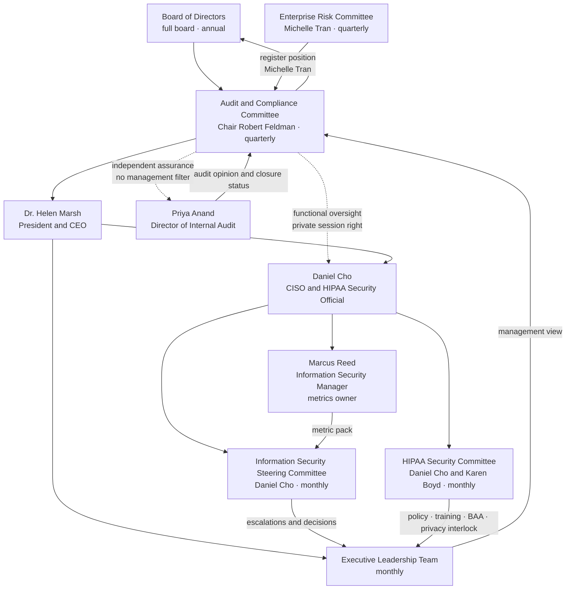
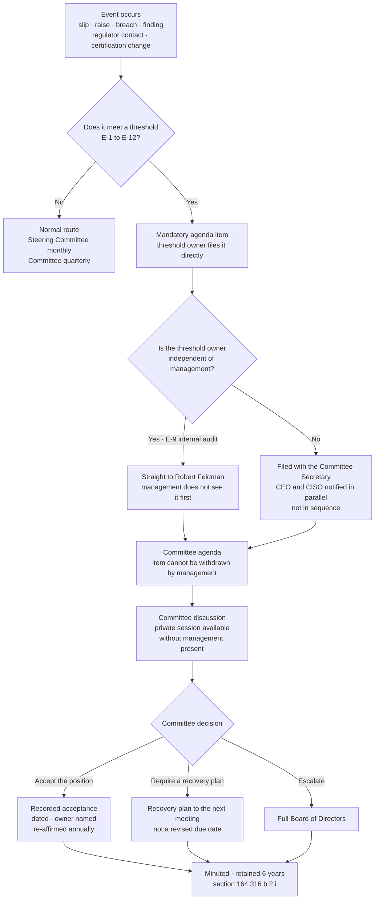

# 09.02 — Board &amp; Committee Reporting

| Field | Value |
|---|---|
| Document ID | MBH-ERM-BRD-2026-902 |
| Program | MercyBridge Health Network — HIPAA Security Program |
| Phase | 09 — Executive Reporting, Program Maturity &amp; Continuous Compliance |
| Version | 1.0 |
| Date | 2026-07-15 |
| Classification | Confidential — Electronic Protected Health Information (ePHI) // Illustrative Portfolio Sample |
| Owner | Daniel Cho, Chief Information Security Officer &amp; HIPAA Security Official |
| Co-Owner | Karen Boyd, Chief Compliance Officer |
| Approver | Robert Feldman, Board Audit &amp; Compliance Committee Chair |
| Author | Advisory Team (Healthcare GRC / HIPAA) |
| Status | Approved |

## Purpose

A security programme that governs itself well and reports itself badly is indistinguishable, from the Board's seat, from one that does neither.

This document defines the reporting architecture: **who reports what, to whom, how often, and in what form**. It records the §164.308(a)(2) line of accountability that makes the reporting meaningful, publishes the contents of the **2026-12 board reporting pack**, sets the annual board calendar, and — the section that matters most — defines the **escalation thresholds that force an item onto the Board agenda regardless of whether management wants it there**.

That last part is not decoration. The live example is running right now: **M-2**, the joint restoration test with Halcyon Health, has slipped once, is overdue, and is on the December agenda because the threshold fired, not because anyone volunteered it.

## 1. The Line of Accountability

**§164.308(a)(2) — Assigned Security Responsibility** requires a covered entity to *"identify the security official who is responsible for the development and implementation of the policies and procedures required by this subpart."* It is a **required** standard with no implementation specifications and no addressable alternative. One identifiable person owns the Security Rule programme.

At MercyBridge that person is **Daniel Cho, Chief Information Security Officer and HIPAA Security Official**. Reporting exists to make that accountability observable.

| Attribute | Position | Why it matters to reporting |
|---|---|---|
| Designated official | Daniel Cho | A single signature on the annual evaluation report and the risk analysis |
| Administrative reporting line | Dr. Helen Marsh, President &amp; CEO | Budget and enterprise authority; security does not report through IT operations |
| Functional oversight line | **Board Audit &amp; Compliance Committee**, chaired by Robert Feldman | Allows a security concern to reach the Board **above** the CIO when the concern is about IT delivery — which is precisely the M-2 situation |
| Independent assurance line | Priya Anand, Director of Internal Audit, reporting functionally to the same Committee | Closure status is attested by a function that does not own the controls |
| Privacy counterpart | Rebecca Stern, Chief Privacy Officer | Co-owns breach determination and notification reporting |
| Register custodian | Michelle Tran, VP Enterprise Risk | Risk numbers in the Board pack are produced by someone other than the CISO |
| Continuity | CEO designates an interim official without delay on vacancy; designation documented and reported to the Committee | §164.308(a)(2) coverage is never broken by a resignation |

**The structural point.** Three of the numbers in the Board pack — the audit opinion, the closure status of the 45 tracked items, and the risk register position — are produced by people who do not report to the CISO. That is deliberate. A Board pack in which every figure is generated and attested by the function being reviewed is a self-assessment with a cover page.

## 2. The Reporting Forums

| Forum | Chair | Cadence | Audience | What it receives | What it decides |
|---|---|---|---|---|---|
| **Board of Directors** | Board Chair | **Annual**, plus on threshold event | Full board | The annual HIPAA Security Program report; the §164.308(a)(8) evaluation conclusion; the risk appetite re-affirmation; the budget | Budget; appetite; acceptance of residuals outside appetite |
| **Audit &amp; Compliance Committee** | **Robert Feldman** | **Quarterly** | Committee members; CEO; CISO; CCO; Internal Audit | Risk register position; findings closure; audit opinion; incident and breach summary; assurance calendar; escalated items | Escalation to full board; acceptance of a re-baselined date; direction to management |
| **Enterprise Risk Committee** | Michelle Tran | Quarterly | Executive risk owners | The 56-risk register in full; movements with rationale; appetite breaches | Re-scores; owner changes; integration with enterprise risk |
| **Executive Leadership Team** | Dr. Helen Marsh | Monthly | CEO and direct reports | One-page metric scorecard; open item ageing; resourcing conflicts | Resourcing; cross-functional unblocking |
| **Information Security Steering Committee** | Daniel Cho | Monthly | Security, IT, Clinical Engineering, Compliance, Privacy, Risk | Full metric pack; vulnerability and detection position; remediation tracker; exception register | Control decisions; exception approval; prioritisation |
| **HIPAA Security Committee** | Daniel Cho with Karen Boyd | Monthly | Security, Compliance, Privacy, HIM, Legal, Clinical, HR, Facilities | Policy currency; training; sanctions; BAA position; activity review; site consistency | Policy approval recommendation; procedure changes; workforce actions |
| **Privacy &amp; Security Coordination** | Daniel Cho / Rebecca Stern | Monthly | Security and Privacy leadership | Incident pipeline; four-factor determinations; minimum-necessary issues | Breach determination path; joint notification readiness |
| **CSIRT** | Daniel Cho | On event | Incident responders; HICS interface | Live incident state | Containment; severity; clinical trade-offs |

**Why both a Steering Committee and a HIPAA Security Committee.** They answer different questions and mixing them produces a meeting where neither gets answered. The Steering Committee asks *is the control estate working and what do we fix next*; it is technical, monthly, and metric-driven. The HIPAA Security Committee asks *is the organisation discharging the Security Rule as an institution* — policies, training, sanctions, contracts, physical practice, documentation — and it is where Compliance, Legal, HR, HIM and Facilities sit at the table. The Steering Committee would never have surfaced the door-prop alarm at an outpatient clinic. The HIPAA Security Committee did, twice, before Internal Audit found it.

## 3. Who Reports What

| Reporter | Reports | To | Cadence | Cannot be edited by |
|---|---|---|---|---|
| **Daniel Cho** — CISO / Security Official | Programme position, control effectiveness, risk posture, annual evaluation conclusion, certification status | Audit &amp; Compliance Committee; Board; CEO | Quarterly / annual | — (he signs it) |
| **Marcus Reed** — Information Security Manager | The metric pack — KPIs, KRIs, vulnerability position, detection performance, exception register | Steering Committee → CISO → Committee | Monthly | Nobody below CISO; thresholds are fixed in 09.03 and cannot be adjusted inside a reporting period |
| **Priya Anand** — Internal Audit | Audit opinion; recommendation closure status; the consolidated 45-item tracker; follow-up audit results | **Directly to the Audit &amp; Compliance Committee** | Quarterly, plus the annual audit report | **Management.** The management response is appended, never merged |
| **Karen Boyd** — Chief Compliance Officer | Policy currency, training completion, sanctions, OCR readiness, regulatory change including the 2025 NPRM watch | Committee; HIPAA Security Committee | Quarterly | — |
| **Michelle Tran** — VP Enterprise Risk | The 56-risk register position, movements, appetite breaches | Enterprise Risk Committee → Audit &amp; Compliance Committee | Quarterly | The CISO may challenge a score but does not author the register |
| **Rebecca Stern** — Chief Privacy Officer | Incident and breach determinations; notification readiness; patient-rights interlock | Committee; Privacy &amp; Security Coordination | Quarterly, immediate on a reportable breach | — |
| **Anthony Ruiz** — CIO | Infrastructure remediation delivery, contingency and restoration status, device estate lifecycle | Steering Committee; Committee for CAP-01 and M-2 | Monthly / quarterly | — |
| **Lisa Coleman** — General Counsel | BAA population and flow-down, litigation and regulatory correspondence, NPRM legal analysis | Committee | Quarterly | — |
| **Dr. Samuel Ortega** — CMIO | Break-glass review, clinical downtime readiness, clinical acceptability of controls | HIPAA Security Committee; Committee on clinical-safety items | Monthly / as required | — |

## 4. The 2026-12 Board Reporting Pack

Delivered to the Board Audit &amp; Compliance Committee for the December 2026 cycle and, in summary form, to the full Board. Issued **five business days** before the meeting. Total length **19 pages**, of which the first is the one-page summary and the last four are appendices nobody is required to read.

| Tab | Content | Source | Owner | Pages |
|---|---|---|---|---|
| **A** | **One-page executive summary** — the eleven-month position, the four non-claims, the six asks | 09.01 §1 and §9 | Daniel Cho | 1 |
| **B** | **Programme outcome** — the nine phases, what each delivered, the headline numbers | 09.01 §2 | Daniel Cho | 2 |
| **C** | **Risk posture** — 56-risk register position, phase trajectory, heat map, **the two risks that were raised and why**, residuals outside appetite | 09.05 | Michelle Tran | 3 |
| **D** | **Independent assurance** — pen test result, internal audit opinion, HITRUST i1 certificate and its limits, OCR Audit Protocol readiness | 08.03, 08.05, 08.07, 08.08 | Priya Anand and Daniel Cho | 2 |
| **E** | **Metrics scorecard** — 12 board-level measures with trend arrows, thresholds and the amber and red items named first | 09.03 §7 | Marcus Reed | 2 |
| **F** | **Open items** — 45 tracked, 22 closed, 23 open, **1 overdue**, ageing, and the three items flagged at risk of their dates | 08.10 | Priya Anand | 2 |
| **G** | **Incidents and breaches** — 3 incidents, 3 four-factor assessments, **0 reportable breaches**, all three independently re-performed | 07.10, 08.05 | Rebecca Stern | 1 |
| **H** | **Programme maturity** — 23 domains, the five-level model, the six domains at Level 2 and what moves them | 09.04 | Daniel Cho | 1 |
| **I** | **§164.308(a)(8) annual evaluation report** and management response | 09.06 | Daniel Cho | 2 |
| **J** | **2027 plan and budget** — an indicative **~$3,190,000** programme of which **~$1,140,000 requires new approval**, the recertification calendar, the NPRM watch | 09.01 §3 | Daniel Cho with Karen Boyd | 1 |
| **K** | Appendices — assurance calendar, register extract, escalation thresholds, glossary | Various | Karen Boyd | 4 |

| Pack discipline | Rule |
|---|---|
| Bad news position | **Amber and red items appear before green items on every tab.** No tab opens with an achievement |
| Trend, not snapshot | Every metric carries the prior two periods. A single-period figure is not reportable |
| Denominators mandatory | No count without its population. "148 vulnerabilities closed" is not a statement; "148 of 148 KEV-listed instances closed, from a 2026-03 baseline of 148" is |
| Unedited assurance | Tabs D and F are drafted by Internal Audit; management may append a response, not amend the content |
| Named owners | Every open item shows one individual, not a department |
| Language check | Karen Boyd reviews the pack for over-claim before issue — specifically for any sentence that could be read as "certified therefore compliant" |
| Retention | The pack, minutes and management response are retained **six years** under §164.316(b)(2)(i) |

**What was deliberately in the December pack that management would not have chosen.** The 48% first-measured detection rate, ahead of the 74% re-measure. The single overdue item. The two raised risk ratings. The 25% HITRUST requirement score. The six of 412 late terminations. Internal Audit verified in 08.05 §7 that the Committee pack matched the Ironwood report with no softening observed — which is the check that makes the rest of this section credible.

## 5. The Annual Board Calendar

| Cycle | Forum | Standing agenda | Owner |
|---|---|---|---|
| **Q1 — March** | Audit &amp; Compliance Committee | **Annual risk re-analysis result** under 03.10 TR-1; register rebaseline; prior-year evaluation actions; Q1 metric scorecard; open item ageing | Daniel Cho / Michelle Tran |
| **Q2 — June** | Audit &amp; Compliance Committee | **Internal Audit follow-up audit** of recommendation closure; HITRUST recertification decision (i1 rapid recertification versus r2 evaluation); mid-year metric scorecard; NPRM finalisation watch | Priya Anand / Daniel Cho / Karen Boyd |
| **Q3 — September** | Audit &amp; Compliance Committee | **Annual §164.308(a)(8) evaluation fieldwork status**; penetration test scope approval; annual audit plan approval for the following year; training and sanction position | Daniel Cho / Priya Anand |
| **Q4 — December** | Audit &amp; Compliance Committee **and full Board** | **The annual pack in §4**: programme report, evaluation report, certification status, risk posture, maturity, budget, appetite re-affirmation | Daniel Cho |
| Monthly | Executive Leadership Team | One-page scorecard; resourcing conflicts; anything trending to a threshold | Daniel Cho |
| Monthly | Steering Committee / HIPAA Security Committee | Full metric pack; remediation tracker; exceptions; policy and training | Marcus Reed / Karen Boyd |
| On event | Audit &amp; Compliance Committee, out of cycle | Any §6 threshold breach | Any threshold owner |

**Why the certification decision sits in Q2 and not Q4.** The i1 certificate expires **2027-11-29**. A recertification assessment needs its fieldwork window, its remediation runway and its assessor booking. Deciding in Q4 would mean deciding after the point at which the decision could still be executed — which is how organisations discover in October that they have already chosen to lapse.

## 6. How Bad News Travels

Every reporting architecture has the same failure mode: management decides what governance hears. MercyBridge removes that discretion for a defined set of conditions. **If a threshold fires, the item goes on the Committee agenda. There is no management judgement step, no "we'll bring it next quarter if it hasn't resolved", and no requirement that the CISO agree it is serious.**

| # | Threshold — any one of these forces a Committee agenda item | Reported by | Timing | Management discretion |
|---|---|---|---|---|
| **E-1** | **A tracked remediation item slips its date a second time** | Priya Anand | Next scheduled Committee, or within 15 business days if the item is Critical or High | **None.** The item returns with a **recovery plan, not a new date** |
| **E-2** | Any risk is **raised** in rating, or any risk enters the **High** band | Michelle Tran | Immediate notification; next Committee for discussion | None |
| **E-3** | A residual moves **outside stated risk appetite** without an existing acceptance | Michelle Tran | Next Committee | None — the Committee decides acceptance, management does not |
| **E-4** | A **reportable breach** under §164.400–414 is determined | Rebecca Stern | **Immediate**, to the Committee Chair and CEO, ahead of any notification | None |
| **E-5** | Any **SEV-1 incident**, or a SEV-2 involving ePHI exposure | Daniel Cho | Within 24 hours to the Chair; written summary within 5 business days | None |
| **E-6** | Regulatory contact — an OCR inquiry, complaint, compliance review, or state AG or health department contact | Karen Boyd with Lisa Coleman | **Immediate** | None |
| **E-7** | A **KEV-listed vulnerability on an ePHI system remains open beyond 7 days** | Marcus Reed | Next Committee | None; the 7-day KEV standard carries **no exception route** |
| **E-8** | Loss, suspension or material qualification of the **HITRUST certification**, or a HITRUST-reportable control failure | Daniel Cho | Immediate | None |
| **E-9** | An **internal audit finding rated High or Critical**, or a downgrade of the audit opinion below Satisfactory | Priya Anand | Direct to the Committee, bypassing management entirely | **None. Management does not see it first** |
| **E-10** | A **business associate breach** affecting MercyBridge ePHI, or a critical BA losing its assurance basis | Lisa Coleman | Within 5 business days | None |
| **E-11** | Any **exception granted to a required implementation specification**, or a risk acceptance signed above the Moderate band | Daniel Cho | Next Committee | None; a High-band acceptance requires Committee approval, not notification |
| **E-12** | Departure or incapacity of the **designated Security Official** | Dr. Helen Marsh | Immediate | None; §164.308(a)(2) continuity is a Board-visible matter |

### 6.1 The Live Example — M-2

**M-2** is the joint full-scale restoration test with Halcyon Health, the vendor-hosted EHR business associate holding the entire 2.1 million-record clinical archive. It is the single best illustration of the escalation machinery working, because at no point did anyone choose to escalate it.

| Stage | What happened | Which rule operated |
|---|---|---|
| Original commitment | Joint restoration test scheduled **2026-09**, written into 07.12 as the condition on the R-23 reduction | 07.11 conditional-claim rule |
| Slip | Vendor sequencing pushed the window; re-baselined **once** to **2027-02-28**, with a documented reason | 08.10 §1 date discipline — one re-baseline permitted |
| Consequence to the register | The conditional reduction lapsed. **R-23 raised from 8 to 10** — not held, not quietly left | 08.11 §4; ADR-0021 |
| Consequence to certification | Beacon scored the corresponding requirement at **25%**, the lowest in the i1 assessment; **CAP-01** opened, due 2027-03-31 | 08.07 |
| Escalation | Item taken to the Audit &amp; Compliance Committee **2026-11-24** under threshold E-1 and E-2 | This document, §6 |
| Standing position | **A second re-baseline is not authorised.** A further slip returns to Robert Feldman with a recovery plan, and the plan must address the vendor dependency, not restate it | 08.10 §8; E-1 |
| Board visibility now | Named in Tab A, Tab C and Tab F of the December pack, and in §5 and §6 of the executive summary | 09.01 |

**What makes this the useful example rather than an embarrassing one.** The slip was **self-reported** by the CIO before either external assessor arrived, and both Internal Audit and Beacon Assurance subsequently confirmed it independently. The organisation did not get caught. It escalated, took the risk increase, absorbed the lowest score in its own certification assessment, and put the item at the top of the Board pack. The alternative — leaving R-23 at 8 on the grounds that the test was only postponed — would have been defensible in the moment and indefensible in an OCR investigation eighteen months later.

## 7. Reporting Failure Modes and the Controls Against Them

| Failure mode | What it looks like | Control at MercyBridge |
|---|---|---|
| **The green dashboard** | Every indicator green; the Board learns of problems from the newspaper | Amber and red first on every tab; thresholds fixed in 09.03 and unchangeable inside a period |
| **The management filter** | Bad findings soften on the way up | Internal Audit reports directly; management response appended, not merged; private session with the Chair |
| **The optimistic date** | Slipping items get new dates indefinitely | **One re-baseline per item**; a second slip is an E-1 threshold breach requiring a recovery plan |
| **The certification over-claim** | "We're HITRUST certified, so we're compliant" | Written into the pack, the minutes and 09.01 §5; Karen Boyd reviews language before issue |
| **The vanity metric** | Alert volumes and training hours crowd out control effectiveness | Metric catalogue in 09.03 with an explicit vanity-metric exclusion list |
| **The frequency trap** | Quarterly reporting means a problem in week 2 waits eleven weeks | Twelve event-driven thresholds independent of the calendar |
| **The unowned item** | "IT is working on it" | One named individual per item; no departmental owners |
| **The disappearing finding** | Items closed without verification | 08.10 §6 closure discipline; **0** items closed on management assertion where independent verification was competent |
| **The single-period number** | A figure with no history, read as a trend | Every metric carries two prior periods |

## Cross-References

| Reference | Relevance |
|---|---|
| 01.05 — Security Official Designation &amp; Governance | The §164.308(a)(2) designation and committee structure extended here |
| 01.07 — Roles, Responsibilities &amp; RACI | The accountability matrix behind §3 |
| 01.12 — Communications &amp; Escalation Plan | The programme-level escalation routes this document supersedes for governance reporting |
| 03.10 — Periodic Review &amp; Update | The Q1 annual re-analysis on the board calendar |
| 07.07 — Breach Notification Requirements | The E-4 threshold and the notification clock |
| 08.05 — Internal Audit of the Security Program | The independent reporting line and the private session of 2026-11-24 |
| 08.07 — HITRUST i1 Assessment Results | The certificate expiry driving the Q2 recertification decision |
| 08.10 — Findings Remediation Tracker | The one-re-baseline rule and the M-2 escalation record |
| 08.11 — Control-to-Risk Traceability | The R-23 conditional-claim lapse reported under E-2 |
| 09.01 — Executive Summary | Tab A and Tab B of the December pack |
| 09.03 — Security Metrics, KRI &amp; KPI Program | Tab E; the fixed thresholds referenced in §7 |
| 09.05 — Risk Posture &amp; Heat Map | Tab C; the appetite statement behind threshold E-3 |
| 09.06 — Annual Evaluation §164.308(a)(8) | Tab I |

---
[⬅ Previous](09.01-executive-summary.md) · [🏠 Phase 09 Home](09.00-README.md) · [Next ➡](09.03-security-metrics-kri-kpi-program.md)
