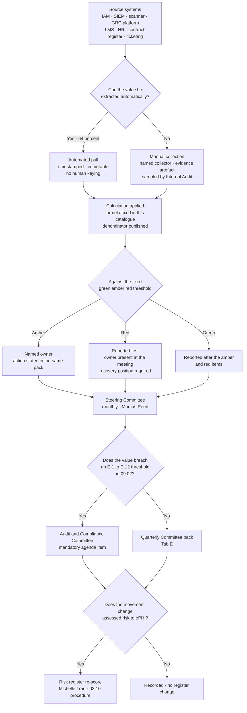

# 09.03 — Security Metrics, KRI &amp; KPI Program

| Field | Value |
|---|---|
| Document ID | MBH-ERM-MET-2026-903 |
| Program | MercyBridge Health Network — HIPAA Security Program |
| Phase | 09 — Executive Reporting, Program Maturity &amp; Continuous Compliance |
| Version | 1.0 |
| Date | 2026-07-15 |
| Classification | Confidential — Electronic Protected Health Information (ePHI) // Illustrative Portfolio Sample |
| Owner | Marcus Reed, Information Security Manager |
| Co-Owner | Daniel Cho, Chief Information Security Officer &amp; HIPAA Security Official |
| Approver | Daniel Cho, CISO &amp; HIPAA Security Official |
| Author | Advisory Team (Healthcare GRC / HIPAA) |
| Status | Approved |

## Purpose

This document establishes the MercyBridge security metrics programme: what is measured, how it is calculated, where the number comes from, who owns it, how often it is produced, what thresholds turn it amber and red, and what it reads at programme close.

It exists because the alternative is worse. Without a defined catalogue, a security function reports whatever it can extract easily, which is almost always activity rather than effectiveness, and almost always improving. **The single hardest thing about a metrics programme is not building it. It is committing, in advance and in writing, to publish the numbers it produces after you have seen them.** §8 of this document is the test of whether MercyBridge did that; §9 is the test of whether the numbers can be manipulated once people know they are being watched.

> **Programme position at 2026-12-31: 36 metrics in the catalogue — 22 KPIs and 14 KRIs. Across the full catalogue, 17 green · 10 amber · 9 red. The Board-level scorecard in §7 is a twelve-measure subset of the catalogue, of which **four are red**; those four appear before the green ones in every pack.**

## 1. Three Kinds of Number

Most security reporting fails at this distinction, and the failure is invisible until an executive draws a conclusion the metric could never support.

| | **KPI — Key Performance Indicator** | **KRI — Key Risk Indicator** | **Vanity metric** |
|---|---|---|---|
| Question answered | *Is the control operating as designed, across its declared scope?* | *Is the risk to ePHI changing?* | *Were we busy?* |
| Points | Backwards, at execution | Forwards, at exposure | Nowhere |
| Unit | Coverage, timeliness, completeness, exception rate | Rate, count, dwell, trend against a threshold | Volume |
| Fails when | The control stops operating or scope grows past it | Conditions change; assumptions decay | Always — it cannot fail, which is the problem |
| Board relevance | Assurance | **Decision** | None |
| MercyBridge example | *68 of 68 ePHI systems enforce MFA* | *Detection rate against simulated adversary actions is 74%* | *"1.4 million malicious emails blocked"* |
| What it cannot tell you | Whether MFA would stop the attack you will actually face | Whether the control is operating today on every system | Anything |

**Why both are required.** A KPI can be perfect while risk rises: MFA coverage held at 68 of 68 all year, and the enterprise ransomware risk still went **up**, because the risk depended on recoverability rather than authentication. A KRI can move without any control changing: the detection rate went from 48% to 74% because MercyBridge wrote 34 new analytics — a real change — but the underlying telemetry gap of 3 unonboarded systems is unchanged, so R-35 was **held**, not reduced. Reporting either alone produces a confident and wrong picture.

**The rule this programme applies.** *A KPI is evidence that a control operates. A KRI is evidence about the world. Only a KRI may move a risk rating, and only on evidenced measurement — never on a project plan.*

## 2. Catalogue Governance

| Attribute | Position |
|---|---|
| Catalogue of record | `trackers/metrics-catalogue.xlsx`; this document is the point-in-time statement of it |
| Owner | **Marcus Reed**, Information Security Manager |
| Approver of definitions and thresholds | **Daniel Cho**. A threshold change requires CISO approval and is disclosed in the pack in which it first applies |
| Threshold stability | **A threshold cannot be changed inside a reporting period.** Discovering that a number will be red is not a reason to move the line |
| Formula stability | A formula change creates a **new metric ID**. The old ID is retired with its history intact, so a redefinition can never be presented as an improvement |
| Denominator rule | Every count publishes its population. A numerator without a denominator is not reportable |
| Trend rule | Every metric carries the two prior periods. Single-period values are not reportable |
| Automation | **64%** of underlying evidence is captured automatically from source; target 80% by 2027-11 |
| Independent check | Internal Audit samples manual-collection metrics annually; four were sampled in IA-2026-14 with no exceptions to the collection method |
| Retention | Metric history and source extracts retained **six years** under §164.316(b)(2)(i) |

## 3. KPI Catalogue — Is the Control Operating?

Thresholds are absolute, not relative to last period. Current values are at **2026-12-31** unless stated.

| ID | Metric | Definition &amp; formula | Source | Owner | Cadence | Green / Amber / Red | **Current** | Status |
|---|---|---|---|---|---|---|---|---|
| **KPI-01** | MFA coverage, ePHI systems | ePHI systems enforcing MFA for remote and privileged access ÷ 68 | IAM platform extract | Marcus Reed | Monthly | 100% / 98–99% / <98% | **68 of 68 = 100%** | 🟢 |
| **KPI-02** | Encryption at rest coverage | ePHI systems with ePHI encrypted at rest to HHS guidance ÷ 68 | Configuration extract; verified by Internal Audit and Ironwood | Marcus Reed | Monthly | 100% / 99% / <99% | **68 of 68 = 100%** | 🟢 |
| **KPI-03** | Encryption in transit coverage | ePHI systems with all external ePHI transmission over approved TLS ÷ 68 | TLS inventory; interface register | Marcus Reed | Monthly | 100% / 99% / <99% | **68 of 68 = 100%** | 🟢 |
| **KPI-04** | Central audit-log coverage | ePHI systems forwarding audit logs to the SIEM ÷ 68 | SIEM onboarding register | Marcus Reed | Monthly | 100% / 96–99% / <96% | **65 of 68 = 95.6%** | 🔴 |
| **KPI-05** | Authenticated scan coverage | Hosts successfully credentialed-scanned in the month ÷ 1,914 in-scope hosts | Vulnerability platform | Marcus Reed | Monthly | ≥98% / 95–97.9% / <95% | **1,842 of 1,914 = 96.2%** | 🟡 |
| **KPI-06** | KEV remediation inside 7 days | KEV-listed instances remediated within 7 days ÷ KEV instances raised | Vulnerability platform + CISA KEV feed | Marcus Reed | Weekly | 100% / — / <100% | **100%; 0 open** | 🟢 |
| **KPI-07** | Termination access timeliness | Terminations with ePHI access removed inside the policy window ÷ all terminations in period | HR feed + IAM deprovisioning log | Marcus Reed / HR Director | Monthly | ≥99.5% / 98–99.4% / <98% | **406 of 412 = 98.5%** (6 late, 2–4 business days) | 🟡 |
| **KPI-08** | Post-termination access use | Distinct accesses using credentials after the termination effective date | 100% population analytics, SIEM | Marcus Reed | Monthly | 0 / — / ≥1 | **0** | 🟢 |
| **KPI-09** | Security awareness training completion | Workforce members completing annual training ÷ workforce in scope | LMS | Karen Boyd | Monthly | ≥98% / 95–97.9% / <95% | **97.8%** of 6,512; 143 outstanding, all inside grace | 🟡 |
| **KPI-10** | Phishing simulation report rate | Recipients reporting the simulated message ÷ recipients | Simulation platform | Marcus Reed | Per campaign | ≥20% / 15–19.9% / <15% | **22.4%** | 🟢 |
| **KPI-11** | Phishing simulation click rate | Recipients clicking ÷ recipients | Simulation platform | Marcus Reed | Per campaign | ≤5% / 5.1–8% / >8% | **4.2%** (from 11.4% baseline) | 🟢 |
| **KPI-12** | Break-glass retrospective review | Break-glass uses reviewed inside 5 business days ÷ break-glass uses | EHR access log + GRC workflow | Dr. Samuel Ortega | Monthly | 100% / 95–99% / <95% | **23 of 25 sampled = 92%** (2 late at 7 and 9 days) | 🔴 |
| **KPI-13** | Provisioning approval evidence | Provisioning actions with a retained approval record ÷ provisioning actions sampled | ITSM + IAM | Marcus Reed | Monthly | 100% / 96–99% / <96% | **23 of 25 = 92%**; manual bypass disabled 2026-12-11 | 🔴 |
| **KPI-14** | Activity-review attestation retention | Monthly activity reviews with the reviewer attestation retained ÷ reviews due | GRC platform | Marcus Reed | Monthly | 100% / 96–99% / <96% | **22 of 25 = 88%** | 🔴 |
| **KPI-15** | Privileged account recertification | Privileged accounts recertified in the cycle ÷ privileged accounts | IAM; 100% population test | Marcus Reed | Quarterly | 100% / 97–99% / <97% | **1,182 of 1,182 = 100%** | 🟢 |
| **KPI-16** | Standing elevated EHR accounts | Count of standing elevated EHR accounts (lower is better) | EHR role extract | Dr. Samuel Ortega | Quarterly | ≤70 / 71–120 / >120 | **63** (from 214) | 🟢 |
| **KPI-17** | BAA coverage | BA-involved ePHI systems with a current executed BAA ÷ BA-involved ePHI systems | Contract register | Lisa Coleman | Quarterly | 100% / — / <100% | **47 of 47 = 100%** | 🟢 |
| **KPI-18** | Critical BA assurance currency | Critical and High-tier BAs with current assurance on file ÷ 24 | Vendor assurance register | Lisa Coleman | Quarterly | 100% / 96–99% / <96% | **24 of 24 = 100%** | 🟢 |
| **KPI-19** | BA population under tiered monitoring | BAs with an active monitoring record ÷ ~180 | Vendor assurance register | Lisa Coleman | Quarterly | ≥90% / 60–89% / <60% | **62 of ~180 = 34.4%** | 🔴 |
| **KPI-20** | Tier 1 validated restoration | Tier 1 systems with a **validated** 24-hour restoration ÷ 12 | Restore test records | Anthony Ruiz | Quarterly | 12 of 12 / 10–11 / ≤9 | **7 of 12 = 58.3%** | 🔴 |
| **KPI-21** | Evidence production time | Median business days from evidence request to production | Evidence repository audit log | Karen Boyd | Per request; reported quarterly | ≤2 days / 2.1–4 / >4 | **1.5 business days** | 🟢 |
| **KPI-22** | Policy and procedure currency | Approved policies and procedures inside their review date ÷ total | Document register | Karen Boyd | Quarterly | 100% / 96–99% / <96% | **24 of 24 policies; 2 procedures lagged and were re-issued 2026-12-09** | 🟡 |

## 4. KRI Catalogue — Is Risk Changing?

| ID | Metric | Definition &amp; formula | Source | Owner | Cadence | Green / Amber / Red | **Current** | Status | Register link |
|---|---|---|---|---|---|---|---|---|---|
| **KRI-01** | Adversary detection rate | Simulated adversary actions detected and alerted ÷ actions executed | Purple-team run sheet reconciled to SIEM | Marcus Reed | Quarterly | ≥85% / 70–84% / <70% | **74%** (48% at first measurement, 2026-09) | 🟡 | R-24, R-35 |
| **KRI-02** | Detect → escalate time | Median minutes from first detection to analyst escalation | SIEM / SOAR case timestamps | Marcus Reed | Monthly | ≤30 min / 31–45 / >45 | **41 minutes** | 🟡 | R-35 |
| **KRI-03** | Detect → contain time | Median hours from detection to containment on declared incidents | Incident register | Daniel Cho | Quarterly | ≤4 h / 4.1–8 / >8 | **2.6 hours** | 🟢 | R-23, R-34 |
| **KRI-04** | Open KEV instances | Count of CISA KEV-listed instances open on ePHI or ePHI-adjacent assets | Vulnerability platform | Marcus Reed | Weekly | 0 / — / ≥1 | **0** (from 148 at 2026-03) | 🟢 | R-09, R-25 |
| **KRI-05** | Total open vulnerability instances | Count of distinct open instances across the scanned estate | Vulnerability platform | Marcus Reed | Monthly | ≤15,000 / 15,001–25,000 / >25,000 | **16,583** (from 40,119; −58.7%) | 🟡 | R-09, R-42 |
| **KRI-06** | Unaccounted ePHI-bearing assets | Assets holding ePHI found at quarterly reconciliation that were absent from the inventory | IV-05 reconciliation against DNS, certificate transparency, external attack surface | Marcus Reed | Quarterly | 0 / — / ≥1 | **1** — PT-03, 6,880 records | 🔴 | **R-41** |
| **KRI-07** | Overdue tracked remediation items | Items past their date, after the single permitted re-baseline | Consolidated findings register | Priya Anand | Monthly | 0 / — / ≥1 | **1 — M-2** | 🔴 | R-23, R-47 |
| **KRI-08** | Residuals outside risk appetite | Residual risks scoring above the appetite line without a current Board acceptance | Risk register | Michelle Tran | Quarterly | 0 / 1–2 / ≥3 | **3** — R-11, R-23, R-28, all under dated acceptance | 🟡 | Appetite |
| **KRI-09** | Risk ratings raised in period | Count of residuals raised, by cause | Risk register change log | Michelle Tran | Quarterly | Reported, not thresholded | **2** — R-23 (lapsed condition), R-41 (disproved assumption) | ⚪ | ADR-0021 |
| **KRI-10** | Unsupported-OS device population | Networked medical devices on a manufacturer-unsupported OS ÷ 6,120 | Device register; passive profiling | Anthony Ruiz | Quarterly | ≤10% / 10.1–20% / >20% | **1,300 of 6,120 = 21.2%** | 🔴 | R-09, R-10, R-11 |
| **KRI-11** | Device attribution coverage | Devices with confirmed passive attribution or MDS2 on file ÷ 6,120 | Device register | Anthony Ruiz | Quarterly | ≥95% / 90–94.9% / <90% | **5,704 of 6,120 = 93.2%** | 🟡 | R-12 |
| **KRI-12** | Legacy PSK wireless remnant | Devices remaining on the legacy pre-shared-key wireless path | Wireless controller | Anthony Ruiz | Monthly | 0 / 1–100 / >100 | **173 of 214 remaining** (41 replaced) | 🟡 | CAP-05, R-17 |
| **KRI-13** | BA breach notifications received on time | BA notices received inside the contractual clock ÷ BA notices received | Incident register; contract clocks | Lisa Coleman | Quarterly | 100% / — / <100% | **4 of 4 = 100%** | 🟢 | R-31 |
| **KRI-14** | Reportable breaches | Incidents determined reportable under §164.400–414 | Breach determination file | Rebecca Stern | Continuous | 0 / — / ≥1 | **0** from 3 incidents and 3,961 individuals assessed | 🟢 | R-24, R-34 |

**Legend.** 🟢 green · 🟡 amber · 🔴 red · ⚪ reported without a threshold, because a target of "zero raised risks" would create an incentive to stop raising them.

## 5. Metrics Deliberately Not Kept

Each of these is produced by some tool in the estate, and each is excluded from the catalogue with a reason. Exclusion is a decision, so it is written down.

| Excluded metric | Why it looks like measurement | Why it is not | What replaces it |
|---|---|---|---|
| Malicious emails blocked | Large, rising, easy to extract | The number is set by attacker volume, not by MercyBridge. It rises when things get worse | KPI-10, KPI-11 — human behaviour under test |
| SIEM alerts generated | Implies vigilance | Rises with noisy rules and falls with good tuning; the desirable direction is ambiguous | KRI-01, KRI-02 — detection **efficacy** and speed |
| Vulnerabilities patched this month | Feels like productivity | No denominator, no severity weighting, and inflated by a single mass deployment | KPI-05, KRI-04, KRI-05 — coverage, KEV position, total open with a denominator |
| Training hours delivered | Effort is visible | Measures attendance, not capability | KPI-09 completion plus KPI-10 and KPI-11 behaviour under simulation |
| Number of policies published | Countable, and the count only rises | 24 approved policies with two stale procedures is worse than 22 accurate ones | KPI-22 — currency, not count |
| Percentage of controls "compliant" against a self-assessment | Looks like a maturity score | It is an opinion with a percent sign; it cannot be falsified | 09.04 maturity levels with evidence, and the HITRUST validated score |
| Mean time to patch, across all severities | Common in industry decks | Averages a 7-day KEV obligation with a 180-day cosmetic finding into one meaningless figure | KPI-06 at the severity band that matters |
| Security incidents "prevented" | Attractive to executives | Unfalsifiable. Nobody can count events that did not occur | KRI-14 outcome; KRI-03 response performance |
| Uptime of security tooling | Operationally real | Tool availability is not control effectiveness; a fully available EDR with 3 unonboarded systems is KPI-04's problem, not a green light | KPI-04 coverage |
| Number of dashboards or reports produced | — | Measures the reporting function measuring itself | — |

## 6. Metric-to-Requirement Coverage

Each metric anchors to something the Security Rule or the risk register actually requires, so the catalogue cannot drift into whatever happens to be easy to measure.

| Security Rule anchor | Metrics | Coverage judgement |
|---|---|---|
| §164.308(a)(1)(ii)(B) Risk management | KRI-04, KRI-05, KRI-07, KRI-08, KRI-09 | Strong |
| §164.308(a)(1)(ii)(D) Activity review | KPI-14, KPI-12 | **Weak — both red.** The control operates; the evidence of it does not always survive |
| §164.308(a)(3) Workforce security | KPI-07, KPI-08 | Adequate; timeliness amber, outcome green |
| §164.308(a)(4) Access management | KPI-13, KPI-15, KPI-16 | Adequate; approval evidence red |
| §164.308(a)(5) Awareness and training | KPI-09, KPI-10, KPI-11 | Strong |
| §164.308(a)(6) Incident procedures | KRI-03, KRI-14 | Strong |
| §164.308(a)(7) Contingency | **KPI-20** | **Weak — a single metric, and it is red.** The programme's thinnest measurement surface, in its weakest domain |
| §164.308(a)(8) Evaluation | KPI-21, KRI-01, and the 09.06 cycle | Adequate |
| §164.310 Physical | *None quantitative* | **A genuine gap.** Physical consistency was found by three lenses and is measured by inspection, not by a metric. A quarterly alarm-test and visitor-log completeness metric is committed for Q1 2027 under CAP-08 |
| §164.312(a) Access control | KPI-01, KPI-15 | Strong |
| §164.312(b) Audit controls | KPI-04, KPI-14 | Weak — both red or amber |
| §164.312(d) Authentication | KPI-01 | Strong |
| §164.312(e) Transmission security | KPI-03 | Strong |
| §164.314 Organisational | KPI-17, KPI-18, KPI-19, KRI-13 | Adequate at the critical tier; **red below it** |
| §164.316 Documentation | KPI-21, KPI-22 | Strong |

**The honest reading of this table.** The metrics programme is strongest where the controls are strongest and thinnest where they are weakest — contingency has one measure, physical safeguards have none. That is the normal direction of the failure: it is easiest to instrument what is already working. Both gaps are named, dated and owned rather than papered over with an easier proxy.

## 7. The Board-Level Scorecard — Tab E

Twelve measures. Red and amber first, in every pack, every quarter.

| Measure | 2026-Q2 | 2026-Q3 | **2026-Q4** | Threshold | Direction | Owner |
|---|---|---|---|---|---|---|
| 🔴 **Tier 1 validated restoration** | 7 of 12 | 7 of 12 | **7 of 12** | 12 of 12 | **Flat all year** | Anthony Ruiz |
| 🔴 **Overdue tracked items** | 0 | 0 | **1 (M-2)** | 0 | **Worse** | Priya Anand |
| 🔴 **Central audit-log coverage** | 62 of 68 | 62 of 68 | **65 of 68** | 68 of 68 | Improving, not closed | Marcus Reed |
| 🔴 **BA population under monitoring** | 24 of ~180 | 41 of ~180 | **62 of ~180** | ≥90% | Improving, far from target | Lisa Coleman |
| 🟡 **Adversary detection rate** | Not measured | **48%** | **74%** | ≥85% | Improving | Marcus Reed |
| 🟡 **Detect → escalate median** | Not measured | 47 min | **41 min** | ≤30 min | Improving | Marcus Reed |
| 🟡 **Residuals outside appetite** | 4 | 3 | **3** | 0 | Flat; all under dated acceptance | Michelle Tran |
| 🟡 **Termination timeliness** | 98.1% | 98.3% | **98.5%** | ≥99.5% | Improving | Marcus Reed |
| 🟢 **MFA / encryption at rest / in transit** | 68 / 68 / 68 | 68 / 68 / 68 | **68 / 68 / 68** | 68 of 68 | Held | Marcus Reed |
| 🟢 **Open KEV instances** | 37 | 11 | **0** | 0 | Closed | Marcus Reed |
| 🟢 **Reportable breaches** | 0 | 0 | **0** | 0 | Held | Rebecca Stern |
| 🟢 **Evidence production median** | Not measured | 2.4 days | **1.5 days** | ≤2 days | Improving | Karen Boyd |

## 8. Metrics That Got Worse — and Were Reported Anyway

This section is the reason the rest of the document is credible. Each of these was produced by MercyBridge's own measurement, was worse than the organisation's prior belief, and appears in the Committee pack rather than in a footnote.

| # | Metric | What was believed | What was measured | What happened next |
|---|---|---|---|---|
| **1** | **Adversary detection rate** | The SOC's own view, based on alert volumes and tuning work, was that detection against a competent adversary was strong | **48%.** Fewer than half of Ironwood's actions produced an alert; PT-02 and PT-03 went entirely undetected | Reported to the Committee **before** any remediation. Drove D-11 to D-14 and the IV-09 detection engineering programme — 34 new analytics. Re-measured at **74%**, and 74% is still amber |
| **2** | **Detect → escalate time** | Containment performance of 2.6 hours suggested escalation was fast | **47 minutes median to escalate**, against a 30-minute target — the slow step was between the alert and the analyst, not after | Reported as red; item D-14 opened, dated 2027-02-28; improved to 41 minutes and **still amber** |
| **3** | **Unaccounted ePHI assets** | Discovery scanning had bounded the sprawl; the assumed count was **0** | **1** — an internet-facing appointment application, live since 2018, holding **6,880 patient records**, in no inventory, with no owner or logging | **R-41 raised Low → Moderate.** Not merely remediated. ADR-0021 made this the standing rule |
| **4** | **Tier 1 validated restoration** | The 2026 plan was to reach 12 of 12 | **7 of 12, unchanged across all four quarters.** The joint restoration test that would have moved it slipped | **R-23 raised 8 → 10**; CAP-01 scored **25%**, the lowest requirement score in the HITRUST assessment; M-2 escalated as overdue |
| **5** | **Central audit-log coverage** | Phase 05 reported SIEM onboarding at **68 of 68** on completion of the build | By Phase 07 the measured figure was **62 of 68**. Onboarding had been recorded at deployment; six systems were not actually forwarding | **The earlier figure was restated rather than defended.** Every subsequent pack reports the measured number, and KPI-04 is now taken from the SIEM's own received-events data, not from the onboarding tracker. This is the clearest instance in the programme of a metric whose *source* was the defect |
| **6** | **Activity-review attestation retention** | The activity review was believed fully evidenced | **22 of 25 months.** The review happened; the attestation did not always survive | IA-F-02 raised; **R-36 held rather than reduced** — a detective control you cannot evidence is not one an assessor will credit |
| **7** | **Break-glass review timeliness** | Phase 04 reported post-hoc review at 100% | Reviews **completed**, but 2 of 25 were late at 7 and 9 days against a 5-day standard | IA-F-09 raised; the metric was re-defined to measure *timeliness*, not *occurrence*, and issued a new ID rather than restated under the old one |
| **8** | **Termination timeliness** | Phase 04 reported 98.1% inside 24 hours and improving | Internal Audit's **100% population test** of 412 terminations found **6 late** by 2 to 4 business days, concentrated in per-diem staff | IA-F-01 and CAP-07 raised. Reported alongside the mitigating fact — **0 post-termination accesses used** — but not instead of it |

**The pattern worth naming.** In six of these eight cases the worse number came from **measuring something for the first time**, not from a control degrading. That is what a first-year metrics programme is for, and it is why a programme's second year of metrics usually looks worse than its first. An organisation whose numbers only improve in year one has probably not started measuring anything difficult.

## 9. Gaming Resistance

Every metric with a threshold creates an incentive. The question is not whether people will respond to the incentive — they will — but whether the cheapest way to move the number is also the right thing to do. Where it is not, a specific control is named.

| Metric | How it could be gamed | What stops it |
|---|---|---|
| **KPI-01 / KPI-02 / KPI-03** coverage at 68 of 68 | Shrink the denominator — quietly reclassify a system as non-ePHI | The 68 is set by the Phase 02 inventory, changed only through a documented scope decision, and **reconciled quarterly under IV-05** against DNS and external attack-surface data. Internal Audit traced the scope to procurement and network records |
| **KPI-04** log coverage | Count a system as onboarded at deployment rather than at first received event | Source changed to the **SIEM's received-events data**, per event type, over a rolling 7 days. This is precisely the defect described in §8 item 5 |
| **KPI-05** scan coverage | Exclude hosts that fail credentialed scanning | Failed credentialed scans count as **not covered**. The 72 hosts that cannot accept credentials are carried openly as CAP-06 and appear in KRI-11, not removed from the denominator |
| **KPI-06 / KRI-04** KEV position | Dispute the applicability of a KEV entry to buy time | KEV applicability is determined against the CISA feed by the vulnerability platform, not by the remediating team; **no exception route exists** for a 7-day KEV obligation |
| **KRI-05** total open vulnerabilities | Mass-accept low-severity findings into the exception register | All **1,284** exceptions carry a **named owner and an expiry**; the exception register is reported alongside the vulnerability count, and an expiring exception reopens the finding automatically |
| **KPI-07** termination timeliness | Adjust the recorded effective date to fit the removal date | The clock starts from the **HR record**, which Security does not control, and Internal Audit tests the full population rather than a sample |
| **KPI-09** training completion | Push the grace period to sweep laggards into the next period | Grace-period membership is reported as a separate line — **143 outstanding** — not netted into the completion figure |
| **KPI-10 / KPI-11** phishing results | Send easy simulations; exclude difficult populations | Campaign difficulty is graded and reported; clinical and executive populations are included; **no pretext invoking a clinical emergency** is permitted, which constrains difficulty in a documented direction rather than a convenient one |
| **KPI-12 / KPI-14** review evidence | Backdate an attestation | Attestation is a **system-enforced workflow step with an immutable timestamp** in the GRC platform, deployed 2026-12-14. Backdating is not available to the reviewer |
| **KPI-20** validated restoration | Count a partial or tabletop exercise as a validation | Validation requires the **G1–G8 gates with clinical acceptance as gate 9**. This metric has not moved all year precisely because the definition was not loosened to let it |
| **KPI-21** evidence production time | Cherry-pick easy requests | Measured across **all** requests including the unannounced RFI drill; the drill is run by Compliance, not Security, and the 4 items not produced in the window are reported |
| **KRI-01** detection rate | Brief the SOC before the purple-team run | Purple-team run sheets are held by the assessor; the SOC is not notified of timing or technique. The 2026-09 measurement was taken during a **grey-box test the SOC was not told the schedule of** |
| **KRI-06** unaccounted assets | Do not look very hard | Reconciliation sources are **external** — DNS, certificate transparency, third-party attack-surface data — so the search is not bounded by MercyBridge's own inventory |
| **KRI-07** overdue items | Re-baseline the date | **One re-baseline per item.** A second slip is escalation threshold E-1 and requires a recovery plan, not a date |
| **KRI-09** risks raised | Stop raising risks | **Deliberately not thresholded.** A target of zero raised risks would make the correct behaviour the reportable failure |
| **All thresholds** | Move the line when the number will be red | Thresholds are approved by the CISO, **cannot change inside a reporting period**, and a formula change creates a **new metric ID** so history cannot be rewritten |

**The general defence.** Three structural properties do more work than any individual control above: **denominators are published**, **definitions are versioned**, and **the closure of an item is attested by Internal Audit rather than by the function delivering it**. A metric that carries its own population, cannot be silently redefined, and is not marked complete by the person responsible for completing it is difficult to game without the gaming itself being visible.

## Cross-References

| Reference | Relevance |
|---|---|
| 02.02 — ePHI System Inventory | The 68-system denominator behind KPI-01 to KPI-04 |
| 03.07 — Risk Register | The residuals each KRI is linked to |
| 04.06 — Security Awareness &amp; Training | The population behind KPI-09 to KPI-11 |
| 04.09 — Evaluation | The quarterly control-operation scorecard this catalogue formalises |
| 05.06 — Audit Controls | The §164.312(b) position behind KPI-04 and KPI-14 |
| 06.08 — Ongoing Monitoring &amp; Oversight | The BA monitoring KRIs extended in KPI-19 |
| 07.10 — Incident Register | The source for KRI-03 and KRI-14 |
| 08.03 — Penetration Test Results | The 48% first measurement of KRI-01 |
| 08.04 — Vulnerability Assessment &amp; Remediation | The KEV, scan-coverage and exception-register positions |
| 08.05 — Internal Audit of the Security Program | The 100% population tests behind KPI-07 and KPI-08 |
| 08.09 — Evidence Repository &amp; Documentation | The 64% automation figure and KPI-21 |
| 08.10 — Findings Remediation Tracker | The source for KRI-07 |
| 09.02 — Board &amp; Committee Reporting | Tab E and the E-1 to E-12 escalation thresholds |
| 09.04 — Program Maturity Assessment | Where measurement coverage determines a domain's Level 4 eligibility |
| 09.05 — Risk Posture &amp; Heat Map | Where KRI movement is converted into register movement |

---
[⬅ Previous](09.02-board-and-committee-reporting.md) · [🏠 Phase 09 Home](09.00-README.md) · [Next ➡](09.04-program-maturity-assessment.md)
