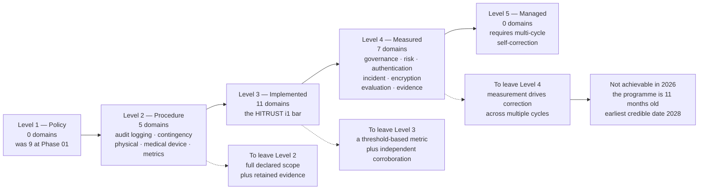

# 09.04 — Program Maturity Assessment

| Field | Value |
|---|---|
| Document ID | MBH-ERM-MAT-2026-904 |
| Program | MercyBridge Health Network — HIPAA Security Program |
| Phase | 09 — Executive Reporting, Program Maturity &amp; Continuous Compliance |
| Version | 1.0 |
| Date | 2026-07-15 |
| Classification | Confidential — Electronic Protected Health Information (ePHI) // Illustrative Portfolio Sample |
| Owner | Daniel Cho, Chief Information Security Officer &amp; HIPAA Security Official |
| Co-Owner | Priya Anand, Director of Internal Audit (independent challenge) |
| Approver | Robert Feldman, Board Audit &amp; Compliance Committee Chair |
| Author | Advisory Team (Healthcare GRC / HIPAA) |
| Status | Approved |

## Purpose

Maturity assessments are the easiest document in a GRC portfolio to falsify and the hardest to falsify convincingly. A five-point scale with vague level names produces whatever score the author wanted, and the reader has no way to check it.

This assessment is built to be checkable. It states the model it uses and why, defines each of the five levels in terms of **what evidence must exist**, scores **23 programme domains** against those definitions with the evidence named in-line, presents a view by Security Rule section, compares against the Phase 01 baseline, and — for every domain not yet at the next level — states the **specific, testable condition** that would move it.

> **Programme maturity at 2026-12-31: weighted mean 3.1 of 5, from a Phase 01 baseline of 1.6. Seven domains at Level 4 · eleven at Level 3 · five at Level 2 · none at Level 1 · none at Level 5.**
>
> **No domain is rated Level 5, and none will be for at least two more assessment cycles. An eleven-month-old programme cannot be Optimising. Reporting that it is would be the single clearest signal that the assessment was scored to flatter.**

## 1. The Model, and Why This One

MercyBridge uses a **five-level model derived from NIST PRISMA** — the Program Review for Information Security Assistance maturity ladder — as adopted in substance by the **HITRUST CSF maturity model**.

| Candidate model | Why it was not selected |
|---|---|
| **CMMI-derived** (Initial / Managed / Defined / Quantitatively Managed / Optimizing) | Designed for process capability in engineering organisations. Its levels describe *process discipline*, not *control evidence*, and Level 2 "Managed" and Level 3 "Defined" invert the intuitive order for a compliance audience |
| **NIST CSF 2.0 Tiers** (Partial / Risk Informed / Repeatable / Adaptive) | Four tiers, explicitly **not** a maturity model — NIST says so — and describes risk-management posture rather than per-control state |
| **HITRUST CSF / PRISMA** (Policy / Procedure / Implemented / Measured / Managed) | **Selected** |

**Why PRISMA.** Three reasons, in order of weight. First, it is **the ladder MercyBridge is already assessed against**: Beacon Assurance scored 182 HITRUST i1 requirement statements at the *Implemented* maturity level, so a PRISMA-derived assessment can borrow real external evidence instead of inventing a parallel scale. Second, its levels are **evidence-defined rather than adjective-defined** — the difference between Level 2 and Level 3 is whether a retained artefact demonstrates execution across the declared scope, which is a question with an answer. Third, it distinguishes **Implemented** from **Measured**, which is exactly the distinction a first-year programme needs to be forced to confront: MercyBridge implemented a great deal in 2026 and measured comparatively little of it.

### 1.1 Level Definitions

Each level **subsumes** the ones below it. A domain cannot be Level 4 with a gap at Level 2.

| Level | Name | A domain is at this level when… | Required evidence | Typical failure that caps a domain here |
|---|---|---|---|---|
| **1** | **Policy** | A written, approved, communicated policy exists and names an accountable owner. There is no evidence that the activity actually occurs | Approved policy document with an owner, an effective date and a review cycle | The policy describes an estate the organisation no longer operates |
| **2** | **Procedure** | Documented procedures state who does what, when, with which system, to what standard. Execution occurs but is **inconsistent, partial, or unevidenced** | Procedure documents; some execution records; no coverage assertion that survives sampling | The control operates and the evidence of it does not always survive — or it operates at some sites and not others |
| **3** | **Implemented** | The procedure is **executed across the full declared scope**, and retained evidence demonstrates execution for the period. This is the level HITRUST i1 requires | Coverage evidence for the whole population, retained for the period, that survives independent sampling | Execution is real but nobody would notice for a quarter if it stopped |
| **4** | **Measured** | Operation is **measured against a defined threshold on a defined cadence**; the measurement itself detects deviation; and an independent party has corroborated the measurement | A catalogued metric with a fixed threshold, a trend, an owner, **and** independent corroboration — audit, penetration test, or external assessor | Deviations are detected but correction is still a management decision rather than a designed response |
| **5** | **Managed / Optimising** | Measurement **drives systematic correction**: the control self-corrects, improvement caused by the organisation's own measurement can be demonstrated across **multiple cycles**, and the threshold itself is tightened on evidence | Multi-cycle trend data; documented instances of the measurement triggering a change **before** an assessor or an incident did; a tightened threshold with a rationale | Insufficient elapsed time. **This is MercyBridge's universal blocker in 2026** |

**The Level 5 rule, stated plainly.** Level 5 requires demonstrated self-correction *across multiple cycles*. MercyBridge's metrics catalogue was formalised in this phase and most measures have two or three data points. The programme has been operating for eleven months. **No domain qualifies, and the assessment says so rather than rounding an ambitious Level 4 upward.** The earliest credible Level 5 in any domain is the 2028 assessment.

## 2. Scoring Method and Independence

| Attribute | Position |
|---|---|
| Scored by | Daniel Cho with Marcus Reed, domain by domain, against §1.1 |
| Evidence source | The Phase 08 evidence repository — 8,412 controlled artefacts — plus the metrics catalogue in 09.03 |
| Independent challenge | **Priya Anand** reviewed every score above Level 2 and required documentary support. **Four proposed scores were reduced** on challenge and none was raised |
| External corroboration | Level 4 requires corroboration by at least one of: Ironwood penetration test, IA-2026-14, or the Beacon Assurance i1 validated assessment |
| Rounding | **Down, always.** A domain meeting most of a level's criteria scores at the level below with the gap stated |
| Weighting | Unweighted mean across 23 domains. A weighted mean was considered and rejected — weighting invites the weight to be chosen after the scores are known |
| Retention | Assessment, evidence index and challenge log retained six years under §164.316(b)(2)(i) |

**The four scores reduced on challenge**, recorded because a challenge process nobody ever loses is not a challenge process: Business Associate &amp; Third-Party Risk (proposed 4, scored 3 — monitoring reaches 62 of ~180); Workstation Use &amp; Security (proposed 4, scored 3 — no threshold-based metric exists); Vulnerability &amp; Threat Management (proposed 4, scored 3 — 72 hosts cannot accept credentialed assessment, so coverage is not full-scope); Incident Response (proposed 5, scored 4 — one tabletop and three live incidents is not multiple cycles).

## 3. Domain Scores

| # | Domain | Rule anchor | **Level** | Evidence for the score | What is missing for the next level |
|---|---|---|---|---|---|
| **1** | Governance, Security Official &amp; oversight | §164.308(a)(2) | **4** | Designation documented with authority and budget; dual reporting line to CEO and Committee; quarterly Committee reporting with fixed escalation thresholds; independence tested by Internal Audit; HITRUST requirement set at 100% | Multi-cycle evidence that a threshold breach changed a governance decision **before** an assessor raised it. M-2 is the first such instance and it is one instance |
| **2** | Risk analysis &amp; register management | §164.308(a)(1)(ii)(A)/(B) | **4** | 56 risks, named owners, quarterly review, annual re-analysis, nine documented triggers; Internal Audit traced 15 of 56 to source evidence; **two risks raised on evidence**, which is the behaviour a measured register produces | A second full annual re-analysis cycle (Q1 2027) and demonstrated re-scoring driven by KRI movement rather than by assessment findings |
| **3** | Policy, procedure &amp; documentation | §164.316(a) | **3** | 24 of 24 policies approved, current and retained; procedure library mapped to standards; change control operating | A currency **metric with a threshold** rather than a review calendar. IA-F-06 showed two procedures lagged a plan revision and nothing detected it — the calendar found it late, a measure would have found it early |
| **4** | Workforce security &amp; joiner-mover-leaver | §164.308(a)(3) | **3** | 100% population test of 412 terminations; JML procedures operating across ~6,500 workforce; weekly exception reporting live from 2026-12-01 | Timeliness at ≥99.5% sustained. **6 of 412 late** and the per-diem HR feed is still manual — CAP-07 / IA-F-01, due 2027-03-31 |
| **5** | Information access management | §164.308(a)(4) | **3** | Minimum-necessary role model; 1,182 privileged accounts recertified at 100%; standing elevated EHR accounts 214 → 63; break-glass available to every clinician | Approval evidence at 100%. **KPI-13 is red at 92%**; the manual bypass was disabled 2026-12-11 and the evidence period has not run |
| **6** | Authentication &amp; MFA | §164.312(d) | **4** | 68 of 68 systems; 100% coverage test by Internal Audit; Ironwood found and closed one legacy path; HITRUST Password Management at 100%; 14 exceptions reviewed, 11 revoked; measured monthly against a 100% threshold | Multi-cycle evidence of the measurement catching a regression before a tester did. PT-05 found the last gap, not the metric |
| **7** | Security awareness &amp; training | §164.308(a)(5) | **3** | 97.8% completion across 6,512; click rate 11.4% → 4.2%; report rate 22.4% against a 20% target; role-based clinical content deployed | Threshold-driven correction: a measured population-level intervention triggered by a metric, with the result measured. Currently the programme runs on a calendar, not on its own data |
| **8** | Audit logging &amp; activity review | §164.312(b); §164.308(a)(1)(ii)(D) | **2** | Logging generated on all 68 systems; monthly review procedure operating across 12 systems sampled | **Two Level-3 gaps.** Only **65 of 68** systems forward to the SIEM, so scope is not full; and the reviewer attestation was not retained for **3 of 25** months, so execution is not evidenced. CAP-03 (2027-01-31) closes the first; IA-F-02's system-enforced workflow, deployed 2026-12-14, closes the second after two review cycles |
| **9** | Incident response &amp; breach determination | §164.308(a)(6); §164.400–414 | **4** | 4,118 events → 138 escalations → 3 incidents → 3 four-factor assessments → **0 reportable breaches**; TTX-2026-01 with 11 findings and 6 plan revisions; **Internal Audit re-performed all 3 determinations and reached the same conclusion on each**; HITRUST Incident Management at 100%; detect → contain measured at 2.6 hours | Multiple exercise cycles and a real SEV-1. One tabletop, one functional test and three low-severity incidents is a strong first year, not a track record |
| **10** | Contingency planning, backup &amp; recovery | §164.308(a)(7) | **2** | Plans documented for 12 of 12 Tier 1 systems; immutable copies for Tier 1; quarterly restore verification passing; emergency mode operation defined; backups proven unreachable from any position Ironwood achieved | **The weakest domain in the programme, and the most consequential.** Restoration is **validated for only 7 of 12**; the enterprise-scale joint test (M-2) is overdue; HITRUST BC/DR scored **79%** with CAP-01 at **25%**; Tier 2–3 immutability is 6 of 9. Level 3 requires validated restoration across the full Tier 1 scope — nothing else moves it |
| **11** | Physical &amp; facility safeguards | §164.310(a) | **2** | Zoned facility access across 4 hospitals and ~30 clinics; badge systems; data-centre controls held under adversarial test at both clinical sites | **Consistency, not absence.** A door-prop alarm was found disabled at one clinic and visitor logging incomplete at one hospital entrance; PT-15 succeeded at 1 of 2 sampled administrative entrances. **Three independent lenses found the same defect** (ISS-14). Level 3 requires evidenced execution at *all* sites, and there is **no quantitative physical metric at all** — the largest single measurement gap in the catalogue |
| **12** | Workstation use &amp; security | §164.310(b)/(c) | **3** | Automatic logoff graded by care area and co-signed by CISO and CMIO; badge-tap plus PIN on 3,550 endpoints; policy and training in place; 60 workstations observed by Internal Audit | A metric. 4 of 60 observed unattended and unlocked, and PT-15 observed 2 — the control is implemented and **measured only by inspection**, which is why R-51 was not reduced |
| **13** | Device &amp; media controls | §164.310(d) | **3** | Disposal and re-use procedures to NIST SP 800-88; 25 disposal records and 15 media movements sampled; sanitisation witnessed | Certificate filing at 100%. One certificate was not filed though the sanitisation was performed — IA-F-08, workflow change in test, due 2027-01-31 |
| **14** | Technical access control | §164.312(a) | **3** | Unique identification enforced; **96 shared clinical logins eliminated to 0**; emergency access with 100% retrospective review; automatic logoff configured; encryption addressed under domain 15 | Break-glass review **timeliness** at 100% — 2 of 25 reviews were late at 7 and 9 days. IA-F-09 automation due 2027-02-28 |
| **15** | Encryption &amp; key management | §164.312(a)(2)(iv); §164.312(e)(2) | **4** | 68 of 68 at rest and in transit; verified independently by **two** lenses — Internal Audit tested all 68, Ironwood **defeated no encryption and recovered no plaintext ePHI**; the safe harbour operated in a live incident (INC-2026-0031); measured monthly at a 100% threshold | **O-6 — customer-managed keys at Halcyon are not in place**, so MercyBridge does not hold cryptographic control over the archive containing 2.1M records. That is a Level 5 blocker as well as a Level 4 caveat, and it is why R-28 is not reduced |
| **16** | Transmission security | §164.312(e) | **3** | 22 external services and 14 interfaces tested clean post-remediation; HL7, DICOM, FHIR, Direct and SFTP paths governed; HITRUST Transmission Protection at 100% | Continuous measurement. Coverage is verified at assessment points, not monitored against a threshold between them |
| **17** | Integrity controls | §164.312(c) | **3** | 10 interface reconciliations tested with 0 exceptions; integrity treated as a patient-safety control; post-downtime reconciliation surge model re-based on a 10-day outage and **verified closed by Internal Audit** | A standing integrity metric. R-43's reduction came from a fix verified once, not from an operating measure — and the original assumption was disproved by a tabletop, which is exactly what a metric should have caught first |
| **18** | Medical device &amp; IoMT security | §164.312(a)/(b); §164.310(d) | **2** | 6,120 devices catalogued; 96 device VLANs with default-deny egress; passive discovery continuous; compensating-control packages evidenced; **no patient-connected device was touched in testing** | **Structural.** 1,300 devices (21.2%) run a manufacturer-unsupported OS under FDA-cleared change control; **72 hosts cannot accept credentialed assessment** (CAP-06); attribution is 93.2%, not full scope; PT-01 proved the boundary was not what the documentation claimed. Level 3 requires full-scope evidenced execution and this population cannot yet provide it. IV-07 quarterly purple-team validation is the path, and it needs two clean cycles |
| **19** | Business associate &amp; third-party risk | §164.308(b)(1); §164.314(a) | **3** | ~180 BAs identified and tiered; **47 of 47** BAA coverage; **24 of 24** critical assured; 71 downstream entities registered; contractual notification at 5 days against a 60-day statutory limit; 4 of 4 BA notices received on time | **Split domain, scored at the weaker half.** At the critical tier this is a Level 4 capability. Below it, **62 of ~180** are under active monitoring and 3 of 40 sampled BAAs lacked §164.314(a)(2)(iii) flow-down. CAP-02 and IA-F-03, due 2027-04-30 |
| **20** | Vulnerability &amp; threat management | §164.308(a)(1)(ii)(B); (a)(5)(ii)(B) | **3** | Monthly authenticated and weekly internet-facing scanning; **KEV 148 → 0**; total instances −58.7%; 1,284 exceptions all with owner and expiry; passive device inference continuous | Full-scope coverage. Authenticated scanning reaches **96.2%**, and the 72 unscannable hosts are a known exclusion, so the population is not fully covered. CAP-06, due 2027-06-30 |
| **21** | Evaluation &amp; independent assurance | §164.308(a)(8) | **4** | Annual technical **and** non-technical evaluation performed and signed; eight change triggers defined; **four independent lenses applied in one year**; internal audit reporting to the Committee; HITRUST i1 quality-reviewed by HITRUST; assurance cadence exceeds the 2025 NPRM proposal before it is in force | A second cycle, and evidence that a triggered evaluation fired on a real environmental change rather than on the calendar. The trigger set has not yet been exercised in anger |
| **22** | Security metrics &amp; continuous monitoring | Cross-cutting; §164.308(a)(1)(ii)(D) | **2** | 36 metrics catalogued with definitions, formulas, sources, owners and fixed thresholds; monthly and quarterly reporting live; 64% automated capture; the December pack reports its own worst numbers first | **The programme is one quarter old.** Most measures have two or three data points, several were first measured in 2026-Q3, and the catalogue itself is the deliverable of this phase. Level 3 requires the full catalogue to have operated across its declared scope for a period — that is Q2 2027 at the earliest, and it is honest to score the newest capability as the least mature |
| **23** | Evidence, records &amp; retention | §164.316(b) | **4** | **8,412** controlled artefacts across 18 index nodes; **100%** indexed to a Security Rule standard; retention model platform-enforced and sampled at 40 artefacts with **0** exceptions; median production **1.5 business days**; unannounced drill produced 38 of 42 items in 10 days | Automation at 80% (currently 64%) and a second unannounced drill. One drill is a data point |

## 4. Distribution

| Level | Name | Domains | Which |
|---|---|---|---|
| **5** | Managed / Optimising | **0** | — |
| **4** | Measured | **7** | Governance · Risk analysis · Authentication · Incident response · Encryption · Evaluation &amp; assurance · Evidence &amp; retention |
| **3** | Implemented | **11** | Policy &amp; documentation · Workforce security · Access management · Training · Workstation security · Device &amp; media · Technical access control · Transmission security · Integrity · Business associate risk · Vulnerability management |
| **2** | Procedure | **5** | **Audit logging &amp; activity review · Contingency &amp; recovery · Physical safeguards · Medical device security · Security metrics** |
| **1** | Policy | **0** | — |
| — | **Weighted mean** | **3.1** | (71 points ÷ 23 domains) |

## 5. Maturity by Security Rule Section

| Section | Domains included | Phase 01 baseline | **At close** | Movement | The section's weakest domain |
|---|---|---|---|---|---|
| **§164.308 — Administrative safeguards** | Governance, Risk analysis, Workforce security, Access management, Training, Incident response, Contingency, Vulnerability management, Evaluation, Metrics (10) | 1.50 | **3.20** | +1.70 | **Contingency (2)** — and it is the section's largest standard by consequence |
| **§164.310 — Physical safeguards** | Physical &amp; facility, Workstation, Device &amp; media (3) | 2.00 | **2.67** | +0.67 | **Physical &amp; facility (2)** — found by three lenses; no quantitative metric exists |
| **§164.312 — Technical safeguards** | Authentication, Audit logging, Technical access control, Encryption, Transmission, Integrity, Medical device (7) | 1.71 | **3.00** | +1.29 | **Audit logging (2)** and **medical device (2)** |
| **§164.314 — Organisational requirements** | Business associate &amp; third-party risk (1) | 1.00 | **3.00** | +2.00 | Below the critical tier — monitoring at 62 of ~180 |
| **§164.316 — Policies, procedures &amp; documentation** | Policy &amp; documentation, Evidence &amp; retention (2) | 1.50 | **3.50** | +2.00 | Policy currency detection — a calendar, not a measure |
| **Programme** | All 23 | **1.61** | **3.09** | **+1.48** | — |

**The pattern in this table is the most useful thing in the document.** §164.310 moved least, from the highest starting point. Physical security is the family most organisations start strongest in — the doors, badges and cameras already existed in 1962 — and the family that improves least under a security programme, because the defect is never absence, it is **consistency across thirty-four locations**. §164.314 moved most, from the lowest base, because business associate governance genuinely did not exist as a discipline before Phase 06 and a discipline built from nothing reaches Implemented quickly. Neither of those movements says anything about which family is now safest.

## 6. Comparison to the Phase 01 Baseline

| # | Domain | Phase 01 | **Close** | Δ | The change in one line |
|---|---|---|---|---|---|
| 1 | Governance &amp; Security Official | 1 | **4** | +3 | No documented designation record → a named official with budget, a Board line and twelve fixed escalation thresholds |
| 2 | Risk analysis &amp; register | 1 | **4** | +3 | No enterprise risk analysis → 56 owned risks, quarterly review, two raised on evidence |
| 3 | Policy &amp; documentation | 2 | **3** | +1 | Legacy suite predating the estate → 24 current policies under change control |
| 4 | Workforce security | 2 | **3** | +1 | 92.4% revocation inside 24h → 98.5%, with 100% population testing |
| 5 | Information access management | 2 | **3** | +1 | 214 standing elevated EHR accounts → 63; recertification at 100% |
| 6 | Authentication &amp; MFA | 2 | **4** | +2 | MFA on 44 of 68 → **68 of 68**, independently verified |
| 7 | Training | 2 | **3** | +1 | 91% completion, 11.4% click → 97.8% and 4.2% |
| 8 | Audit logging &amp; activity review | 1 | **2** | +1 | Activity review unevidenced on 19 systems → operating on all, evidenced on most, **65 of 68** forwarding |
| 9 | Incident response | 1 | **4** | +3 | No plan, no exercise → plan, playbooks, tabletop, 3 live incidents, all determinations independently re-performed |
| 10 | Contingency &amp; recovery | 2 | **2** | **0** | **The only domain that did not move.** Plans improved, immutability improved, and the validation count is **7 of 12 in Q1 and 7 of 12 in Q4** |
| 11 | Physical &amp; facility | 2 | **2** | **0** | Zones and badges were already there; consistency across ~34 sites was the defect then and is the defect now |
| 12 | Workstation use &amp; security | 2 | **3** | +1 | Inconsistent logoff → graded by care area, clinically co-signed, deployed |
| 13 | Device &amp; media controls | 2 | **3** | +1 | Disposal uncertificated → NIST SP 800-88 procedure with witnessed sanitisation |
| 14 | Technical access control | 2 | **3** | +1 | **96 shared clinical logins → 0** |
| 15 | Encryption &amp; key management | 2 | **4** | +2 | At rest 51 of 68 → **68 of 68**; the entire estate moved under the breach safe harbour |
| 16 | Transmission security | 2 | **3** | +1 | 60 of 68 → 68 of 68 |
| 17 | Integrity controls | 2 | **3** | +1 | Reconciliation undefined → built into recovery, tested, re-based on a 10-day outage |
| 18 | Medical device &amp; IoMT | 1 | **2** | +1 | No fleet inventory → 6,120 catalogued, 96 VLANs, compensating packages; the unsupported-OS population is unchanged |
| 19 | Business associate risk | 1 | **3** | +2 | 15 of 24 subcontractor disclosures → 24 of 24; **47 of 47** BAA coverage |
| 20 | Vulnerability &amp; threat management | 2 | **3** | +1 | 40,119 instances and 148 KEV → 16,583 and **0 KEV** |
| 21 | Evaluation &amp; assurance | 1 | **4** | +3 | Programme rated **Not Implemented** at baseline → four independent lenses in one year |
| 22 | Security metrics | 1 | **2** | +1 | No catalogue → 36 metrics with fixed thresholds, one quarter old |
| 23 | Evidence &amp; retention | 1 | **4** | +3 | ~900 uncontrolled artefacts on shares → **8,412** controlled, 100% indexed, 1.5-day production |
| — | **Mean** | **1.61** | **3.09** | **+1.48** | — |

**Two domains did not move at all**, and both are stated at the top of §6 rather than buried. Contingency and recovery is flat because the one measure that defines it — validated Tier 1 restoration — read 7 of 12 in every quarter of 2026. Physical safeguards is flat because the defect was never the presence of controls but their consistency across thirty-four sites, and consistency is the slowest thing in any estate to change. Both are in the December Board pack with owners and dates.

## 7. What Would Have To Be True

For each domain below Level 4, the **specific, testable condition** for the next level. These are not aspirations; each is an evidence statement with a date and an owner.

| Domain | Current | Target | The condition that must be true | Owner | Earliest |
|---|---|---|---|---|---|
| **Contingency &amp; recovery** | **2** | 3 | **Validated 24-hour restoration for 12 of 12 Tier 1 systems**, evidenced against gates G1–G8 with clinical acceptance — which requires M-2 to complete and CAP-01 to close | Anthony Ruiz | **2027-03-31** |
| **Physical &amp; facility** | **2** | 3 | Quarterly alarm testing evidenced at **all** sites for two consecutive quarters, **and** electronic visitor logging live at the two remaining paper sites — CAP-08 / IA-F-04 | Facilities Director | **2027-06-30** (two quarters after the 2027-02-28 deployment) |
| **Audit logging &amp; activity review** | **2** | 3 | **68 of 68** systems forwarding, verified from SIEM received-events data, **and** two consecutive review cycles with the attestation retained by the enforced workflow | Marcus Reed | **2027-03-31** |
| **Medical device &amp; IoMT** | **2** | 3 | Attribution at ≥95% of 6,120, an assessment path agreed for all 72 unscannable hosts, **and two clean quarterly purple-team validations** of the device boundary under IV-07 | Anthony Ruiz | **2027-06-30** |
| **Security metrics** | **2** | 3 | The full 36-metric catalogue producing values on its stated cadence for **two complete quarters**, with the manual-collection metrics sampled by Internal Audit at 0 exceptions | Marcus Reed | **2027-06-30** |
| **Business associate risk** | 3 | 4 | Tiered monitoring active across **≥90% of ~180** BAs with a threshold-based metric, and the §164.314(a)(2)(iii) flow-down sweep complete — CAP-02 / IA-F-03 | Lisa Coleman | 2027-04-30 |
| **Vulnerability &amp; threat management** | 3 | 4 | Authenticated coverage ≥98% of 1,914 hosts, which requires CAP-06 to resolve the 72-host exclusion rather than carry it | Marcus Reed / Anthony Ruiz | 2027-06-30 |
| **Information access management** | 3 | 4 | Provisioning approval evidence at 100% across a full operating period following the 2026-12-11 bypass disablement — CAP-04 / IA-F-07 | Marcus Reed | 2027-03-31 |
| **Workforce security** | 3 | 4 | Termination timeliness ≥99.5% sustained for two quarters with the per-diem HR feed automated — CAP-07 / IA-F-01 | Marcus Reed / HR Director | 2027-06-30 |
| **Technical access control** | 3 | 4 | Break-glass review timeliness at 100% with automated due-date alerting — IA-F-09 | Dr. Samuel Ortega | 2027-05-31 |
| **Workstation use &amp; security** | 3 | 4 | A quantitative unattended-session metric derived from session telemetry rather than from walkthrough observation | Marcus Reed | 2027-Q3 |
| **Policy &amp; documentation** | 3 | 4 | A currency metric with a threshold, fed by the procedural-dependency field added to change control — IA-F-06 | Karen Boyd | 2027-Q2 |
| **Training** | 3 | 4 | A documented instance of a campaign result triggering a targeted intervention, with the post-intervention result measured | Karen Boyd | 2027-Q3 |
| **Transmission security · Integrity · Device &amp; media** | 3 | 4 | Continuous threshold-based measurement replacing point-in-time assessment verification in each case | Marcus Reed / Anthony Ruiz | 2027-Q3 → Q4 |
| **All Level 4 domains** | 4 | 5 | **Multi-cycle evidence that the organisation's own measurement caused a correction before an assessor or an incident did.** Not achievable before the 2028 assessment | Daniel Cho | **2028** |

**Projected 2027 position, if every dated item closes on time:** weighted mean **3.6**, with 0 domains at Level 2 and the first credible Level 5 candidates — governance and evidence &amp; retention — entering assessment in 2028. That projection is stated as a plan, not a forecast, and it assumes M-2 does not slip a second time.

## 8. What This Assessment Does Not Claim

| Not claimed | Why |
|---|---|
| That a mean of 3.1 means the programme is "average" | The scale is not a grade. Level 3 is the level HITRUST i1 requires and the level at which a control is genuinely implemented across its scope. A programme at a genuine 3.1 after eleven months is doing well; a programme claiming 4.5 after eleven months is describing something else |
| That maturity and risk are the same thing | They are correlated and not identical. Encryption is at Level 4 and R-11 remains Moderate (10), because the residual is a device population that cannot encrypt at all — no amount of process maturity changes physics |
| That HITRUST certification implies maturity | The i1 assessment scores at the **Implemented** level only. It does not assess Measured or Managed, so certification at 93.1% is consistent with a programme mean of 3.1 and would also be consistent with one of 3.0 |
| That the scores are precise | They are judgements against defined criteria, reduced on independent challenge four times, with evidence named. They are defensible, not measured |
| That maturity is monotonic | A domain can fall. Audit logging fell in effect between Phase 05 and Phase 07 when the onboarding figure was restated from 68 of 68 to the measured 62 of 68 — see 09.03 §8 |

## Cross-References

| Reference | Relevance |
|---|---|
| 01.05 — Security Official Designation &amp; Governance | Domain 1 baseline and current evidence |
| 03.04 — Existing Controls Assessment | The Phase 01/03 control ratings underpinning the baseline column |
| 03.07 — Risk Register | The residuals that maturity does and does not move |
| 04.09 — Evaluation | Domain 21; the C-A14 "Not Implemented" baseline |
| 05.13 — Phase Summary &amp; Transition | The §164.310 and §164.312 implementation evidence |
| 06.12 — Phase Summary &amp; Transition | Domain 19 evidence |
| 07.09 — Incident Response Tabletop Exercise | Domain 9; why one cycle is not multiple cycles |
| 08.05 — Internal Audit of the Security Program | The independent corroboration required at Level 4 |
| 08.07 — HITRUST i1 Assessment Results | The Implemented-level external validation, and its limits |
| 08.09 — Evidence Repository &amp; Documentation | Domain 23 evidence |
| 08.10 — Findings Remediation Tracker | The dated items behind every §7 condition |
| 09.03 — Security Metrics, KRI &amp; KPI Program | The measurement that determines Level 4 eligibility |
| 09.05 — Risk Posture &amp; Heat Map | Why maturity and residual risk move at different speeds |
| 09.06 — Annual Evaluation §164.308(a)(8) | The per-standard conformance view that complements this per-domain view |

---
[⬅ Previous](09.03-security-metrics-kri-kpi-program.md) · [🏠 Phase 09 Home](09.00-README.md) · [Next ➡](09.05-risk-posture-and-heat-map.md)
