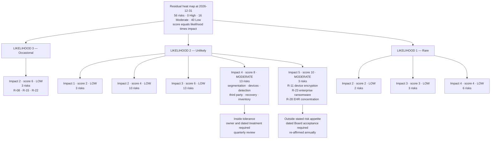
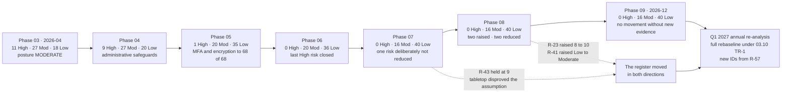

# 09.05 — Risk Posture &amp; Heat Map

| Field | Value |
|---|---|
| Document ID | MBH-ERM-RSK-2026-905 |
| Program | MercyBridge Health Network — HIPAA Security Program |
| Phase | 09 — Executive Reporting, Program Maturity &amp; Continuous Compliance |
| Version | 1.0 |
| Date | 2026-07-15 |
| Classification | Confidential — Electronic Protected Health Information (ePHI) // Illustrative Portfolio Sample |
| Owner | Michelle Tran, VP Enterprise Risk (register custodian) |
| Co-Owner | Daniel Cho, Chief Information Security Officer &amp; HIPAA Security Official |
| Approver | Robert Feldman, Board Audit &amp; Compliance Committee Chair |
| Author | Advisory Team (Healthcare GRC / HIPAA) |
| Status | Approved |

## Purpose

This is the register at programme close: all **56 risks** to the confidentiality, integrity and availability of ePHI, where each one sits, how the position moved across nine phases, which residuals are outside the Board's stated appetite, and what 2027 is likely to bring.

It is written for a Board that has to decide whether to believe it. So the structure inverts the usual order: **the two risks that went up are §4, before the reductions in §6.** A register that only falls is a register that has stopped describing the organisation and started describing the programme's ambitions for it.

> **Position at 2026-12-31: 56 risks — 0 High · 16 Moderate · 40 Low. Overall posture Low-to-Moderate. Eleven High risks eliminated since the 2026-04 baseline. Two residuals raised in the closing phase. Three residuals sit outside stated risk appetite under dated Board acceptance.**

## 1. Method — Unchanged Since 03.05

Nothing about the scoring model changed during the programme. Changing the scale is the most common way a register manufactures improvement.

| Element | Definition |
|---|---|
| Score | **Likelihood × Impact**, each on a 1–5 scale, assessed **residually** — after crediting controls actually in place and evidenced |
| Bands | **High 15–25 · Moderate 8–12 · Low 1–6** |
| Escalations | **ESC-1** patient-safety device availability; **ESC-2** loss or extended unavailability of the longitudinal clinical record; **ESC-3** clinical data integrity. Each floors impact at 5 where it applies |
| Re-scoring rule | On **evidenced** implementation only — a configuration export, a test record, a coverage report. Never on a project plan |
| Raising rule (**ADR-0021**) | Where independent testing disproves an assumption a residual depended on, the rating is **raised** to what the evidence supports, at the date of discovery. Closing the finding is not sufficient |
| Conditional claims | A reduction claimed on a named future test **reverts** if the test does not happen, exactly as it would if the test failed |
| New IDs | Created only at the annual re-analysis under 03.10, continuing from R-56, so the register does not drift between analyses |
| Custodian | **Michelle Tran**, VP Enterprise Risk. Rating and ownership changes require the Security Official's approval and are logged with date, actor and rationale |

## 2. The Heat Map at Programme Close

**Likelihood × Impact, 56 risks.** Bands: **High 15–25 · Moderate 8–12 · Low 1–6**.

| Likelihood ↓ / Impact → | **1 — Negligible** | **2 — Minor** | **3 — Moderate** | **4 — Major** | **5 — Severe** |
|---|---|---|---|---|---|
| **5 — Almost certain** | — | — | — | — | — |
| **4 — Likely** | — | — | — | — | — |
| **3 — Occasional** | — | **6 · LOW · 3** R-08 · R-15 · R-22 | — | — | — |
| **2 — Unlikely** | **2 · LOW · 3** R-39 · R-53 · R-56 | **4 · LOW · 10** R-03 · R-04 · R-07 · R-21 · R-25 R-26 · R-32 · R-38 · R-45 · R-50 | **6 · LOW · 13** R-05 · R-13 · R-14 · R-18 · R-19 R-34 · R-42 · R-43 · R-49 · R-51 R-52 · R-54 · R-55 | **8 · MODERATE · 13** R-02 · R-06 · R-09 · R-10 · R-12 R-17 · R-24 · R-30 · R-35 · R-36 **R-41** · R-47 · R-48 | **10 · MODERATE · 3** R-11 · **R-23** · R-28 |
| **1 — Rare** | — | **2 · LOW · 2** R-33 · R-46 | **3 · LOW · 3** R-16 · R-20 · R-27 | **4 · LOW · 6** R-01 · R-29 · R-31 · R-37 R-40 · R-44 | — |

| Band | Cells occupied | Risks | Share |
|---|---|---|---|
| **High** (15–25) | **0** | **0** | 0% |
| **Moderate** (8–12) | 2 | **16** | 28.6% |
| **Low** (1–6) | 7 | **40** | 71.4% |
| **Total** | 9 of 25 | **56** | 100% |

**Two features of this grid are worth an executive's attention.** First, **no risk has a likelihood above 3, and nothing at likelihood 4 or 5 survives.** At the 2026-04 baseline, seven risks sat at likelihood 4 and one — mailbox compromise — at likelihood 5. Most of the programme's work was likelihood reduction: MFA, encryption, segmentation, credential elimination, detection. Second, **the entire Moderate band sits in two cells**, both at likelihood 2, and the three worst are there because **impact is floored at 5 by an escalation rule** that no control can lift. That is the shape of a health system's residual risk: rare, severe, and structural.

## 3. Trajectory Across Nine Phases

| Phase | Closed | **High** | **Moderate** | **Low** | Posture | What moved it |
|---|---|---|---|---|---|---|
| 01 — Program Foundation | 2026-02 | — | — | — | Not yet assessed | Scope and governance established; **the register did not exist** |
| 02 — ePHI Inventory | 2026-03 | — | — | — | Not yet assessed | 210 systems discovered, 68 in scope; the population the register would describe |
| **03 — Risk Analysis** | 2026-04 | **11** | **27** | **18** | **Moderate** | **The baseline.** 56 risks identified, scored and owned |
| 04 — Administrative Safeguards | 2026-07 | **9** | 27 | 20 | Moderate | R-02 and R-34 reduced to Moderate; 31 of 56 risks treated by administrative measures alone |
| 05 — Physical &amp; Technical Safeguards | 2026-07 | **1** | 20 | 35 | Low-to-Moderate | **The largest single movement in the programme.** MFA 44 → 68 of 68; encryption at rest 51 → 68 of 68; 96 shared logins to 0. Six High risks closed |
| 06 — Business Associate Risk | 2026-07 | **0** | 20 | 36 | Low-to-Moderate | **The last High risk closed.** R-28 reduced 15 → 10 by a nine-measure treatment of the Halcyon concentration; impact stayed floored at 5 |
| 07 — Incident Response &amp; Breach | 2026-08 | 0 | **16** | **40** | Low-to-Moderate | Four risks moved Moderate → Low; R-23 reduced **conditionally**; **R-43 deliberately not reduced** because the tabletop disproved its sizing assumption |
| 08 — Independent Assessment | 2026-11 | 0 | **16** | **40** | Low-to-Moderate | **Same totals, different composition.** R-43 out to Low; **R-41 in from Low**; R-23 raised within band; R-24 reduced within band |
| **09 — Executive Reporting** | 2026-12 | **0** | **16** | **40** | **Low-to-Moderate** | **No movement, by design.** A reporting phase that moved the register would be re-scoring risk without new evidence |

**The observation the Board should draw from this trajectory.** The register fell hard in Phase 05 because that is where technology closed risk, and it has been essentially flat since Phase 07 — three consecutive phases at 0 High and two at exactly 0/16/40. **Flatness at this point is the correct result, not a stall.** Phases 08 and 09 tested and reported; they did not build. If the register had continued falling through a validation phase, the validation would not have been validating anything.

## 4. The Risks That Went Up

**This section is deliberately placed before the reductions.**

A risk register is a statement about what the organisation believes. Beliefs are sometimes wrong, and the only way anyone finds out is by testing them. **If testing never raises a rating, one of two things is true: the testing is not adversarial, or the register is not honest.** MercyBridge raised two ratings in 2026, both in the closing phase, both on its own commissioned testing, and both are in Tab C of the December Board pack.

### 4.1 R-23 — Enterprise ransomware disabling Tier 1 clinical systems

| Field | Position |
|---|---|
| Rating movement | **Moderate 8 → Moderate 10** (2 × 4 → 2 × 5). Raised within band |
| Owner | Daniel Cho |
| What happened | Phase 07 reduced impact from 5 to 4 on the basis that an independently keyed, restore-verified immutable replica of the clinical archive makes an enterprise ransomware event a **bounded outage with the record recoverable** rather than a loss. The reduction was written down as **conditional**, in 07.11, on a named future test: the joint full-scale restoration test with Halcyon Health in 2026-09 |
| What went wrong | **The test did not fail. It did not happen.** Vendor sequencing pushed it to 2027-02-28 |
| Why the rating moved | Under the conditional-claim rule, a slipped test is treated exactly as a failed test, because the claim it was to support is unproven either way. The impact reduction was withdrawn and ESC-2 restored impact to 5 |
| Corroboration | Self-reported by the CIO before either external assessor arrived; subsequently confirmed independently by Internal Audit (08.05 §6) and by Beacon Assurance, which scored the corresponding requirement at **25%** — the lowest single score in the i1 assessment — and opened **CAP-01** |
| What restores the reduction | **M-2 completing successfully by 2027-02-28, then CAP-01 closing by 2027-03-31.** R-23 returns to 8 on demonstrated recoverability, not on schedule |
| Board position | Escalated to the Audit &amp; Compliance Committee 2026-11-24. **A second re-baseline is not authorised.** A further slip returns with a recovery plan, not a new date |

### 4.2 R-41 — Unaccounted ePHI outside the governed inventory

| Field | Position |
|---|---|
| Rating movement | **Low 6 → Moderate 8** (2 × 3 → 2 × 4). **Band change** |
| Owner | Marcus Reed |
| What happened | **PT-03.** Ironwood found an internet-facing appointment application, live since 2018, superseded in 2023, never decommissioned, holding **6,880 records** of name, date of birth, contact details and free-text reason-for-visit. It appeared in **no** ePHI inventory. It had no owner, no BAA dependency, no patching path and no logging |
| Why the rating moved | The Low residual rested on an assumption: that discovery scanning had bounded the unstructured sprawl. **It had not.** The score expressed a belief about completeness and the test proved the belief wrong |
| Why remediation was not enough | The application is gone, the database is under legal hold, the host was sanitised, and **IV-05** now reconciles the inventory quarterly against DNS, certificate transparency and external attack-surface data so an orphan can survive at most one quarter. All of that is true, and none of it retroactively makes the old score correct on the date it was assigned |
| What restores the reduction | **Two consecutive clean quarterly reconciliations** under IV-05 — first due 2027-03-31, second 2027-06-30 |
| Standing consequence | **ADR-0021** was written because of this case: *testing that disproves an assumption raises the rating; closing the finding is not sufficient* |

**Why this matters more than any reduction in this document.** A Board that is shown a register in which risk only ever falls learns, over a few cycles, to discount it — and then it discounts the one cycle where the number was trying to tell it something. The two increases above cost MercyBridge nothing except the discomfort of reporting them, and they are the reason the other fifty-four entries are worth reading.

## 5. The Sixteen Moderate Residuals

| Risk | Description | L × I | Movement in 2026 | Owner | Disposition |
|---|---|---|---|---|---|
| **R-11** | ePHI at rest on device platforms that cannot encrypt; loss forfeits safe harbour (ESC-1) | **2 × 5 = 10** | 15 → 10 | Anthony Ruiz | **Structural.** Validated by three lenses; Ironwood recovered no plaintext ePHI **Outside appetite** |
| **R-23** | Enterprise ransomware disabling Tier 1 clinical systems (ESC-2) | **2 × 5 = 10** | 20 → 8 → **raised to 10** | Daniel Cho | **Raised.** M-2 and CAP-01 **Outside appetite** |
| **R-28** | Compromise or extended outage of the vendor-hosted Halcyon EHR holding 2.1M records (ESC-2) | **2 × 5 = 10** | 15 → 10 | Daniel Cho | **Structural.** O-6 customer-managed keys open **Outside appetite** |
| **R-02** | Shared and generic logins defeat unique identification and audit attribution | 2 × 4 = 8 | 16 → 8 | Marcus Reed | **Held** — PT-02 proved the class still existed; broker mandate has no operating history |
| **R-06** | Vendor remote-support entitlements under-reviewed | 2 × 4 = 8 | Held at 8 | Anthony Ruiz | **Held** — CAP-02 |
| **R-09** | KEV vulnerabilities on unsupported-OS devices that cannot be patched | 2 × 4 = 8 | 16 → 8 | Anthony Ruiz | **Structural.** KEV at 0; the population cannot be remediated |
| **R-10** | Malware propagation into device VLANs halting clinical devices (ESC-1) | 2 × 4 = 8 | 15 → 8 | Anthony Ruiz | **Held** — PT-01 proved the boundary was not as documented; two clean IV-07 cycles required |
| **R-12** | Devices without an MDS2 cannot be assessed to a consistent standard | 2 × 4 = 8 | 9 → 8 | Anthony Ruiz | **Held** — CAP-06, 72 hosts |
| **R-17** | Incomplete micro-segmentation permits lateral movement to Tier 1 | 2 × 4 = 8 | 16 → 8 | Anthony Ruiz | **Held** — proven in one direction, disproven in another; IV-06 and IV-07 |
| **R-24** | Double-extortion exfiltration of ePHI before encryption | 2 × 4 = 8 | 16 → 12 → 9 → **8** | Daniel Cho / Rebecca Stern | **Reduced within band** on measured detection 48% → 74% |
| **R-30** | Subcontractor (BA-of-BA) chain not visible | 2 × 4 = 8 | 9 → 8 | Lisa Coleman | **Held** — IA-F-03 and CAP-02 found the same thin layer |
| **R-35** | Extended dwell time because telemetry does not reach the SIEM | 2 × 4 = 8 | 12 → 8 | Marcus Reed | **Held** — 3 of 68 systems still not forwarding |
| **R-36** | Workforce browses records without a TPO purpose | 2 × 4 = 8 | 12 → 8 | Rebecca Stern | **Held** — IA-F-02; the control operates, the evidence does not always survive |
| **R-41** | Unaccounted ePHI outside the governed inventory | 2 × 4 = 8 | 12 → 6 → **raised to 8** | Marcus Reed | **Raised** — PT-03 |
| **R-47** | Tier 1 restoration time never validated at full scale | 2 × 4 = 8 | 12 → 8 | Anthony Ruiz | **Held** — validated for 7 of 12, unchanged all year; CAP-01 at 25% |
| **R-48** | Backup immutability incomplete for Tier 2–3 systems | 2 × 4 = 8 | Held at 8 | Anthony Ruiz | **Held** — 6 of 9 complete; closes Q1 2027 |

### 5.1 The Ten Residuals Deliberately Held

Ten of the sixteen were **remediated and not reduced**. That is a decision, not an oversight, and it rests on a single rule from 08.11: *a finding closed and re-tested proves the fix existed on a date; it does not prove the control operates.*

| Held residual | Remediation delivered | Why the score did not move | What moves it |
|---|---|---|---|
| **R-02 / R-06** | Per-engineer vendor accounts; privileged-access broker mandated with MFA and session recording across all third-party remote support | The broker mandate has **no operating history** — it went live in Q4 2026 | Broker adoption across the full third-party population; CAP-02 closure, 2027-04-30 |
| **R-10 / R-17** | Default-deny device boundary rebuilt; 412 legacy devices removed from workstation-VLAN reachability; IV-06 exception expiry; IV-07 quarterly purple-team validation | The fix is verified. **The process that let the boundary rot in the first place is not** — a 2019 static route and a 2024 ACL rule coexisted undetected | **Two clean quarterly IV-07 validations**, Q1 and Q2 2027 |
| **R-12** | Passive attribution at 93.2%; MDS2 procurement clause added | 72 hosts still cannot accept credentialed assessment | CAP-06, 2027-06-30 |
| **R-30** | Flow-down amendment templates; tiering model approved 2026-12-05 | 62 of ~180 BAs reviewed; two lenses found the same thin layer below the critical tier | CAP-02 and IA-F-03, 2027-04-30 |
| **R-35** | 34 new detection analytics; WAF out of monitor-only; vendor jump host onboarded | **3 of 68** systems still do not forward logs; escalation median 41 minutes against a 30-minute target | CAP-03 (2027-01-31) and the detection re-measure in the 2027 penetration test |
| **R-36** | Reviewer attestation made a system-enforced workflow step, deployed 2026-12-14 | **Two review cycles** are required before the evidence exists | IA-F-02 evidence period, 2027-01-31 |
| **R-47** | Restoration sequencing exercised; gates G1–G8 defined with clinical acceptance | **The validation count did not move all year: 7 of 12 in Q1, 7 of 12 in Q4** | CAP-01, dependent on M-2 |
| **R-48** | Immutability delivered for 6 of 9 remaining Tier 2–3 systems | Three remain | V-24, Q1 2027 |

**The uncomfortable arithmetic.** Had MercyBridge reduced all ten on closure evidence, the register would close at roughly **0 High / 6 Moderate / 50 Low** and the programme would look substantially more successful than it is. Every one of those reductions would have been withdrawn at the first follow-up audit that asked for an operating period.

### 5.2 Structural Residuals That Will Not Reduce

Four residuals are not open items awaiting a workplan. They are properties of what MercyBridge is, and no plausible 2027 or 2028 activity closes them.

| Residual | Score | Why it is structural | What is actually being managed |
|---|---|---|---|
| **R-11 — ePHI at rest on unencryptable device platforms** | **10** | Five medical device platforms **cannot encrypt at all** under vendor OS constraint. The devices are FDA-cleared and under manufacturer change control; MercyBridge cannot modify them and cannot remove them from clinical service | Physical control, segmentation, disposal certification, and accepting that there is **no cryptographic safe harbour** on loss for this population. Reduces only as the fleet is replaced, over years |
| **R-09 — KEV vulnerabilities on unsupported-OS devices** | 8 | **1,300 devices — 21.2% of the fleet — run a manufacturer-unsupported operating system.** There is no patch to apply. FDA-cleared configuration under vendor change control (PC-3) makes this structurally permanent | Compensating packages under IV-04, 96 default-deny device VLANs, passive detection, and quarterly boundary validation. **KEV instances are at 0 and the underlying condition is unchanged** |
| **R-28 — vendor-hosted EHR concentration** | **10** | The entire **2.1 million-record** clinical archive sits with a single business associate. Replacing a core EHR is a multi-year, multi-hundred-million-dollar undertaking, and MercyBridge retains full HIPAA liability regardless of who holds the data | The nine-measure plan from Phase 06: independent ePHI export outside vendor control, a tested exit path, enhanced contract terms, assurance beyond reading a SOC 2, joint exercise, key-custody escalation, SLA commitments, downstream mapping, executive escalation. **Impact stays floored at 5 permanently.** Only likelihood was ever reducible |
| **R-12 — devices that cannot accept credentialed assessment** | 8 | 72 hosts have no vendor-supported assessment path. The constraint is contractual and technical, not budgetary | Vendor path negotiation (18 of 72 agreed), passive inference, replacement at end of life |

**What the Board should hear from this table.** Three of the four highest residuals in the register — R-11, R-23 and R-28 — are consequences of running a modern hospital: an installed base of regulated medical devices that cannot be patched or encrypted, and a clinical record held by a vendor. **They are not evidence of a weak security programme. They are the reason the security programme exists,** and they will appear on this register in 2027, 2028 and 2029.

## 6. The Reductions, and What Earned Them

| Risk | Movement | The evidence that earned it | Who verified |
|---|---|---|---|
| **R-01** MFA incomplete | High 16 → **Low 4** | MFA extended 44 → **68 of 68**; PT-05 found and closed the last legacy authentication path; 14 exceptions reviewed and 11 revoked | Internal Audit 100% coverage test; Ironwood; HITRUST at 100% |
| **R-40** ePHI at rest unencrypted | High 16 → **Low 4** | Encryption at rest 51 → **68 of 68**; the entire estate moved under the breach safe harbour, confirmed in a live incident | Internal Audit tested all 68; **Ironwood defeated no encryption and recovered no plaintext ePHI** |
| **R-02** shared clinical logins | High 16 → Moderate 8 | **96 shared clinical logins eliminated to 0** | Internal Audit; the residual is Held, not reduced further, because PT-02 found a surviving vendor service credential |
| **R-34** mailbox compromise | High 15 → **Low 6** | Legacy non-MFA connector retired; item-level mailbox auditing; inbox-rule anomaly detection; phishing click 11.4% → 4.2%, report rate 22.4% | Live incident INC-2026-0044 contained in 41 minutes; social-engineering test |
| **R-28** EHR concentration | High 15 → Moderate 10 | The nine-measure Phase 06 plan; likelihood reduced, **impact deliberately not** | HITRUST; SOC 2 Type II reliance after scope and competence review |
| **R-24** double extortion | High 16 → Moderate 8 | Detection measured **48% → 74%**; egress baselining; leak-site monitoring; **no data extracted at any point in the penetration test** | Ironwood; purple-team re-measure |
| **R-31 / R-37** BA notification timing; IR capability | Moderate 8 / 12 → **Low 4** | Contractual clocks in 24 of 24 critical BAAs and exercised in a live incident; IR plan, playbooks, TTX-2026-01, 3 live incidents | Internal Audit **re-performed all three four-factor assessments and reached the same conclusion** |
| **R-43** reconciliation integrity | Moderate 9 → **Low 6** | HIM surge model re-based from a 48-hour to a 10-day outage; agency surge contract executed | **Internal Audit verified the closure.** This is the Phase 07 disproof, corrected with evidence |
| **R-49** outpatient downtime | Moderate 9 → **Low 6** | Downtime kits verified at all ~30 sites; **CLIN-2026-01 drill conducted 2026-12-08 at 6 sites**; conditional flag removed | Drill records; Internal Audit |

**Note what is absent from this table.** R-51 (unattended logged-in workstations) and R-52 (tailgating and badge-sharing) were **not** reduced, despite auto-lock being tightened to five minutes clinically and badge controls holding at both clinical sites — because **two independent lenses each found the defect**. PT-15 observed two unattended sessions and succeeded at one of two sampled administrative entrances; Internal Audit observed four of sixty workstations. Where testing finds a control, the control is not reduced on the strength of the fix applied afterwards.

## 7. Risk Appetite and Tolerance

Approved by the Board on the recommendation of the Audit &amp; Compliance Committee, and re-affirmed annually as item 3 of the December pack.

| Statement | Position |
|---|---|
| **Appetite — High risk** | **MercyBridge accepts no High residual risk (15–25) to ePHI.** A High residual requires either a treatment plan delivering reduction within 90 days, or a time-bounded exception approved by the Audit &amp; Compliance Committee with a named executive owner. **No High risk may be accepted by management alone** |
| **Tolerance — Moderate at 8** | Tolerated where there is a named owner, a dated treatment action and quarterly Committee review. This is where 13 of the 16 Moderate residuals sit |
| **Outside appetite — Moderate at 10 or 12** | **Requires explicit, dated Board acceptance, re-affirmed annually, with the reason it cannot be reduced stated in writing.** Three residuals sit here |
| **Low** | Monitored. Documented acceptance permitted at executive level; re-evaluated at the annual re-analysis |
| **Zero tolerance — no exception available** | (a) ePHI at rest unencrypted on any system **capable** of encryption; (b) any ePHI system without MFA for remote or privileged access; (c) any KEV-listed vulnerability open beyond **7 days** on an ePHI system; (d) any business associate handling ePHI without an executed BAA; (e) any use of a shared or generic clinical login |
| **Patient safety override** | Where a control creates a credible risk to patient care, the CMIO may require an alternative. The alternative is documented, risk-assessed and Committee-visible. **A clinical objection suspends a control; it does not delete the risk** |
| **Appetite for uncertainty** | MercyBridge does **not** accept an unquantified residual. Where a risk cannot be measured, the response is to commission measurement, not to score it optimistically. This is the appetite statement that produced the 48% detection measurement and the PT-03 discovery |

### 7.1 The Three Residuals Outside Appetite

| Risk | Score | Board acceptance | Why it cannot be reduced now | Re-affirmation |
|---|---|---|---|---|
| **R-11** — unencryptable ePHI on medical device platforms (ESC-1) | **10** | Accepted 2026-07; re-affirmed 2026-12 | Five device platforms cannot encrypt under vendor OS constraint. Removing them from clinical service is not an option | Annually, with the fleet replacement position |
| **R-23** — enterprise ransomware (ESC-2) | **10** | Accepted 2026-12, **conditionally and for one period only** | Enterprise-scale recoverability is unproven because M-2 slipped. **This acceptance expires when M-2 completes or on 2027-06-30, whichever is first** | Not automatic — the Committee must re-decide |
| **R-28** — Halcyon EHR concentration (ESC-2) | **10** | Accepted 2026-07; re-affirmed 2026-12 | The entire clinical archive sits with one BA; replacement is a multi-year programme. Impact is permanently floored at 5 | Annually, with the vendor assurance and exit-path position |

**The R-23 acceptance is written differently from the other two on purpose.** R-11 and R-28 are accepted because they cannot be fixed. R-23 is accepted because a test has not been run — which is a temporary and correctable state, and an acceptance with no expiry would let it stop being temporary.

## 8. The 2027 Outlook

### 8.1 Expected Movement in the Registered Population

| If this happens by | Then | Effect on the register |
|---|---|---|
| **2027-01-31** — CAP-03 closes; 68 of 68 forwarding to the SIEM | R-35 and R-55 gain their missing coverage | R-35 candidate for reduction at Q2 2027 review |
| **2027-02-28** — **M-2 completes successfully** | The recoverability claim becomes evidenced | **R-23 returns to 8.** If it slips again, it stays at 10 and goes to the Board with a recovery plan |
| **2027-03-31** — CAP-01 closes; 12 of 12 Tier 1 validated | The programme's weakest domain reaches full scope | **R-47 candidate for reduction**; contingency maturity moves 2 → 3 |
| **2027-03-31 and 2027-06-30** — two clean IV-05 reconciliations | The completeness assumption is re-earned on evidence | **R-41 returns to Low** |
| **2027-04-30** — CAP-02 and IA-F-03 close | BA monitoring extends below the critical tier | R-30 and R-06 candidates for reduction |
| **Q1 and Q2 2027** — two clean IV-07 purple-team validations | The device boundary is proven to hold over time, not once | R-10 and R-17 candidates for reduction |
| **2027-06-30** — CAP-05 and CAP-06 close | Legacy wireless and unassessable hosts resolved | R-12 candidate; R-09 unchanged — it is structural |
| **2027-09** — annual penetration test | Detection re-measured adversarially, not by purple team | **Could move R-24 and R-35 in either direction** |

**Best realistic case at 2027 close: 0 High · 9–11 Moderate · 45–47 Low.** **Most likely case: 0 High · 12–14 Moderate · 42–44 Low**, because at least two of the dated items above will slip and at least one 2027 test will disprove something. **The three structural residuals will still be there.**

### 8.2 Emerging Risks

These are **candidate risks**, not register entries. Under 03.10, new IDs are created only at the annual re-analysis, so each will be formally scored at the **Q1 2027 re-analysis** and, if registered, will take an ID continuing from **R-57**. Recording them as candidates rather than as risks prevents the register drifting between analyses while ensuring nothing is lost.

| Candidate | Emerging risk | Why now | Likely disposition at Q1 2027 |
|---|---|---|---|
| **C-01** | **Clinical AI and ambient documentation tools** processing ePHI — model-training clauses, vendor sub-processors, output stored outside the designated record set | Clinical demand is arriving faster than the BA onboarding cycle; Dr. Ortega has three requests in flight | **Register.** Likely Moderate; the governance gap, not the technology, is the risk |
| **C-02** | **Mass exploitation of a managed file transfer or remote access platform** in the BA population — the sector's dominant 2023–2026 breach vector | ~180 BAs, 71 registered downstream entities, 9 fourth parties. CAP-02 shows monitoring below the critical tier is thin | **Register.** Relates to R-30 but is distinct — this is fourth-party concentration, not chain visibility |
| **C-03** | **Finalisation of the 2025 HIPAA Security Rule NPRM** — mandatory MFA, encryption at rest and in transit, network segmentation, asset inventory, annual penetration testing, and removal of the addressable/required distinction | The rule is **proposed and not in force**. MercyBridge already meets most of it as forward-looking readiness | **Watch, not register.** A compliance-cost and evidence-burden risk rather than an ePHI risk. Owned by Karen Boyd with Lisa Coleman under trigger TR-8 |
| **C-04** | **Halcyon contract renewal and vendor consolidation** — a change of ownership, hosting model or subcontractor at the EHR vendor | The single largest concentration in the estate; O-6 key custody is still open | **Register as a modifier to R-28** rather than a new ID, unless the event materialises |
| **C-05** | **Identity attacks that defeat MFA** — session-token theft, push fatigue, help-desk social engineering | MFA at 68 of 68 changes the attack, it does not remove it. R-39 already covers service-desk reset abuse at Low | **Register.** The 2027 penetration test scope should include an MFA-bypass objective |
| **C-06** | **Ambulatory growth outpacing the inventory reconciliation cycle** — new sites and acquired practices joining faster than quarterly reconciliation can absorb | IV-05 runs quarterly; trigger TR-7 requires analysis before ePHI integration, and the two cadences can conflict | **Watch.** Managed by tightening TR-7 rather than by a new ID |
| **C-07** | **Medical device end-of-support cliff** — a concentrated block of the 1,300 unsupported-OS devices reaching a point where compensating controls become unsupportable | Structural; the replacement cycle is capital-constrained | **Register as a time-bounded modifier to R-09** with a capital-plan dependency |
| **C-08** | **Patient right-of-access and information-blocking pressure** expanding FHIR API egress paths | More sanctioned egress paths mean more places ePHI legitimately leaves, each requiring authorisation and logging | **Register.** Low-to-Moderate; interlocks with Rebecca Stern's Privacy programme |
| **C-09** | **Cyber insurance attestation risk** — a control attestation made to an insurer that the evidence base cannot support | The programme now has an evidence base that could support attestations; the risk is making one that outruns it | **Watch.** Owned by Lisa Coleman; attestations reviewed against the evidence repository before signature |

## 9. Register Governance at Close

| Control | Position |
|---|---|
| Register of record | `trackers/risk-register.xlsx`; this document is the point-in-time statement of it |
| Custodian | Michelle Tran; all rating and ownership changes approved by Daniel Cho and logged with date, actor and rationale |
| Cadence | Quarterly review at the Security Steering Committee; quarterly reporting to the Enterprise Risk Committee and the Audit &amp; Compliance Committee; **full rebaseline at the Q1 2027 annual re-analysis** under 03.10 TR-1 |
| Reconciliation to target | 03.08 set a target profile of **0 High / 23 Moderate / 33 Low**. Actual is 0 / 16 / 40 — High matches, Moderate is 7 better and Low 7 higher than target. Reconciled formally at the annual re-analysis |
| Retention | Six years from the later of creation or last effective date, §164.316(b)(2)(i); superseded versions retained, not overwritten |
| Availability | Produced to HHS OCR, Internal Audit, Beacon Assurance and Ironwood Security Labs on request |
| Escalation | Any raise, any new High, and any residual moving outside appetite are mandatory Committee agenda items under thresholds E-2 and E-3 |

## Cross-References

| Reference | Relevance |
|---|---|
| 03.05 — Likelihood, Impact &amp; Risk Determination | The 5×5 model, bands and ESC escalations applied unchanged |
| 03.07 — Risk Register | The 56 risks as originally scored; the 11 High baseline |
| 03.08 — Risk Management Plan | The 0 / 23 / 33 target profile reconciled in §9 |
| 03.10 — Periodic Review &amp; Update | The Q1 2027 rebaseline and the rule that new IDs start at R-57 |
| 05.12 — Control-to-Risk Traceability | The Phase 05 movement that produced the largest single reduction |
| 06.11 — Control-to-Risk Traceability | Where the last High risk closed |
| 07.11 — Control-to-Risk Traceability | The R-23 conditional claim and the R-43 refusal to reduce |
| 08.03 — Penetration Test Results | The PT-03 discovery behind R-41 and the detection position |
| 08.05 — Internal Audit of the Security Program | Independent confirmation of the residual position |
| 08.07 — HITRUST i1 Assessment Results | CAP-01 at 25% and the BC/DR domain at 79% |
| 08.11 — Control-to-Risk Traceability | The four-way movement model — validated, held, raised, reduced |
| ADR-0021 — Raise Risk on a Disproved Assumption | The standing rule behind §4 |
| 09.02 — Board &amp; Committee Reporting | Tab C; escalation thresholds E-2 and E-3 |
| 09.04 — Program Maturity Assessment | Why maturity and residual risk move at different speeds |
| 09.06 — Annual Evaluation §164.308(a)(8) | The evaluation that consumes and feeds this register |

---
[⬅ Previous](09.04-program-maturity-assessment.md) · [🏠 Phase 09 Home](09.00-README.md) · [Next ➡](09.06-annual-evaluation-164-308-a-8.md)
