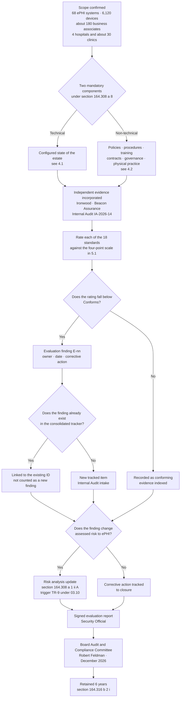

# 09.06 — Annual Evaluation §164.308(a)(8)

| Field | Value |
|---|---|
| Document ID | MBH-ERM-EVL-2026-906 |
| Program | MercyBridge Health Network — HIPAA Security Program |
| Phase | 09 — Executive Reporting, Program Maturity &amp; Continuous Compliance |
| Evaluation reference | **EVAL-2026-01** |
| Version | 1.0 |
| Date | 2026-07-15 |
| Classification | Confidential — Electronic Protected Health Information (ePHI) // Illustrative Portfolio Sample |
| Owner | Daniel Cho, Chief Information Security Officer &amp; HIPAA Security Official |
| Co-Owner | Karen Boyd, Chief Compliance Officer (non-technical lead) · Michelle Tran, VP Enterprise Risk |
| Approver | Daniel Cho, CISO &amp; HIPAA Security Official — signature at §12 |
| Independent reviewer | Priya Anand, Director of Internal Audit |
| Author | Advisory Team (Healthcare GRC / HIPAA) |
| Status | Approved |

## Purpose

This is the **formal evaluation report required by 45 CFR §164.308(a)(8)** for the period **2026-02-02 to 2026-12-31**. It is a regulatory deliverable, not a management summary, and it is written to be produced to the HHS Office for Civil Rights on request without amendment.

It states the standard, the scope evaluated, the methodology applied in both its technical and its non-technical components, the evaluators and the basis of their independence, the period covered, the findings by standard, the corrective actions with owners and dates, the required linkage to the §164.308(a)(1)(ii)(A) risk analysis, the trigger conditions for off-cycle evaluation, the limitations of the work, and the Security Official's signed conclusion.

## 1. The Standard

> **45 CFR §164.308(a)(8) — Evaluation.** *"Perform a periodic technical and nontechnical evaluation, based initially upon the standards implemented under this rule and, subsequently, in response to environmental or operational changes affecting the security of electronic protected health information, that establishes the extent to which a covered entity's or business associate's security policies and procedures meet the requirements of this subpart."*

| Element of the standard | Requirement | How EVAL-2026-01 discharges it |
|---|---|---|
| **Periodic** | A defined, documented recurring cycle | Annual comprehensive evaluation, plus quarterly control-operation reviews, established under POL-14 and 04.09 §6. This is the **first** annual cycle |
| **Technical** | Testing the configured state of systems and controls | §4.1 — configuration inspection across 68 ePHI systems, 100%-population analytics, independent penetration test, authenticated vulnerability scanning, log-forwarding verification from received-events data |
| **Non-technical** | Policies, procedures, training, sanctions, contracts, governance, physical practice | §4.2 — 24-policy review, training and sanction records, ~180-BA contract population, committee minutes, site walkthroughs at 12 locations |
| **Based initially upon the standards implemented** | The first evaluation baselines against the Security Rule itself | §6 — all **18 standards** rated individually, with §164.314 and §164.316 rated supplementarily |
| **In response to environmental or operational changes** | Event-driven evaluation independent of the calendar | §9 — eight trigger classes T-E1 to T-E8 with defined windows |
| **Establishes the extent to which policies and procedures meet the requirements** | A written conclusion with ratings and findings, not an activity log | §6, §7 and the signed conclusion at §11 |

**Standard, not specification.** §164.308(a)(8) carries **no implementation specifications**. The standard is itself **required**, so there is no addressable analysis available and no §164.306(d)(3)(ii) rationale that could substitute for performing it. The duty is absolute.

**What this evaluation is not.** It is not a compliance determination. **No document produced by a covered entity, and no certificate issued by any private body, constitutes a determination of HIPAA compliance — OCR neither endorses nor recognises any certification for that purpose.** This report establishes the extent to which MercyBridge's policies and procedures meet the requirements of Subpart C, as evaluated, with its limitations stated at §10.

## 2. Scope

| Dimension | In scope |
|---|---|
| Entity | MercyBridge Health Network, a HIPAA covered entity — 4 hospitals, ~30 outpatient and clinic sites, ~1,200 licensed beds, ~6,500 workforce members |
| Protected asset | Electronic protected health information — approximately **2.1 million patient records** |
| Systems | **68 of 210** enterprise information systems that create, receive, maintain or transmit ePHI |
| Devices | **6,120** networked medical devices and IoMT assets |
| Third parties | **~180 business associates**, of which **24** are Critical or High tier; 71 registered downstream entities; 9 fourth parties |
| Facilities | Primary and secondary data centres; biomedical staging facility; 3 of 4 hospitals and 7 of ~30 clinic sites visited during fieldwork |
| Regulatory scope | 45 CFR Part 164 **Subpart C** (§164.302–318) in full, and the **Breach Notification Rule** at §164.400–414 as it bears on incident and breach apparatus |
| Documentation | The 24-policy HIPAA security suite and its supporting procedures; the evidence repository of **8,412** controlled artefacts |

| Explicitly out of scope | Why |
|---|---|
| The **142 non-ePHI** systems | Security Rule scope is ePHI. Network adjacency to ePHI systems **was** evaluated; the systems themselves were not |
| HIPAA **Privacy Rule** (Subpart E) beyond ePHI security | Rebecca Stern's function; separate evaluation cycle and separate internal audit IA-2026-09 |
| **Halcyon Health's internal control environment** | Reliance placed on the vendor's SOC 2 Type II report after review for scope, competence and independence. **MercyBridge's oversight of Halcyon was evaluated; Halcyon was not** |
| The **security posture of the ~180 business associates themselves** | MercyBridge's oversight programme was evaluated. Each BA's own posture is its own obligation under HITECH direct liability |
| Clinical quality, patient-safety and revenue-cycle controls | Outside the Security Rule |
| Ironwood's penetration test **methodology** | Assessed for competence and independence to establish reliance; not re-performed |

## 3. Evaluators and Independence

Evaluation under §164.308(a)(8) is performed **by** the covered entity. The Rule does not require an external evaluator. It does require the result to be credible, and MercyBridge applies two structural safeguards: **the person who operates a control does not rate that control**, and **the evaluation is independently reviewed by a function that reports to the Board rather than to management**.

| Role | Individual | Contribution | Independence position |
|---|---|---|---|
| **Evaluation owner and signatory** | **Daniel Cho**, CISO &amp; HIPAA Security Official | Owns POL-14; approved scope; signs the conclusion; presents to the Board Committee | Reports to the CEO with a functional line to the Audit &amp; Compliance Committee. **Does not report through IT operations** |
| Technical evaluation lead | Marcus Reed, Information Security Manager | Configuration evidence, coverage testing, vulnerability and detection data | **Excluded from rating the controls he operates** — activity review, incident handling and training design were rated by Internal Audit |
| Non-technical evaluation lead | Karen Boyd, Chief Compliance Officer | Policy currency, training, sanctions, documentation, OCR protocol mapping | Reports to the CEO, independent of IT and Security delivery |
| Clinical evaluation | Dr. Samuel Ortega, CMIO | Break-glass review, downtime practice, clinical workflow realism | Independent of Security and IT |
| Infrastructure evidence | Anthony Ruiz, CIO | Configuration, backup, hosted-service and device evidence | **Rated by others.** The CIO supplies evidence for contingency and infrastructure; he does not rate those standards |
| Contract evaluation | Lisa Coleman, General Counsel | ~180-BA population; §164.314(a) clause conformance | Independent of Security |
| Risk integration | Michelle Tran, VP Enterprise Risk | Findings converted into register movement under 03.10 | Register custodian; not a control owner |
| **Independent review** | **Priya Anand**, Director of Internal Audit | Reviewed the evaluation for completeness and challenge; rated the controls the Security function operates; separately issued **IA-2026-14** | **Reports functionally to the Board Audit &amp; Compliance Committee (Robert Feldman)**, administratively to the CEO. Not to the CISO, CIO or CCO. Authored no policy, designed no control, performed no remediation. Held a private session with the Committee Chair on **2026-11-24 without management present** |
| Board oversight | Robert Feldman, Audit &amp; Compliance Committee Chair | Receives this report and the management response | Non-executive |

### 3.1 Independent Evidence Relied Upon

The technical component of this evaluation draws substantially on work performed by parties with no stake in the outcome. Reliance was established before use.

| Source | Party | Independence basis | What it contributed |
|---|---|---|---|
| Penetration test and re-test, 2026-09-07 → 2026-09-25 | **Ironwood Security Labs, LLC** | Third-party firm contracted through Legal, not Security; fixed fee with no contingency; never implemented a MercyBridge control; report delivered simultaneously to CISO, Compliance and Internal Audit | 16 findings; adversarial validation of segmentation, authentication, encryption and inventory; first measurement of detection rate |
| HITRUST i1 Validated Assessment, 2026-10 → 2026-11 | **Beacon Assurance, LLC**, HITRUST Authorized External Assessor | Accredited assessor firm; performed no remediation or implementation work; HITRUST prohibits contingent fee arrangements; results submitted directly to HITRUST, which performed its own quality review | 182 requirement statements validated; 8 corrective action plans; independent scoring of 19 control domains |
| Internal audit **IA-2026-14**, 2026-11 | **Priya Anand**, Director of Internal Audit | Board reporting line; no role in the audited programme; salaried with no outcome-contingent element; management response appended, not merged | Operating-effectiveness testing over eleven months; 100%-population analytics; re-performance of all three breach determinations |
| Vendor assurance | Halcyon Health Systems SOC 2 Type II | Reviewed for scope, period, competence and independence before reliance | Control environment of the hosted EHR, within stated report limits |

## 4. Methodology

### 4.1 Technical Component

| Technique | Applied to | Volume | Source of evidence |
|---|---|---|---|
| Configuration inspection | MFA, encryption at rest, encryption in transit, automatic logoff, unique identification | **68 of 68** ePHI systems | Platform extracts, timestamped |
| Log-forwarding verification | Audit log generation and central receipt | 68 systems, verified from **SIEM received-events data** rather than from the onboarding tracker | SIEM |
| Authenticated vulnerability scanning | Server estate | **1,842 of 1,914 hosts (96.2%)**, monthly; weekly for internet-facing | Vulnerability platform |
| Passive device discovery and vulnerability inference | Medical device estate — active scanning prohibited on patient-connected devices | 6,120 devices; attribution confirmed for **5,704 (93.2%)** | Passive sensors, MDS2 register |
| **Adversarial testing** | Perimeter, internal network, wireless, applications, physical, social engineering | Grey-box across 6 domains; **16 findings**, all remediated and independently re-tested; **0 ePHI records extracted** | Ironwood report and retest letters |
| 100%-population data analytics | Privileged accounts, dormant accounts, terminated-user access | **1,182** privileged accounts; **412** terminations | IAM, HR feed, SIEM |
| Restore verification | Tier 1 backup and restoration | 12 Tier 1 systems documented; **7 validated**; 8 restore tests | Restore test records |
| Detection measurement | Alerting against known adversary actions | 48% at test, **74%** on re-measurement | Purple-team run sheet reconciled to SIEM |
| Requirement-statement validation | Prescriptive control set | **182** HITRUST i1 requirement statements at **93.1%** | Beacon Assurance; HITRUST quality review |

### 4.2 Non-Technical Component

| Technique | Applied to | Volume | Source of evidence |
|---|---|---|---|
| Policy and procedure review | The 24-policy suite and supporting procedures | **24 of 24** policies; procedure library | Document register |
| Process walkthrough | Control processes end to end | **22** processes | Interview and observation records |
| Attribute sampling | Provisioning, terminations, training, BAAs, incidents, change records, disposals, break-glass | **11** populations, sized at 25 for monthly-or-more-frequent controls and 100% for quarterly-or-less-frequent | Workpapers |
| Re-performance | Access recertification, **four-factor breach assessment logic**, backup restore verification, risk scoring | **4**, including **3 of 3** breach determinations re-performed with the same conclusion reached on each | Internal Audit workpapers |
| Contract examination | Business associate agreements | **40 of ~180**, including **24 of 24** critical | Contract register |
| Governance review | Committee charters, minutes, escalation records, designation record | Board Committee, Steering Committee, HIPAA Security Committee | `governance/` |
| Training and sanction review | Workforce records | **100% of 6,512** workforce members; sanction register | LMS, HR |
| **Physical walkthrough** | Facility access, workstation practice, badge and escort controls, visitor logging | **12 locations** across 3 hospitals, 7 clinics, 2 data centres | Observation records |
| Regulator-shaped self-review | OCR Audit Protocol inquiry set | **91 inquiries** — 78 fully evidenced, 10 with a dated gap, 3 not evidenced | OCR protocol mapping workbook |
| Evidence production drill | Unannounced simulated data request | **38 of 42 items (90.5%)** in a 10-day window; median **1.5 business days** | RFI-DRILL-2026-01 |

## 5. Period Covered and Rating Scale

| Attribute | Position |
|---|---|
| **Evaluation period** | **2026-02-02 (programme kickoff) to 2026-12-31** |
| Fieldwork windows | Technical: 2026-09-07 → 2026-12-15. Non-technical: 2026-10-01 → 2026-12-19. Physical walkthroughs: 2026-11 |
| Report date | December 2026 board cycle |
| Basis | First annual cycle; baselined against the Security Rule standards as implemented, per the "based initially upon" clause |
| Next annual evaluation | **2027 Q3**, reported in the 2027 Q4 board cycle |
| Next full risk re-analysis | **Q1 2027**, under 03.10 trigger TR-1 |

### 5.1 Rating Scale

| Rating | Definition |
|---|---|
| **Conforms** | Policies and procedures meet the requirement, and evidence demonstrates operation across the declared scope for the period, without exception or with exceptions immaterial to the requirement |
| **Conforms with observation** | The requirement is met. Isolated exceptions were identified that do not defeat the control objective, and each has a corrective action, an owner and a date |
| **Partially conforms** | The requirement is met in design and in part in operation, but a **material gap in scope, evidence or validation** prevents an unqualified conclusion. A corrective action is mandatory |
| **Does not conform** | The requirement is not met. Escalation to the Board is automatic |

## 6. Findings by Standard

**18 standards evaluated: 8 Conform · 5 Conform with observation · 5 Partially conform · 0 Do not conform.**

### 6.1 §164.308 — Administrative Safeguards

| Standard | Citation | Rating | Basis for the rating |
|---|---|---|---|
| Security Management Process | §164.308(a)(1) | **Conforms with observation** | Risk analysis complete, current and enterprise-wide across all 68 systems; Internal Audit traced 15 of 56 risks to source evidence; sanction policy operating. **(ii)(D) information system activity review was performed but the reviewer attestation was not retained for 3 of 25 sampled months** — **E-01** |
| Assigned Security Responsibility | §164.308(a)(2) | **Conforms** | Designation documented with authority, budget and dual reporting lines; continuity provision defined; no exception |
| Workforce Security | §164.308(a)(3) | **Partially conforms** | 100% population test of **412** terminations found **6** with ePHI access removed **2 to 4 business days late**, against a policy standard of same-day for involuntary and 1 business day otherwise. **0 accesses were used post-termination.** The gap is concentrated in per-diem workers whose HR record closes on a different cycle — **E-02** |
| Information Access Management | §164.308(a)(4) | **Conforms with observation** | Minimum-necessary role model operating; 1,182 privileged accounts recertified at 100%; standing elevated EHR accounts reduced 214 → 63. **2 of 25 sampled provisioning approvals could not be evidenced**, though the access granted was appropriate in both cases — **E-03** |
| Security Awareness and Training | §164.308(a)(5) | **Conforms** | **97.8%** completion across 6,512 workforce members, 143 outstanding and all within grace; phishing click rate 11.4% → **4.2%**; report rate **22.4%** against a 20% target; role-based clinical content deployed |
| Security Incident Procedures | §164.308(a)(6) | **Conforms** | 4,118 events → 138 escalations → **3 declared incidents**; plan, playbooks and severity model approved; TTX-2026-01 conducted 2026-08-13; all 3 post-incident reviews completed inside 15 business days |
| **Contingency Plan** | **§164.308(a)(7)** | **Partially conforms** | Data backup, disaster recovery and emergency mode operation plans exist for **12 of 12** Tier 1 systems; immutable copies operating; quarterly restore verification passing; backups proven unreachable from any position achieved in adversarial testing. **The (ii)(D) testing-and-revision specification is not satisfied at enterprise scale: restoration is validated for only 7 of 12 Tier 1 systems, and the joint full-scale restoration test with the hosted EHR business associate did not occur in the period.** The corresponding HITRUST requirement scored **25%** — **E-04** |
| Evaluation | §164.308(a)(8) | **Conforms** | Programme established under POL-14; annual and quarterly cadence defined; eight change triggers documented; **this evaluation performed with both required components**; independently reviewed; report retained |
| Business Associate Contracts | §164.308(b)(1) | **Partially conforms** | BAA coverage **47 of 47** BA-involved ePHI systems; **24 of 24** critical BAs with current assurance; contractual notification at 5 days against a 60-day statutory outer limit. **3 of 40 sampled agreements lacked explicit §164.314(a)(2)(iii) subcontractor flow-down language, and ongoing monitoring reaches only 62 of ~180 business associates** — **E-05** |

### 6.2 §164.310 — Physical Safeguards

| Standard | Citation | Rating | Basis for the rating |
|---|---|---|---|
| **Facility Access Controls** | **§164.310(a)(1)** | **Partially conforms** | Zoned access across 4 hospitals and ~30 clinics; contingency operations, facility security plan, access control and validation, and maintenance records all addressed. **Inconsistency of operation across sites: a door-prop alarm was found disabled at one clinic; visitor logging was incomplete at one hospital entrance; adversarial testing succeeded at 1 of 2 sampled administrative entrances while holding at both clinical sites.** Three independent lenses identified the same defect — **E-06** |
| Workstation Use | §164.310(b) | **Conforms** | Policy and procedure define permitted functions and the manner of performance by care area; clinically co-signed automatic logoff intervals |
| Workstation Security | §164.310(c) | **Conforms with observation** | Physical safeguards deployed across the endpoint estate; badge-tap plus PIN on 3,550 endpoints. **4 of 60 observed workstations were unattended and unlocked; adversarial testing observed a further 2** — **E-07** |
| Device and Media Controls | §164.310(d)(1) | **Conforms with observation** | Disposal, media re-use, accountability and data backup-and-storage specifications addressed; sanitisation to NIST SP 800-88 witnessed. **1 sanitisation certificate was not filed, though the sanitisation was performed and witnessed** — **E-08** |

### 6.3 §164.312 — Technical Safeguards

| Standard | Citation | Rating | Basis for the rating |
|---|---|---|---|
| Access Control | §164.312(a)(1) | **Conforms with observation** | Unique user identification enforced — **96 shared clinical logins eliminated to 0**; emergency access procedure available to every clinician with 100% retrospective review; automatic logoff graded by care area; **encryption and decryption implemented on 68 of 68 systems**. **2 of 25 break-glass reviews were completed late, at 7 and 9 days against a 5-day standard** — **E-09** |
| **Audit Controls** | **§164.312(b)** | **Partially conforms** | Audit log generation verified on all 68 ePHI systems; retention model enforced; VIP and co-worker access monitoring operating. **3 of 68 systems do not forward audit records to the central SIEM at period end (65 of 68), with compensating documented local review in place.** This is the same defect identified by Internal Audit, HITRUST and the detection measurement — **E-10** |
| Integrity | §164.312(c)(1) | **Conforms** | Mechanisms to authenticate ePHI in place; 10 interface reconciliations tested with 0 exceptions; post-downtime reconciliation surge model re-based on a 10-day outage and independently verified closed |
| Person or Entity Authentication | §164.312(d) | **Conforms** | **MFA enforced on 68 of 68** ePHI systems for remote and privileged access; 100% coverage test performed; the single legacy authentication path found in adversarial testing was closed and re-tested; 14 exceptions reviewed and 11 revoked |
| Transmission Security | §164.312(e)(1) | **Conforms** | Integrity controls and encryption addressed on **68 of 68**; 22 external services and 14 interfaces tested clean post-remediation; HL7, DICOM, FHIR, Direct and SFTP paths governed |

### 6.4 Supplementary Requirements

| Requirement | Citation | Rating | Basis |
|---|---|---|---|
| Business associate contracts and other arrangements | §164.314(a) | **Partially conforms** | Required clauses present in the sampled critical population; **subcontractor flow-down and tiered monitoring incomplete below the critical tier** — linked to **E-05** |
| Policies and procedures | §164.316(a) | **Conforms with observation** | 24 of 24 policies approved, current and communicated. **2 operating procedures had not been updated to reflect plan revisions approved after the 2026-08 tabletop**; both re-issued 2026-12-09 — **E-11** |
| Documentation — written form, availability, retention, review and update | §164.316(b) | **Conforms** | **8,412** controlled artefacts across 18 index nodes; **100%** indexed to at least one Security Rule standard; six-year retention platform-enforced and sampled at 40 artefacts with **0** exceptions; median production **1.5 business days** |

## 7. Evaluation Findings and Corrective Actions

**Eleven findings. None rated Critical or High. None is a new defect — all eleven map to an item already on the consolidated findings register maintained by Internal Audit, which is itself a material result: a fourth review, applied last and using the regulator's own question set, found nothing the first three had missed.**

| ID | Standard | Finding | Corrective action | Owner | Due | Existing tracker ID |
|---|---|---|---|---|---|---|
| **E-01** | §164.308(a)(1)(ii)(D) | Reviewer attestation not retained for 3 of 25 sampled months | Make attestation retention a system-enforced workflow step; two review cycles to evidence | Marcus Reed | 2027-01-31 | IA-F-02 · ISS-17 |
| **E-02** | §164.308(a)(3) | 6 of 412 terminations had ePHI access removed 2–4 business days late; 0 accesses used post-termination | Automate the HR-to-IAM trigger for all worker types including per-diem; weekly exception reporting | Marcus Reed / HR Director | 2027-03-31 | IA-F-01 · CAP-07 · ISS-16 |
| **E-03** | §164.308(a)(4) | 2 of 25 provisioning approvals not evidenced | Enforce approval capture; manual bypass disabled 2026-12-11; evidence period running | Marcus Reed | 2027-02-28 | IA-F-07 · CAP-04 · ISS-21 |
| **E-04** | **§164.308(a)(7)(ii)(D)** | **Restoration validated for only 7 of 12 Tier 1 systems; the joint full-scale restoration test with the hosted EHR business associate did not occur in the period** | **Complete the joint restoration test, then validated 24-hour restoration for the remaining 5 Tier 1 systems.** Second re-baseline not authorised | Anthony Ruiz | **2027-02-28 → 2027-03-31** | **M-2 (overdue) · CAP-01 · R-47a · ISS-24** |
| **E-05** | §164.308(b)(1); §164.314(a) | 3 of 40 sampled BAAs lacked §164.314(a)(2)(iii) flow-down; monitoring reaches 62 of ~180 BAs | Complete the flow-down sweep across the full population; extend risk-tiered monitoring below the 24 critical BAs with annual attestation and evidence sampling | Lisa Coleman | 2027-04-30 | IA-F-03 · CAP-02 · ISS-18 |
| **E-06** | §164.310(a)(1) | Door-prop alarm disabled at one clinic; visitor logging incomplete at one hospital entrance; entry gained at 1 of 2 sampled administrative entrances | Quarterly alarm testing at all sites; electronic visitor logging at the two remaining paper sites | Facilities Director | 2027-02-28 | IA-F-04 · CAP-08 · PT-15 · ISS-14 |
| **E-07** | §164.310(c) | 4 of 60 observed workstations unattended and unlocked; 2 further observed adversarially | Automatic logoff reduced to 5 minutes in clinical exam areas; targeted awareness at the affected areas; session-telemetry metric to be introduced | Marcus Reed | 2027-Q3 | R-51 · PT-15 |
| **E-08** | §164.310(d)(1) | 1 sanitisation certificate not filed | Make certificate upload a mandatory closure step on the disposal ticket | Anthony Ruiz | 2027-01-31 | IA-F-08 · ISS-22 |
| **E-09** | §164.312(a)(1) | 2 of 25 break-glass reviews completed late, at 7 and 9 days against a 5-day standard | Automate the review-due alert to the CMIO office | Dr. Samuel Ortega | 2027-02-28 | IA-F-09 · ISS-23 |
| **E-10** | §164.312(b) | 3 of 68 ePHI systems not forwarding audit records centrally at period end | Complete SIEM onboarding; report monthly until closed. Compensating local review documented in the interim | Marcus Reed | 2027-01-31 | IA-F-05 · CAP-03 · D-3 · ISS-19 |
| **E-11** | §164.316(a) | 2 operating procedures not updated to reflect approved plan revisions | Procedural-dependency field added to change control so downstream procedures are identified at approval; both procedures re-issued 2026-12-09 | Karen Boyd | 2027-01-31 | IA-F-06 · ISS-20 |

| Finding statistics | Value |
|---|---|
| Findings raised by this evaluation | **11** |
| Rated Critical or High | **0** |
| **New defects not already on the consolidated tracker** | **0** |
| Findings with a named individual owner and a date | **11 of 11** |
| Findings dated inside H1 2027 | **10 of 11**; E-07 is 2027-Q3 |
| Findings past their date at report issue | **1 — E-04**, which carries the overdue M-2 dependency |
| Findings arising from a **standard that is not implemented at all** | **0** |

## 8. Linkage to the §164.308(a)(1)(ii)(A) Risk Analysis

Evaluation and risk analysis are **separate requirements** and are routinely conflated, which produces a document set that looks complete while leaving one of them unsatisfied. §164.308(a)(1)(ii)(A) asks *what could go wrong, how likely and how bad*. §164.308(a)(8) asks *do our policies and procedures meet the Rule, as operated*. Neither discharges the other, and an external penetration test discharges neither on its own.

They are nonetheless **coupled in both directions**, and the coupling is a mandatory step in this evaluation rather than a courtesy.

| Direction | Mechanism | What happened in this cycle |
|---|---|---|
| **Risk analysis → evaluation** | The 56-risk register determines where evaluation effort is concentrated. Standards supporting High and Moderate residuals receive deeper sampling | Contingency, audit controls, business associate contracts and access control received expanded testing because R-23, R-35, R-30 and R-02 sat in the Moderate band |
| **Evaluation → risk analysis** | Every finding is assessed for whether it changes assessed risk to ePHI. Where it does, it is fed to the register custodian under **03.10 trigger TR-9** within 30 days of report | **5 of the 11 findings had register consequences** — see below |
| **Both → the annual re-analysis** | This report is a mandatory input to the **Q1 2027 full re-analysis** under 03.10 trigger TR-1, at which the register is rebaselined and new IDs are issued from R-57 | Scheduled; the nine candidate emerging risks in 09.05 §8.2 enter scoring at the same point |

| Evaluation finding | Register consequence | Movement |
|---|---|---|
| **E-04** contingency validation | **R-23** enterprise ransomware — the Phase 07 impact reduction was conditional on the restoration test; the test did not occur, so the condition lapsed | **RAISED 8 → 10.** R-47 **held** at 8 |
| **E-10** audit log forwarding | **R-35** dwell time and telemetry gaps; **R-55** activity review evidence | **Held.** Improved but not closed; moves on completion, not on progress |
| **E-01** attestation retention | **R-36** unauthorised record browsing | **Held.** A detective control that cannot be evidenced is not one an assessor will credit |
| **E-05** BA flow-down and monitoring | **R-30** subcontractor chain visibility; **R-06** vendor remote access | **Held.** Two independent lenses found the same thin layer |
| **E-06** physical consistency | **R-51** unattended workstations; **R-52** tailgating and badge-sharing | **Not reduced**, despite remediation, because two lenses each found the defect independently |
| Inventory completeness — identified in adversarial testing during the period | **R-41** unaccounted ePHI outside the governed inventory | **RAISED Low → Moderate.** The residual rested on a completeness assumption that testing disproved |

**The governing rule, recorded as ADR-0021.** *Where evaluation or independent testing disproves an assumption a residual depended on, the rating is raised to what the evidence supports at the date of discovery. Closing the finding is not sufficient.* An evaluation cycle that produced only reductions would be an evaluation cycle that had not evaluated anything.

**Register position at the close of the evaluation period: 56 risks — 0 High · 16 Moderate · 40 Low. Overall posture Low-to-Moderate.** Detail at 09.05.

## 9. Off-Cycle Evaluation Triggers

The standard requires evaluation *"in response to environmental or operational changes affecting the security of electronic protected health information"* — a duty **independent of the calendar**. Eight trigger classes are defined under POL-14 and 04.09 §4. A triggered evaluation is scoped to the change, completed inside the stated window, and recorded in the same evaluation log as the annual cycle.

| # | Trigger class | Illustrative event | Window | Scope of the triggered evaluation | Owner |
|---|---|---|---|---|---|
| **T-E1** | New or materially changed ePHI system | A 69th ePHI system enters the inventory; a major Halcyon EHR version upgrade | **30 days of go-live** | System-level technical evaluation; inventory and data-flow update | Marcus Reed |
| **T-E2** | New or changed business associate | A Tier 1 hosted service onboarded; a critical BA replaced or acquired | **Before ePHI is disclosed** | BAA clauses, due diligence, subcontractor chain | Lisa Coleman |
| **T-E3** | Significant security incident | Any SEV-1, or a SEV-2 involving ePHI exposure | **30 days of closure** | Controls implicated by the incident; post-incident review findings | Daniel Cho |
| **T-E4** | Environmental or infrastructure change | Micro-segmentation rollout, data-centre migration, cloud adoption, network re-architecture | **60 days of completion** | Affected technical safeguards and contingency assumptions | Anthony Ruiz |
| **T-E5** | Organisational change | Acquisition of a practice or clinic site; new service line; **change of Security Official** | **90 days** | Full scoping re-run for the acquired entity; governance continuity | Daniel Cho |
| **T-E6** | **Regulatory change** | **Finalisation of the 2025 HIPAA Security Rule NPRM**; new OCR guidance or enforcement position | **90 days of effective date** | Gap assessment against the changed requirement set | **Karen Boyd with Lisa Coleman** |
| **T-E7** | Assessment or audit finding | Penetration-test finding; HITRUST observation; internal audit finding | **30 days of report** | The control family in which the finding sits | Marcus Reed |
| **T-E8** | Threat-landscape shift | Sector-wide ransomware campaign against hospital systems; critical vendor advisory; KEV addition affecting a deployed clinical platform | **30 days**; **14 days** for a KEV-relevant alert | Detection, segmentation and contingency assumptions | Marcus Reed |

### 9.1 The 2025 HIPAA Security Rule NPRM

**The 2025 HIPAA Security Rule NPRM is a proposed rule. It is not in force, and nothing in this report treats it as a current legal obligation.** It is tracked as forward-looking readiness under **T-E6**, owned by **Karen Boyd with Lisa Coleman**, and reported semi-annually to the Audit &amp; Compliance Committee.

| Proposed requirement | MercyBridge position today | Gap if finalised as proposed |
|---|---|---|
| Mandatory **multi-factor authentication** | **68 of 68** ePHI systems | None |
| Mandatory **encryption of ePHI at rest and in transit** | **68 of 68** at rest and in transit | None for the 68 systems. **The medical device population that cannot encrypt (R-11) would require documented technical infeasibility** |
| Mandatory **network segmentation** | Implemented; 96 device VLANs with default-deny egress; quarterly purple-team validation under IV-07 | Evidence burden increases; the operating cadence already exists |
| Mandatory **asset inventory and network map** | 210 systems, 68 in scope, 6,120 devices, quarterly reconciliation under IV-05 | None in substance; the reconciliation cadence would become a stated requirement |
| Mandatory **annual penetration testing and vulnerability scanning** | Annual penetration test; monthly authenticated and weekly internet-facing scanning | **None — the current cadence exceeds the proposal** |
| **Removal of the addressable / required distinction** | Every addressable specification is **implemented**, not documented around | **None.** This was the reasoning recorded in ADR-0008 |

**The consequence of finalisation, stated plainly: MercyBridge would change a citation, not a calendar.** The two areas that would need work are documented technical infeasibility for the unencryptable device population, and the increased evidence burden that follows when a practice becomes a requirement.

## 10. Limitations

Stated so that a reader can judge the weight this report will bear.

| # | Limitation |
|---|---|
| 1 | This evaluation is performed by the covered entity. **It is not an audit, an attestation engagement, or a compliance determination**, and no covered entity can issue itself one |
| 2 | **No certification recognised.** HITRUST i1 certification is evidence of a diligent programme validated by an accredited assessor. OCR neither endorses nor recognises any certification as a determination of HIPAA compliance, and certification confers no protection against investigation, compliance review or civil money penalty |
| 3 | Sampling was applied to populations where 100% testing was not practicable. Samples were sized at 25 items for monthly-or-more-frequent controls with a tolerable deviation rate of 5%; **a sample cannot exclude the existence of undetected exceptions** |
| 4 | Medical device internals were not scanned. Active exploitation and fuzzing of patient-connected devices were prohibited on patient-safety grounds. Device conclusions rest on passive profiling, MDS2 forms and vendor attestation |
| 5 | The security posture of Halcyon Health and the wider ~180-business-associate population was **not** directly tested. MercyBridge's oversight was evaluated; reliance on SOC 2 Type II was established after review for scope, competence and independence |
| 6 | Adversarial testing establishes what could be reached in a **defined three-week window with a defined scope**. It does not establish that no other path exists |
| 7 | **Every remediation delivered in the period is less than three months old.** Durability over time is not evaluated here; it is the subject of the Q2 2027 follow-up audit |
| 8 | Conclusions are as at **2026-12-31**. Any environmental or operational change after that date engages a §9 trigger and is outside this report |
| 9 | The **142 non-ePHI systems** were evaluated only where they provide a network path to ePHI |

## 11. Conclusion

**Based on the technical and non-technical evaluation described in this report, and having regard to its stated limitations:**

**MercyBridge Health Network's security policies and procedures meet the requirements of 45 CFR Part 164, Subpart C, in all eighteen standards evaluated, subject to the qualifications set out below.**

- **Eight standards Conform.** Assigned Security Responsibility; Security Awareness and Training; Security Incident Procedures; Evaluation; Workstation Use; Integrity; Person or Entity Authentication; Transmission Security.
- **Five standards Conform with observation.** Security Management Process; Information Access Management; Workstation Security; Device and Media Controls; Access Control. In each case the control objective is met and isolated exceptions carry a dated corrective action.
- **Five standards Partially Conform.** Workforce Security; **Contingency Plan**; Business Associate Contracts; Facility Access Controls; Audit Controls. In each case the requirement is met in design and substantially in operation, and a material gap in scope, evidence or validation prevents an unqualified conclusion.
- **No standard was assessed as Not Conforming, and no required implementation specification is unimplemented.** Every addressable specification is implemented rather than documented around.

**The most significant deficiency identified is at §164.308(a)(7)(ii)(D), Testing and Revision Procedures.** Restoration of Tier 1 clinical systems is documented for 12 of 12 systems and **validated for 7**. The joint full-scale restoration test with the hosted EHR business associate did not occur within the evaluation period. **MercyBridge therefore cannot currently demonstrate that it can restore its clinical estate at enterprise scale within its stated recovery objective.** The test is overdue, is dated 2027-02-28, is not authorised for a second re-baseline, and is reported to the Board Audit &amp; Compliance Committee as an overdue item. The associated risk rating was **raised** rather than held.

**The most significant positive finding is that no independent lens applied during the period identified a defect that MercyBridge had not already identified, dated and assigned, or that was not found by another lens.** Four independent reviews — adversarial testing, vulnerability assessment, internal audit and an accredited external assessment — produced 33 findings resolving to 26 distinct issues, and a fifth review using the regulator's own Audit Protocol question set produced **zero** new findings. Sixteen adversarial findings were remediated and **independently re-tested**; none was closed on management assertion. No ePHI was extracted, no encryption was defeated, and no patient-connected medical device was affected.

**Corrective action.** Eleven findings, none Critical or High, all with a named individual owner and a date. Ten of the eleven are dated inside H1 2027; all are dated before the HITRUST certificate expiry of 2027-11-29. Progress is reported monthly to the Information Security Steering Committee and quarterly to the Board Audit &amp; Compliance Committee, with closure verified by Internal Audit rather than by the function delivering the remediation.

**This report is submitted to the Board Audit &amp; Compliance Committee for the December 2026 cycle, and is retained for six years from the later of creation or last effective date under §164.316(b)(2)(i).**

## 12. Signature and Distribution

| Role | Name | Action | Date |
|---|---|---|---|
| **HIPAA Security Official — evaluation owner and signatory** | **Daniel Cho**, Chief Information Security Officer | **Signed** | 2026-12 board cycle |
| Non-technical evaluation lead | Karen Boyd, Chief Compliance Officer | Contributed and concurred | 2026-12 |
| Register custodian | Michelle Tran, VP Enterprise Risk | Register consequences accepted and logged | 2026-12 |
| Independent reviewer | Priya Anand, Director of Internal Audit | Reviewed for completeness and challenge; management response appended, not merged | 2026-12 |
| Chief Executive | Dr. Helen Marsh, President &amp; CEO | Received | 2026-12 |
| Board oversight | Robert Feldman, Audit &amp; Compliance Committee Chair | Received and noted | 2026-12 |

| Distribution | Retention |
|---|---|
| Board Audit &amp; Compliance Committee; CEO; Executive Leadership Team; Internal Audit; the evidence repository | **Six years** from the later of creation or last effective date, §164.316(b)(2)(i). Superseded versions retained, not overwritten |
| Available on request to | HHS Office for Civil Rights; Internal Audit; Beacon Assurance; Ironwood Security Labs; the Board |
| Supporting evidence | `governance/annual-evaluation-report/EVAL-2026-01/` — workbook, per-standard evidence index, sampling records, management response |

## Cross-References

| Reference | Relevance |
|---|---|
| 01.04 — HIPAA Security Rule Overview | The 18 standards rated in §6 |
| 01.05 — Security Official Designation &amp; Governance | The §164.308(a)(2) designation evaluated and the signature authority at §12 |
| 02.02 — ePHI System Inventory | The 68-system scope in §2 |
| 03.07 — Risk Register | The 56 risks the evaluation is concentrated against |
| **03.10 — Periodic Review &amp; Update** | **The required linkage in §8; triggers TR-1 and TR-9; the Q1 2027 rebaseline** |
| **04.09 — Evaluation** | **POL-14; the programme this report executes; the T-E1 to T-E8 triggers in §9** |
| 04.11 — Policy Suite &amp; Documentation | The 24-policy suite evaluated under §164.316(a) |
| 07.06 — Breach Risk Assessment — Four Factor | The three determinations re-performed in the non-technical component |
| 08.03 / 08.04 — Penetration Test and Remediation | The adversarial evidence in §4.1 |
| 08.05 — Internal Audit of the Security Program | The independent review basis in §3 and the operating-effectiveness evidence |
| 08.07 — HITRUST i1 Assessment Results | The 182 validated requirement statements, and §6 of that document on what certification does not mean |
| 08.08 — OCR Audit Protocol Readiness | The 91-inquiry regulator-shaped self-review in §4.2 |
| 08.09 — Evidence Repository &amp; Documentation | The §164.316(b) position rated in §6.4 |
| 08.10 — Findings Remediation Tracker | The existing tracker IDs every §7 finding maps to |
| 09.02 — Board &amp; Committee Reporting | Tab I of the December pack; the escalation thresholds governing E-04 |
| 09.05 — Risk Posture &amp; Heat Map | The register position stated at the close of §8 |

---
[⬅ Previous](09.05-risk-posture-and-heat-map.md) · [🏠 Phase 09 Home](09.00-README.md) · [Next ➡](09.07-continuous-compliance-operating-model.md)
