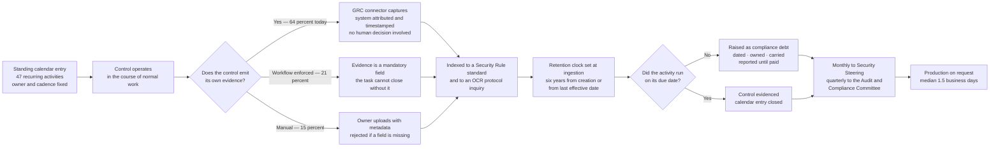

# 09.07 — Continuous Compliance Operating Model

| Field | Value |
|---|---|
| Document ID | MBH-ERM-CCM-2026-907 |
| Program | MercyBridge Health Network — HIPAA Security Program |
| Phase | 09 — Executive Reporting, Program Maturity &amp; Continuous Compliance |
| Version | 1.0 |
| Date | 2026-07-15 |
| Classification | Confidential — Electronic Protected Health Information (ePHI) // Illustrative Portfolio Sample |
| Owner | Karen Boyd, Chief Compliance Officer |
| Co-Owner | Daniel Cho, Chief Information Security Officer &amp; HIPAA Security Official · Marcus Reed, Information Security Manager |
| Approver | Daniel Cho, Chief Information Security Officer &amp; HIPAA Security Official |
| Author | Advisory Team (Healthcare GRC / HIPAA) |
| Status | Approved |

## Purpose

For eleven months MercyBridge has had a programme: a named start date of 2026-02-02, a budget line, an advisory team, a steering committee and a plan that ends. Programmes end. The obligation does not.

This document describes what replaces the programme. It defines the **continuous compliance operating model** — the standing calendar of control activities, the evidence those activities produce automatically, the retention machinery that holds it for the six years §164.316(b)(2)(i) requires, the ownership model that says who is accountable when nobody is watching, and the concept of **compliance debt**, which is how MercyBridge intends to keep track of the gap between what it has committed to and what it can currently evidence.

> **The test of this model is simple and unforgiving: if an OCR data request arrived on an ordinary Tuesday in 2028, with no notice and no programme team, would the answer still be 1.5 business days?**

The honest answer today is *probably, for most of it*. **64%** of the 8,412 evidence artefacts are captured automatically; the other **36%** depend on a named human filing something. Every evidence-related finding raised in Phase 08 — IA-F-02, IA-F-07, IA-F-08 and CAP-04 — was a failure of that 36%. This model is designed around that fact rather than around the 64% that already works.

## 1. What Actually Changes at Handover

Compliance stops being a project when three things become true at once: the work is on somebody's standing calendar rather than a plan, the evidence appears without anyone deciding to produce it, and the failure of the work is visible to someone other than the person doing it.

| Dimension | Programme mode (2026) | **Operating mode (2027 onward)** |
|---|---|---|
| Who drives the work | Advisory team and a programme plan with an end date | **Named control owners with a recurring calendar entry** |
| What triggers activity | A milestone | A **cadence**, or one of the five T-E event triggers in 04.09 |
| Where evidence comes from | Collected for an assessment | **Emitted by the control as it operates** |
| Who notices a miss | The programme manager | The **GRC platform**, then Internal Audit, then the Committee |
| How gaps are held | An action item in a plan that closes | **Compliance debt** — dated, owned, carried, and reported until paid |
| Funding | Programme budget | Departmental operating budget with a named cost centre |
| Assurance | A phase | **Annual cycle** — pen test, internal audit, HITRUST, OCR drill |
| The reporting line | Steering committee | Security Steering monthly · Audit &amp; Compliance Committee quarterly · Board annually |

**The single most important change is the third row.** Evidence generated as a by-product cannot be forgotten, backdated, or lost with the person who used to remember it. Evidence assembled before an audit is a research project run under time pressure by people guessing what the assessor wants, and the artefacts it produces are dated after the request — which proves the request, not the control.

## 2. The Control Operation Calendar

Forty-seven recurring control activities, each with a cadence, a single accountable owner, and a named evidence artefact that lands in a named repository node. This is the table handed to business as usual.

### 2.1 Daily

| # | Activity | Security Rule anchor | Owner | Evidence artefact | Node |
|---|---|---|---|---|---|
| D-01 | SIEM alert triage and escalation against the 30-minute detect-to-escalate target | §164.308(a)(1)(ii)(D); §164.312(b) | Marcus Reed | Alert queue export and case records | EV-06 |
| D-02 | Backup job completion and failure review across Tier 1 and Tier 2 | §164.308(a)(7)(ii)(A) | Anthony Ruiz | Backup job report with exceptions annotated | EV-09 |
| D-03 | Internet-facing attack-surface delta review | §164.308(a)(1)(ii)(B) | Marcus Reed | Daily surface delta report | EV-14 |
| D-04 | Break-glass emergency access event alerting to the CMIO office | §164.312(a)(2)(ii) | Dr. Samuel Ortega | Break-glass event list with review status | EV-05 |
| D-05 | New vendor and BA intake screening before any ePHI disclosure | §164.308(b)(1) | Lisa Coleman | Intake screening record | EV-07 |
| D-06 | Ransomware and threat-intelligence feed review against the 03.06 threat profile | §164.308(a)(5)(ii)(A) | Marcus Reed | Daily intel digest | EV-14 |

### 2.2 Weekly

| # | Activity | Security Rule anchor | Owner | Evidence artefact | Node |
|---|---|---|---|---|---|
| W-01 | HR-to-IAM termination exception report, all worker types including per-diem | §164.308(a)(3)(ii)(C) | Marcus Reed / HR Director | Exception report with dispositions | EV-03 |
| W-02 | Authenticated scan of internet-facing hosts | §164.308(a)(1)(ii)(B) | Marcus Reed | Scan output and SLA position | EV-14 |
| W-03 | Patch deployment against the KEV 7-day and critical 15-day windows | §164.308(a)(5)(ii)(B) | Anthony Ruiz | Deployment report with exceptions | EV-14 |
| W-04 | Incident register review and open-case stand-up | §164.308(a)(6)(ii) | Rebecca Stern | Register extract and minutes | EV-08 |
| W-05 | Open findings stand-up against the consolidated register | §164.308(a)(1)(ii)(B) | Priya Anand | Tracker extract with movement | EV-17 |
| W-06 | Medical device vendor advisory review and disposition | §164.310(d); §164.312(a)(1) | Clinical Engineering | Advisory disposition log | EV-15 |

### 2.3 Monthly

| # | Activity | Security Rule anchor | Owner | Evidence artefact | Node |
|---|---|---|---|---|---|
| M-01 | **Information system activity review** with system-enforced reviewer attestation | §164.308(a)(1)(ii)(D) | Marcus Reed | Review record **plus retained attestation** (the IA-F-02 fix) | EV-06 |
| M-02 | Authenticated vulnerability scan across the full ePHI estate | §164.308(a)(1)(ii)(B) | Marcus Reed | Scan results and coverage percentage | EV-14 |
| M-03 | Security Steering Committee | §164.308(a)(1)(i) | Daniel Cho | Minutes and decision log | EV-17 |
| M-04 | KRI and KPI pack production against the thresholds in 09.03 | §164.308(a)(8) | Marcus Reed | Metrics pack | EV-17 |
| M-05 | Evidence repository ingestion quality control and rejection-rate review | §164.316(b) | Marcus Reed | Ingestion QC report | EV-18 |
| M-06 | SIEM onboarding and coverage reconciliation against the 68-system inventory | §164.312(b) | Marcus Reed | Coverage report, 68 of 68 target | EV-06 |
| M-07 | Business associate incident and notification-clock review | §164.410; §164.314(a) | Lisa Coleman | BA incident log | EV-07 |
| M-08 | Compliance debt register review and ageing | §164.308(a)(1)(ii)(B) | Karen Boyd | Debt register with carrying costs | EV-17 |

### 2.4 Quarterly

| # | Activity | Security Rule anchor | Owner | Evidence artefact | Node |
|---|---|---|---|---|---|
| Q-01 | Access recertification for Tier 1 ePHI systems and all 1,182 privileged accounts | §164.308(a)(4)(ii)(C) | Marcus Reed | Recertification cycle record | EV-05 |
| Q-02 | **IV-05 ePHI inventory reconciliation** against DNS, certificate transparency and external attack-surface data | §164.308(a)(1)(ii)(A) | Marcus Reed | Reconciliation report and exceptions | EV-02 |
| Q-03 | **IV-07 purple-team validation of the medical device boundary** | §164.312(a)(1) | Marcus Reed | Purple-team record and detection rate | EV-15 |
| Q-04 | Exception register review — firewall, ACL, MFA and vulnerability exceptions with expiry | §164.312(a)(1); §164.312(d) | Marcus Reed | Exception register with re-approvals | EV-14 |
| Q-05 | Critical-tier business associate monitoring cycle, 24 of 24 | §164.308(b)(1); §164.314(a) | Lisa Coleman | Monitoring pack per BA | EV-07 |
| Q-06 | Tier 1 restore verification from immutable copy | §164.308(a)(7)(ii)(B) | Anthony Ruiz | Restore verification record | EV-09 |
| Q-07 | Policy review queue — the 24-policy suite on a rolling schedule | §164.316(a)–(b)(2)(iii) | Karen Boyd | Review and re-approval records | EV-01 |
| Q-08 | Physical safeguard walkthrough and **alarm testing** at sampled sites | §164.310(a)(1) | Facilities Director | Walkthrough record and alarm test log | EV-10 |
| Q-09 | Downtime and emergency-mode procedure spot check at two sites | §164.308(a)(7)(ii)(C) | Ambulatory Director | Spot-check record | EV-09 |
| Q-10 | **Audit &amp; Compliance Committee report** to Robert Feldman | §164.308(a)(1)(i) | Daniel Cho with Priya Anand | Committee pack and minutes | EV-17 |
| Q-11 | Risk register movement review with the register custodian | §164.308(a)(1)(ii)(A) | Michelle Tran | Register movement report | EV-02 |

### 2.5 Semi-annual

| # | Activity | Security Rule anchor | Owner | Evidence artefact | Node |
|---|---|---|---|---|---|
| S-01 | **Unannounced OCR data-request drill** against the standing production set | §164.316(b) | Karen Boyd | Drill request, responses and scoring | EV-18 |
| S-02 | Workforce phishing simulation cycle across ~6,500 staff | §164.308(a)(5)(ii)(B) | Karen Boyd | Campaign results and remedial training | EV-04 |
| S-03 | Subcontractor and downstream chain refresh across the 71 registered entities | §164.314(a)(2)(iii) | Lisa Coleman | Chain register refresh | EV-07 |
| S-04 | Disaster recovery exercise for a Tier 1 system in isolation | §164.308(a)(7)(ii)(D) | Anthony Ruiz | Exercise after-action report | EV-09 |

### 2.6 Annual

| # | Activity | Security Rule anchor | Owner | Evidence artefact | Node |
|---|---|---|---|---|---|
| A-01 | **§164.308(a)(1)(ii)(A) risk analysis refresh** across all 68 ePHI systems | §164.308(a)(1)(ii)(A) | Michelle Tran with Daniel Cho | Updated analysis and 56-risk register version | EV-02 |
| A-02 | **§164.308(a)(8) evaluation report** — technical and non-technical | §164.308(a)(8) | Daniel Cho | Evaluation report to the Committee | EV-17 |
| A-03 | Independent penetration test with mandatory retest of every finding | §164.308(a)(8) | Marcus Reed | Test report and retest letters | EV-16 |
| A-04 | Internal audit of the security programme reporting to the Committee | §164.308(a)(8) | Priya Anand | Audit file and opinion | EV-16 |
| A-05 | **HITRUST validated assessment or recertification** | §164.308(a)(8) | Daniel Cho | Certificate, MyCSF export, CAP schedule | EV-16 |
| A-06 | Full 24-policy suite review and re-approval | §164.316(a) | Karen Boyd | Approval records and version history | EV-01 |
| A-07 | Workforce security awareness training cycle for ~6,500 staff | §164.308(a)(5)(i) | Karen Boyd | Completion data by role | EV-04 |
| A-08 | BAA population review and annual assurance attestation across ~180 BAs | §164.314(a) | Lisa Coleman | Attestation register with sampled evidence | EV-07 |
| A-09 | **Joint full-scale restoration test with Halcyon Health** | §164.308(a)(7)(ii)(D) | Anthony Ruiz | Joint test report and validation count | EV-09 |
| A-10 | Contingency plan review, criticality analysis and applications/data criticality update | §164.308(a)(7)(ii)(E) | Anthony Ruiz | Reviewed plan and criticality analysis | EV-09 |
| A-11 | Sanction policy application summary and workforce disciplinary review | §164.308(a)(1)(ii)(C) | Karen Boyd with HR | Sanction record summary | EV-03 |
| A-12 | **Board report** on the security programme and residual risk position | §164.308(a)(1)(i) | Daniel Cho | Board pack and minutes | EV-17 |

### 2.7 Event-driven

Five triggers carried forward from 04.09. Each forces an out-of-cycle review of the affected control and its evidence, regardless of where the calendar sits.

| Trigger | Event | Forced action | Owner |
|---|---|---|---|
| **T-E1** | New or materially changed ePHI system, or an acquisition | Inventory update, risk analysis addendum, safeguard review | Michelle Tran |
| **T-E2** | Security incident at SEV-2 or above, or any four-factor determination | Control review of the failure path; register re-score if warranted | Daniel Cho |
| **T-E3** | New or terminated critical business associate | Tiering, BAA, due diligence, chain refresh | Lisa Coleman |
| **T-E4** | Regulatory change — including **finalisation of the 2025 NPRM** | Gap analysis, policy amendment, calendar amendment | Karen Boyd with Lisa Coleman |
| **T-E5** | Independent assessment finding, or a failed control test | Intake to the consolidated register within 5 business days | Priya Anand |

## 3. Evidence as a By-Product, Not a Scramble

**The design rule, stated once.** A control activity that produces no artefact is not on this calendar. If an activity is worth doing for §164.316(b) purposes and cannot be evidenced, either the activity is redesigned to emit something or it is removed and the underlying obligation is met a different way. There is no third option in which the organisation does valuable work it cannot prove — that is the position MercyBridge was in for **R-36**, where the activity review demonstrably operated and the attestation for 3 of 25 sampled months did not survive, and Internal Audit was right not to credit it.

## 4. The §164.316(b) Retention Machinery

The six-year clock is the most commonly misapplied provision in the Security Rule, and it is the one an enforcement action can turn on years after everyone involved has left. MercyBridge does not calculate it by hand.

| Machinery element | How it operates in business as usual | Failure mode it prevents |
|---|---|---|
| **Clock set at ingestion** | The artefact class and the effective-date field determine the retention date automatically. No user enters a destruction date | An artefact retained for six years from creation when it was in force for four more |
| **Later-of rule enforced in code** | For policies, procedures and agreements the clock starts at the **date last in effect**, not creation | The single most common §164.316(b)(2)(i) error |
| **Live documents have no expiry** | A policy in force carries a null retention date until superseded; supersession starts the clock | Premature destruction of a current policy's audit trail |
| **Legal hold overrides everything** | Applied by Lisa Coleman; currently in force on the PT-03 archived database and all three incident files | Destruction of material under investigation |
| **State-law maximum applies** | Where a state health-records requirement exceeds six years, the longer period governs | Compliance with HIPAA and non-compliance with state law |
| **Destruction requires a certificate** | Only on expiry, only with no hold, media sanitised under NIST SP 800-88, certificate retained | Undocumented disposal — the IA-F-08 finding |
| **Availability preserved** | Role-based read for every control operator; §164.316(b)(2)(ii) is a positive obligation, not a security exception | Evidence locked away from the people who operate the control |
| **Periodic review scheduled** | Annual minimum plus the T-E1 to T-E5 triggers; review restarts the version chain | A policy suite that nobody has read since approval |

| Retention assurance | Position |
|---|---|
| Artefacts under the model | **8,412 (100%)** |
| Retention calculation exceptions in the IA-2026-14 sample of 40 | **0** |
| Artefacts under legal hold | The PT-03 database, three incident files, and their associated determinations |
| First scheduled destruction event under the model | 2032 — no artefact created in this programme becomes eligible before then |
| Independent re-test of the model | Annually within the internal audit scope; sample size not below 40 |

## 5. Control Ownership and the RACI

One accountable owner per control activity. Not a department, not a committee, and not "Security" — a person, with a named deputy, because the model has to survive that person being on leave.

| Control family | **Accountable** | Responsible | Consulted | Informed |
|---|---|---|---|---|
| Risk analysis and management — §164.308(a)(1) | Daniel Cho | Michelle Tran, Marcus Reed | Karen Boyd, Anthony Ruiz | Board Committee |
| Workforce security and access — §164.308(a)(3)–(4) | Marcus Reed | HR Director, IAM team | Dr. Samuel Ortega | Karen Boyd |
| Awareness and training — §164.308(a)(5) | Karen Boyd | Training team | Daniel Cho | Executive team |
| Incident and breach — §164.308(a)(6); §164.400–414 | Rebecca Stern | Daniel Cho, CSIRT | Lisa Coleman, Dr. Samuel Ortega | Board Committee |
| Contingency and recovery — §164.308(a)(7) | Anthony Ruiz | IT Operations, Halcyon | Dr. Samuel Ortega, Ambulatory Director | Daniel Cho |
| Evaluation — §164.308(a)(8) | Daniel Cho | Priya Anand, external assessors | Karen Boyd | Board Committee |
| Business associates — §164.308(b); §164.314 | Lisa Coleman | Procurement, Rebecca Stern | Daniel Cho | Karen Boyd |
| Physical safeguards — §164.310 | Facilities Director | Site managers, Security Services | Marcus Reed | Anthony Ruiz |
| Technical safeguards — §164.312 | Marcus Reed | Infrastructure, Clinical Engineering | Dr. Samuel Ortega | Anthony Ruiz |
| Documentation and retention — §164.316 | Karen Boyd | Marcus Reed as evidence custodian | Lisa Coleman | Priya Anand |
| **Independent assurance over all of the above** | **Priya Anand** | Internal Audit | Robert Feldman | Executive team |

| Ownership rule | Statement |
|---|---|
| One name, not a function | A control with a departmental owner has no owner. Every one of the 47 activities names an individual |
| Named deputy | Each activity carries a deputy who has executed it at least once in the preceding twelve months |
| Segregation | The evidence custodian cannot approve his own control-operation evidence; Internal Audit samples independently |
| Handover protocol | An owner leaving triggers a 30-day documented handover with a run-book walkthrough; the calendar entry cannot be orphaned |
| Escalation on non-operation | Two consecutive missed cycles escalate from Steering to the Audit &amp; Compliance Committee automatically |

## 6. Compliance Debt

**Definition.** Compliance debt is the difference between the control position MercyBridge has committed to and the position it can currently evidence, expressed as work that is owed, with an owner, a date and a stated carrying cost. It is not the same as risk, and it is not the same as an open finding. A finding is a defect somebody found. Debt is a shortfall the organisation already knows about and has chosen — usually for good reasons of sequencing, capital or clinical safety — not to pay yet.

The reason for naming it is that undated debt is invisible, and invisible shortfalls are what make an organisation surprised by its own assessment.

| ID | Debt | Principal outstanding | **Carrying cost — what it costs to keep owing this** | Owner | Payment date |
|---|---|---|---|---|---|
| **CD-01** | Enterprise restoration validation | **5 of 12** Tier 1 systems documented but unvalidated | **R-23 held at Moderate (10)**; CAP-01 at **25%**, the lowest requirement score; the only OCR inquiry MercyBridge cannot answer | Anthony Ruiz | 2027-03-31 |
| **CD-02** | Centralised telemetry | **3 of 68** ePHI systems not forwarding to the SIEM | R-35 held; compensating local review is manual and does not scale; a detection blind spot of known size | Marcus Reed | 2027-01-31 |
| **CD-03** | Evidence automation | **36%** of artefacts still manually captured | Four Phase 08 findings originated here; production time and audit exposure both scale with this number | Marcus Reed | 2027-11 (80% target) |
| **CD-04** | Legacy wireless authentication | **173 of 214** devices on the PSK remnant | CAP-05 open; interim isolation is a compensating control, not a fix | Anthony Ruiz | 2027-06-30 |
| **CD-05** | Unassessable hosts | **54 of 72** hosts without an agreed vendor assessment path | CAP-06 open; these hosts are excluded from the 96.2% authenticated scanning figure | Anthony Ruiz | 2027-06-30 |
| **CD-06** | Business associate oversight depth | **~118 of ~180** BAs not yet under tiered monitoring | R-30 held; CAP-02 and IA-F-03 both point here; the exposure is contractual, not technical | Lisa Coleman | 2027-04-30 |
| **CD-07** | Vulnerability exceptions | **1,284** open exceptions, all with named owner and expiry | Each is an accepted residual; the population is the honest measure of what patching cannot reach | Marcus Reed | Continuous — reviewed quarterly |
| **CD-08** | Structurally unencryptable devices | **3,170** ePHI-bearing devices on platforms that cannot encrypt | **R-11 at Moderate (10)** and not reducible by this programme; safe harbour unavailable for this population | Clinical Engineering | Device replacement lifecycle to 2029 |
| **CD-09** | Procedure currency | 61 procedures on annual review; **2 lagged** in 2026 | R-54; a lagging procedure is an evidentiary gap before it is an operational one | Karen Boyd | Continuous — IA-F-06 control live |

| Debt discipline | Rule |
|---|---|
| No undated debt | Every entry carries an owner and a date. An item without both is escalated at the next Steering meeting |
| Debt is reported upward | Monthly to Security Steering, quarterly to the Audit &amp; Compliance Committee, with ageing |
| New debt requires an accepted exception | Taking on debt is a decision with a signature, an expiry and a compensating control — not a silent omission |
| Structural debt is labelled as such | **CD-08 will not be paid by this programme.** Saying so is more useful than carrying a date nobody believes |
| Debt is not risk | The register records risk. This register records **work owed**. An item can be low risk and high debt, and the reverse |
| The balance is a metric | Total debt items and their ageing are reported in the 09.03 scorecard, not buried in a tracker |

## 7. Automated Versus Manual Evidence

| Capture mode | Share at 2026-12-31 | **Target at 2027-11** | Examples |
|---|---|---|---|
| **Automated from source system** | **64%** | **80%** | Training completions, scan results, MFA coverage, log-retention proof, SIEM coverage, BAA register extracts, backup job outcomes |
| **Workflow-enforced at the point of action** | 21% | 15% | Provisioning approvals, disposal certificates, change records, incident files, reviewer attestations |
| **Manual submission with metadata validation** | 15% | **5%** | Committee minutes, walkthrough notes, physical observation records, vendor correspondence, clinical judgement records |

**Why the target is 80% and not 100%.** Some evidence is irreducibly human. A committee minute records a decision that a person made; a physical walkthrough records what an inspector saw; the CMIO's clinical judgement on a containment decision cannot be emitted by a system. Automating those would mean fabricating them. The correct target is to automate everything that a system already knows and to leave the residue clearly labelled as human testimony, captured within 48 hours of the event, with the observer named.

| Automation initiative for 2027 | Moves | Owner | Date |
|---|---|---|---|
| Activity-review attestation enforced in the GRC workflow (IA-F-02) | Manual → workflow | Marcus Reed | 2027-01-31 |
| Provisioning approval capture with the bypass disabled (IA-F-07 / CAP-04) | Manual → workflow | Marcus Reed | 2027-02-28 |
| Disposal certificate upload as a mandatory ticket closure step (IA-F-08) | Manual → workflow | Anthony Ruiz | 2027-01-31 |
| Break-glass review alerting to the CMIO office (IA-F-09) | Manual → automated | Dr. Samuel Ortega | 2027-02-28 |
| SIEM coverage reconciliation reported automatically against the 68-system inventory | Manual → automated | Marcus Reed | 2027-01-31 |
| BA attestation collection through the vendor portal | Manual → workflow | Lisa Coleman | 2027-04-30 |
| Electronic visitor logging at the two paper sites (CAP-08 / IA-F-04) | Manual → automated | Facilities Director | 2027-02-28 |

## 8. What Breaks This Model

Every operating model has failure modes, and an operating model published without them is a wish. These are MercyBridge's, with the early-warning indicator that would show the failure beginning and the trip-wire that forces action.

| Failure mode | How it actually breaks the model | Early-warning indicator | Trip-wire |
|---|---|---|---|
| **Staff turnover** | **Marcus Reed is the accountable owner for 15 of the 47 activities.** If he leaves, fifteen calendar entries lose their operator on the same day, and the deputy has executed some of them once | Any single owner above 12 activities; any activity whose deputy has not executed it in 12 months | Ownership concentration is a standing Steering metric; above 12, redistribution is mandatory, not advisory |
| **Vendor change** | Halcyon is acquired, changes its subcontractor chain, or withdraws the joint test window again. **A-09 is the only annual activity MercyBridge cannot perform unilaterally** | Vendor M&amp;A notice; SOC 2 scope change; a slipped joint test date | T-E3 fires; the Committee is informed within one reporting cycle; a second slip goes to the Board with a recovery plan |
| **Merger or acquisition** | MercyBridge acquires a practice and inherits systems that are inside the ePHI boundary from day one and inside the inventory in six weeks. **This is exactly the mechanism that produced the PT-03 orphan** | Any signed letter of intent involving a clinical entity | T-E1 fires at LOI, not at close. A 90-day integration protocol runs the inventory, risk addendum and BAA sweep before go-live |
| **Funding withdrawal** | The activities cut first are the ones with an invoice attached and no immediate clinical consequence: the pen test, the purple team, the HITRUST cycle. The organisation stops finding things and reads that as improvement | Any proposed reduction to the assurance line; a deferred assessment engagement | The §164.308(a)(8) obligation is not discretionary. Deferral of A-03, A-04 or A-05 requires a Board Committee decision on the record |
| **Clinical operational pressure** | A capacity surge or a system go-live suspends drills, walkthroughs and recertifications. The suspension is reasonable and nobody restarts them | Two consecutive missed cycles on any activity | Automatic escalation from Steering to the Committee; the missed cycle becomes compliance debt with a date |
| **Regulatory change** | The 2025 NPRM finalises with a compliance deadline and the calendar has to absorb a dozen new mandatory activities at once | Publication of a final rule; OCR guidance; enforcement pattern shift | T-E4 fires; 09.09 gap analysis is re-run within 30 days of publication |
| **Success** | Three good years produce the belief that the controls are self-sustaining, and the assurance spend looks like insurance nobody needs | Falling finding counts with static or falling test rigour | Finding count is **not** a success metric. A pen test that finds nothing gets its scope challenged before it gets celebrated |

## 9. The Standing Cadence Handed to Business as Usual

| Cadence | Activities | Owners involved | Reporting destination | First cycle in operating mode |
|---|---|---|---|---|
| Daily | 6 | Marcus Reed, Anthony Ruiz, Lisa Coleman, Dr. Samuel Ortega | Operational queues | 2027-01-05 |
| Weekly | 6 | Marcus Reed, Anthony Ruiz, Rebecca Stern, Priya Anand, Clinical Engineering | Security Operations review | 2027-01-09 |
| Monthly | 8 | Marcus Reed, Daniel Cho, Karen Boyd, Lisa Coleman | **Security Steering Committee** | 2027-01-26 |
| Quarterly | 11 | All control owners | **Audit &amp; Compliance Committee** — Robert Feldman | 2027-03-31 |
| Semi-annual | 4 | Karen Boyd, Lisa Coleman, Anthony Ruiz | Committee | 2027-06-30 |
| Annual | 12 | Daniel Cho, Michelle Tran, Priya Anand, Karen Boyd, Anthony Ruiz, Lisa Coleman | **Board of Directors** | 2027 cycle, reporting 2027-12 |
| Event-driven | 5 triggers | Trigger owner as listed in §2.7 | As the trigger dictates | On occurrence |
| **Total recurring activities** | **47** | 12 named accountable owners | — | — |

**What this table is for.** It is the artefact the programme hands over. Everything else in this portfolio describes how MercyBridge got to a defensible position; this table is how it stays there after the advisory team has gone, the budget line has closed, and the people who remember why each control exists have moved on. If a single row of it stops running and nobody notices for two quarters, the model has failed — which is why the trip-wire in §8 is two consecutive misses, and why the escalation is automatic rather than discretionary.

## Cross-References

| Reference | Relevance |
|---|---|
| 01.11 — Compliance Obligations Calendar | The obligation set this calendar operationalises |
| 03.10 — Periodic Review &amp; Update | The annual risk re-analysis at A-01 and its triggers |
| 04.09 — Evaluation | The §164.308(a)(8) programme and the T-E1 to T-E5 event triggers |
| 04.11 — Policy Suite &amp; Documentation | The 24-policy suite reviewed under Q-07 and A-06 |
| 05.06 — Audit Controls | The §164.312(b) activity the M-01 attestation evidences |
| 06.08 — Ongoing Monitoring &amp; Oversight | The BA monitoring cycle at Q-05 and the CD-06 debt |
| 07.02 — Incident Response Plan | The plan the W-04 and T-E2 activities keep live |
| 08.09 — Evidence Repository &amp; Documentation | The 18 nodes, the 64% automation baseline and the retention model |
| 08.10 — Findings Remediation Tracker | The four manual-capture findings this model is designed around |
| 08.11 — Control-to-Risk Traceability | Controls IV-05 and IV-07, now standing quarterly activities |
| 09.03 — Security Metrics, KRI &amp; KPI Program | Where cadence adherence and compliance debt are reported |
| 09.08 — Remediation Roadmap 2027–2029 | The dated work that pays down the debt in §6 |
| 09.11 — Program Closeout &amp; Transition to Operations | Where this model becomes the operating position |

---
[⬅ Previous](09.06-annual-evaluation-164-308-a-8.md) · [🏠 Phase 09 Home](09.00-README.md) · [Next ➡](09.08-remediation-roadmap-2027-2029.md)
