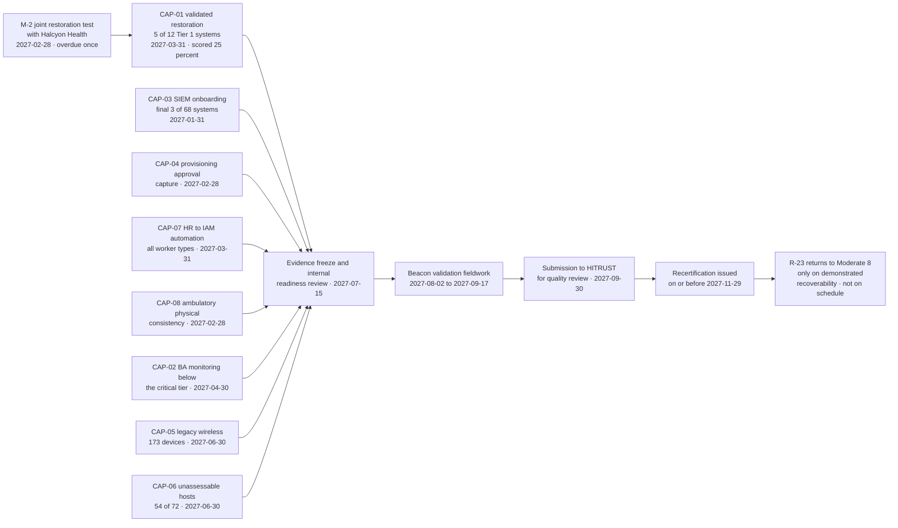
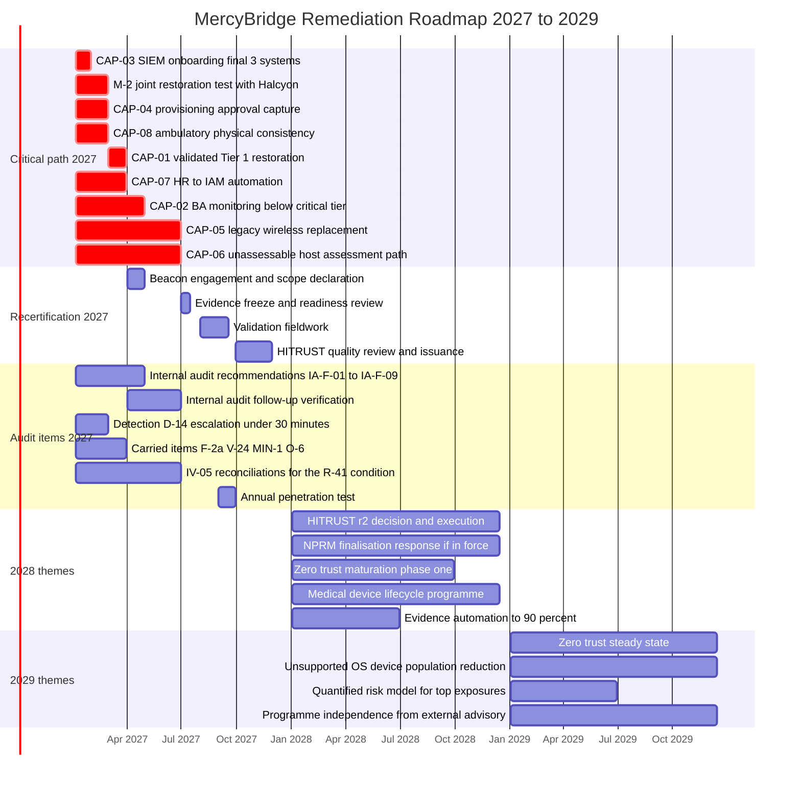

# 09.08 — Remediation Roadmap 2027–2029

| Field | Value |
|---|---|
| Document ID | MBH-ERM-RMP-2026-908 |
| Program | MercyBridge Health Network — HIPAA Security Program |
| Phase | 09 — Executive Reporting, Program Maturity &amp; Continuous Compliance |
| Version | 1.0 |
| Date | 2026-07-15 |
| Classification | Confidential — Electronic Protected Health Information (ePHI) // Illustrative Portfolio Sample |
| Owner | Daniel Cho, Chief Information Security Officer &amp; HIPAA Security Official |
| Co-Owner | Anthony Ruiz, Chief Information Officer · Karen Boyd, Chief Compliance Officer |
| Approver | Robert Feldman, Board Audit &amp; Compliance Committee Chair |
| Author | Advisory Team (Healthcare GRC / HIPAA) |
| Status | Approved |

## Purpose

The 2027 workplan was not written in this document. It was written by three independent assessors during 2026, and it arrived as **23 open items with named owners and dates**. This document sequences them, states what depends on what, identifies the **critical path to HITRUST Rapid Recertification before 2027-11-29**, and then looks two years further out at the themes that will define 2028 and 2029.

> **The roadmap in one line: 23 open items across 2027, of which 9 sit on the critical path to recertification · an indicative 2027 investment of ~$3.19M, of which ~$2.05M is funded and ~$1.14M is requested · two thematic years beyond that, deliberately less precise because precision at 30 months is fiction.**

It also states something that most roadmaps leave out. **A date without a funded owner is a wish.** Six of the 23 items depend on capital or headcount that is requested rather than approved, and four depend on a party MercyBridge does not control. Those are marked, not smoothed over — because the single most damaging thing this roadmap could do is give the Board twenty-three dates of apparently equal reliability.

## 1. What the Roadmap Is Built From

| Source | Items | Verification body | Consequence of missing the date |
|---|---|---|---|
| **HITRUST i1 corrective action plans** | **8** | Beacon Assurance at recertification | An overdue CAP **jeopardises renewal** of the certificate expiring 2027-11-29 |
| **Internal audit recommendations (IA-2026-14)** | **9** | Priya Anand, follow-up audit Q2 2027 | Reported to the Audit &amp; Compliance Committee as an unremediated recommendation |
| **Detection improvement items** | **1** — D-14 | Measured in the 2027 penetration test | Detect-to-escalate stays above the 30-minute target |
| **Phase 07 carried items and successors** | **5** — M-2, F-2a, V-24, MIN-1, O-6 | Internal Audit and the 2027 contingency test | **M-2 holds R-23 at Moderate (10)** and blocks CAP-01 |
| **Total open at 2026-12-31** | **23** | — | — |

Alongside these sits one obligation that is a **risk-register condition rather than a tracker item**: R-41 returns from Moderate to Low only on **two consecutive clean quarterly inventory reconciliations** under IV-05, due 2027-03-31 and 2027-06-30. It is not counted in the 23 because no remediation work is owed — the control already exists. What is owed is two quarters of clean operation, which no amount of funding accelerates.

## 2. The 2027 Plan, Fully Sequenced

Ordered by due date. **CP** marks an item on the critical path to Rapid Recertification.

| Due | ID | Item | Owner | Depends on | CP | Funding |
|---|---|---|---|---|---|---|
| **2027-01-31** | **CAP-03** / IA-F-05 / D-3 | SIEM onboarding for the final **3 of 68** ePHI systems | Marcus Reed | Vendor log-export capability on two hosted systems | **CP** | Funded |
| 2027-01-31 | IA-F-02 | Activity-review attestation enforced in the GRC workflow | Marcus Reed | Two completed review cycles to evidence | — | Funded |
| 2027-01-31 | IA-F-06 | Procedural-dependency field in change control | Karen Boyd | None — deployed, evidence period running | — | Funded |
| 2027-01-31 | IA-F-08 | Disposal certificate upload as a mandatory closure step | Anthony Ruiz | Ticket workflow release | — | Funded |
| **2027-02-28** | **M-2** | **Joint full-scale restoration test with Halcyon Health** | Anthony Ruiz | **Halcyon window — outside MercyBridge's control.** Already re-baselined once; no second re-baseline authorised | **CP** | Funded |
| 2027-02-28 | **CAP-04** / IA-F-07 | Provisioning approval capture with the manual bypass disabled | Marcus Reed | Operating period since 2026-12-11 | **CP** | Funded |
| 2027-02-28 | **CAP-08** / IA-F-04 | Ambulatory physical consistency — quarterly alarm testing, electronic visitor logging | Facilities Director | Procurement complete; installation at two paper sites | **CP** | Funded |
| 2027-02-28 | IA-F-09 | Break-glass review-due alerting to the CMIO office | Dr. Samuel Ortega | Alerting build | — | Funded |
| 2027-02-28 | D-14 | Detect-to-escalate median from **41 minutes** to under 30 | Marcus Reed | Triage automation; CAP-03 completion improves the input | — | Funded |
| **2027-03-31** | **CAP-01** / R-47a | Validated 24-hour restoration for the remaining **5 of 12** Tier 1 systems | Anthony Ruiz | **M-2** | **CP** | Funded |
| 2027-03-31 | **CAP-07** / IA-F-01 | HR-to-IAM automation for per-diem and affiliated worker types | Marcus Reed / HR Director | HR system per-diem feed | **CP** | Funded |
| 2027-03-31 | F-2a | Read-only clinical viewer at the remaining 4 outpatient sites | Ambulatory Director | Site network readiness | — | Funded |
| 2027-03-31 | O-6 | Customer-managed encryption keys at Halcyon | Lisa Coleman / Daniel Cho | **Contract amendment — vendor dependent** | — | Requested |
| Q1 2027 | V-24 | Immutable or offline copies for the remaining **3 of 9** Tier 2–3 systems | Anthony Ruiz | Capital release | — | Requested |
| Q1 2027 | MIN-1 | Mailbox ePHI minimisation from INC-2026-0044 | Rebecca Stern | Scope agreed; clinical consultation | — | Funded |
| **2027-04-30** | **CAP-02** / IA-F-03 | BA monitoring and §164.314(a)(2)(iii) flow-down below the critical tier — **~118 of ~180** remaining | Lisa Coleman | Tiering model approved 2026-12-05; portal build; **1.0 incremental FTE** | **CP** | Requested |
| **2027-06-30** | **CAP-05** | Retire or replace the legacy wireless PSK remnant — **173 of 214** devices remaining | Anthony Ruiz | **Device replacement lead time; capital** | **CP** | Part-funded |
| **2027-06-30** | **CAP-06** | Vendor-supported assessment path or replacement for **54 of 72** unassessable hosts | Anthony Ruiz | **Vendor agreement — 18 of 72 agreed to date** | **CP** | Requested |
| **2027-06-30** | *R-41 condition* | Second consecutive clean IV-05 reconciliation | Marcus Reed | Two clean quarters — cannot be accelerated | — | Funded |
| **2027-07-15** | Recert gate | Internal readiness review and evidence freeze | Daniel Cho | All eight CAPs closed and evidenced | **CP** | Funded |
| **2027-08-02** | Recert | Beacon Assurance validation fieldwork opens | Daniel Cho | Engagement letter by 2027-04-30 | **CP** | Funded |
| **2027-09** | A-03 | Annual independent penetration test — full scope, Ironwood | Marcus Reed | None | — | Funded |
| **2027-09-30** | Recert | Submission to HITRUST for quality review | Daniel Cho | Fieldwork closed | **CP** | Funded |
| **2027-11-29** | **Certificate expiry** | **Recertification must be issued by this date** | Daniel Cho | HITRUST QA cycle | **CP** | — |
| Q2 2027 | IA follow-up | Internal audit verification of all 9 recommendations | Priya Anand | Recommendation closures | — | Funded |
| 2027-12 | A-12 | Board report on the 2027 position | Daniel Cho | Annual cycle complete | — | Funded |

## 3. The Critical Path to Rapid Recertification

| Critical-path question | Answer |
|---|---|
| How much slack is there between the last CAP date and the evidence freeze? | **15 days.** CAP-05 and CAP-06 close 2027-06-30; the freeze is 2027-07-15. That is not slack, it is a rounding error |
| What is the longest single chain? | **M-2 → CAP-01 → freeze → fieldwork → submission → issuance.** 274 days from 2027-02-28 to expiry, of which the final 119 — from fieldwork opening on 2027-08-02 — are consumed by assessment mechanics MercyBridge does not control |
| Which item, if it slips, moves everything? | **M-2.** It is already overdue, it is vendor-dependent, and it is the predecessor of the lowest-scoring requirement in the assessment |
| Can the assessment start with a CAP open? | Yes, but an open CAP at submission is the most likely single cause of a failed or delayed recertification. The freeze date exists to prevent it |
| What happens if the certificate lapses? | Certification is not continuous. A lapse means a **gap on the record** and a full i1 rather than a rapid cycle — see 09.09 §3 |
| Is any of this a HIPAA requirement? | **No.** HITRUST certification is not required by the Security Rule and OCR recognises no certification as a compliance determination. The recertification date is a commercial and assurance commitment, not a regulatory one |

## 4. The Roadmap, 2027 to 2029

## 5. 2028 — Thematic

2028 is described in themes rather than items because the items do not exist yet. They will be produced by the 2027 penetration test, the 2027 internal audit, the recertification, and whatever OCR does with the 2025 NPRM. Committing to named tasks 18 months out would be inventing them.

| Theme | What it means | Trigger or dependency | Indicative owner |
|---|---|---|---|
| **HITRUST r2 evaluation and execution** | Decide by **2027-06-30** whether the 2028 cycle is a second i1, an r2, or a rapid recertification. r2 assesses maturity across five levels and requires an operating history MercyBridge will only have from 2028 | 12 months of measured control operation; CAP-free i1; see 09.09 §5 | Daniel Cho |
| **NPRM finalisation response** | If the 2025 Security Rule NPRM finalises, a compliance deadline attaches. The gap analysis in 09.09 §6 becomes a funded workplan on the day of publication | **Publication of a final rule.** Entirely outside MercyBridge's control | Karen Boyd with Lisa Coleman |
| **Zero-trust maturation, phase one** | Move from network-location trust to identity- and device-posture trust for Tier 1 clinical systems. This is the durable answer to R-17 and R-10, which two clean purple-team quarters only hold in place | CAP-05 and CAP-06 closure; clinical usability review with Dr. Samuel Ortega | Marcus Reed |
| **Medical device lifecycle programme** | **3,170 ePHI-bearing devices**, of which a large population cannot encrypt and 1,300 run unsupported operating systems. This is CD-08 — structural debt that only a capital replacement cycle pays down | Clinical capital planning; FDA and manufacturer support timelines | Clinical Engineering with Anthony Ruiz |
| **Third-party assurance at population scale** | Extend from the 24 critical BAs to continuous monitoring across ~180, with automated attestation collection | CAP-02 closure; portal in production | Lisa Coleman |
| **Detection maturity** | Target a detection rate above **90%** against the 2028 penetration test, from 74% today, with escalation under 15 minutes | SIEM at 68 of 68; detection engineering backlog | Marcus Reed |
| **Evidence automation to 90%** | From the 80% target at recertification. The residue is the irreducibly human evidence described in 09.07 §7 | GRC connector coverage | Marcus Reed |
| **ePHI minimisation** | Reduce the attack surface by reducing the data. The 2.1M-record archive, mailbox retention, and downstream copies | MIN-1 outcomes; clinical and legal retention constraints | Rebecca Stern |

## 6. 2029 — Thematic

| Theme | Intended end state | Honest caveat |
|---|---|---|
| **Zero trust at steady state** | Segmentation and identity posture verified continuously rather than quarterly; IV-07 becomes automated assurance rather than a manual purple-team exercise | Three-year technology programmes in hospitals routinely become four-year programmes |
| **Unsupported-OS device population materially reduced** | The 1,300-device unsupported population reduced through replacement rather than compensating controls | Depends entirely on clinical capital, which competes with clinical equipment. Security rarely wins that argument on its merits |
| **Certification steady state** | Either an r2 on a two-year cycle with interim assessments, or a stable annual i1 — chosen deliberately in 2027, not drifted into | Commercially driven; payer and partner requirements may force the decision |
| **Quantified risk for the top exposures** | Move R-23, R-28 and R-11 from a 5×5 ordinal score to a quantified loss-exposure model for capital decisions | Quantification is a communication tool, not a truth machine. It will not be applied to the whole register |
| **Programme independence** | The operating model in 09.07 runs without external advisory support; internal capability owns the annual cycle end to end | Requires the incremental headcount in §7 to be permanent, not project-funded |
| **Scope expansion beyond ePHI** | Extend the tested control set to the **142 non-ePHI systems** that no lens has examined | Out of HIPAA scope; belongs to enterprise risk. Included here so that nobody mistakes "0 High risks" for a statement about the whole estate |

## 7. Resourcing and Indicative Budget

| 2027 workstream | Indicative cost | Type | Funding status |
|---|---|---|---|
| Restoration validation, joint vendor test, DR tooling (M-2, CAP-01, V-24) | **$420K** | Operating + capital | Funded |
| SIEM completion, detection engineering, triage automation (CAP-03, D-14) | **$310K** | Operating | Funded |
| Legacy wireless retirement — 173 devices (CAP-05) | **$560K** | Capital | **Part-funded — $310K approved, $250K requested** |
| Unassessable host assessment path or replacement — 54 hosts (CAP-06) | **$480K** | Capital | **Requested** |
| HR-to-IAM automation and provisioning controls (CAP-07, CAP-04, IA-F-01/07) | **$180K** | Operating | Funded |
| BA monitoring platform and **1.0 incremental FTE** (CAP-02, IA-F-03) | **$240K** | Operating | **Requested** |
| Ambulatory physical consistency — alarm testing, electronic visitor logging (CAP-08, IA-F-04) | **$195K** | Capital | Funded |
| Evidence automation from 64% to 80% (09.07 §7) | **$150K** | Operating | **Requested** |
| HITRUST rapid recertification — Beacon fees, MyCSF, internal effort | **$265K** | Operating | Funded |
| Annual penetration test and quarterly purple team (Ironwood) | **$95K** | Operating | Funded |
| Contingency at 10% | **$290K** | — | **Requested** |
| **2027 total** | **~$3.19M** | — | **~$2.05M funded · ~$1.14M requested** |

| Resourcing | Position |
|---|---|
| Incremental FTE required in 2027 | **2.0** — one third-party assurance analyst (Legal/Compliance) and one detection engineer (Security Operations) |
| Approved at 2026-12-31 | **1.0** — the detection engineer |
| External advisory | Reduces from full programme delivery to targeted support for the recertification cycle |
| Assessor spend | Ironwood and Beacon both re-engaged; **assessor rotation reviewed in 2028** to avoid familiarity threat |
| Indicative 2028 envelope | **$3.6M–$5.2M**, the spread driven almost entirely by whether the NPRM finalises and whether r2 is elected |
| Indicative 2029 envelope | **$2.8M–$4.0M**, dominated by medical device replacement capital |

## 8. Dates Without Funded Owners Are Wishes

This is the section a Board pack usually omits, and it is the one that determines whether the rest of the roadmap is true.

| Item | The date | Why the date is soft | What would make it firm |
|---|---|---|---|
| **M-2** | 2027-02-28 | Requires a Halcyon engineering window. It has already been missed once for exactly this reason. MercyBridge cannot schedule it unilaterally | Written vendor commitment with a named date, escalated through the executive route established under ADR-0015 |
| **CAP-01** | 2027-03-31 | Entirely downstream of M-2. One month of float behind a vendor-dependent predecessor | M-2 completing on 2027-02-28 |
| **CAP-06** | 2027-06-30 | **54 of 72** hosts have no agreed vendor path, and the budget is requested rather than approved | Capital approval plus 54 vendor agreements — the second is harder than the first |
| **CAP-05** | 2027-06-30 | 173 devices to replace on a hardware lead time, with $250K of the cost unapproved | Full capital release by 2027-01-31; anything later compresses installation into the freeze window |
| **CAP-02** | 2027-04-30 | ~118 BAs to review with **1.0 FTE that has not been approved** | Headcount approval. Without it this is a 2028 date wearing a 2027 label |
| **O-6** | 2027-03-31 | A contract amendment with the EHR vendor. Legal can draft; only Halcyon can sign | Vendor countersignature |
| **Evidence automation to 80%** | 2027-11 | Requested funding; the softest date on the list because nothing breaks visibly if it slips | Funding, and a named owner who is not already accountable for 15 calendar activities |

| Statement | Position |
|---|---|
| Items with a firm date, funded owner and no external dependency | **12 of 23** |
| Items dependent on a party outside MercyBridge's control | **4** — M-2, CAP-01 (via M-2), CAP-06, O-6 |
| Items dependent on funding not yet approved | **6** — CAP-02, CAP-05 (partially), CAP-06, V-24, O-6, evidence automation |
| Items that cannot be accelerated by any amount of money | **2** — the R-41 reconciliation condition and the operating periods behind IA-F-02, CAP-04 |
| **Honest read** | Roughly half the 2027 plan is genuinely under MercyBridge's control. The other half is a negotiation with vendors and a budget committee, and the roadmap says so rather than presenting twenty-three dates of equal weight |

## 9. Roadmap Governance

| Rule | Statement |
|---|---|
| Custodian | **Priya Anand** retains the consolidated register; this roadmap is the sequenced view of it |
| Re-baselining | One re-baseline per item, with a documented reason and Committee visibility. **M-2 has used its one** |
| Escalation | A second slip on any critical-path item goes to Robert Feldman with a recovery plan, not a new date |
| Monthly reporting | Item movement, critical-path health, and days of float remaining to 2027-11-29 |
| Quarterly reporting | Full roadmap review at the Audit &amp; Compliance Committee, including funding status |
| Funding gate | Requested items are re-presented at the Q1 2027 capital review. Items unfunded after that gate are **moved out and re-dated**, not carried at a date nobody intends to meet |
| Relationship to the risk register | Roadmap completion does not automatically move a residual. Scores move on operating evidence, per ADR-0021 and the rules in 08.11 §1 |

## Cross-References

| Reference | Relevance |
|---|---|
| 03.08 — Risk Management Plan | The §164.308(a)(1)(ii)(B) obligation this roadmap discharges for 2027 |
| 05.11 — Medical Device Security Controls | The device population behind the 2028 lifecycle theme |
| 06.08 — Ongoing Monitoring &amp; Oversight | The BA programme CAP-02 extends |
| 07.12 — Phase Summary &amp; Transition | Origin of M-2, F-2a, V-24, MIN-1 and O-6 |
| 08.04 — Vulnerability Assessment &amp; Remediation | Controls IV-05 to IV-09 whose operation the 2027 dates depend on |
| 08.07 — HITRUST i1 Assessment Results | The 8 CAPs and the certificate expiry driving the critical path |
| 08.10 — Findings Remediation Tracker | The 45-item register and the 23 open items sequenced here |
| 08.11 — Control-to-Risk Traceability | Why closure alone does not move a residual |
| 09.07 — Continuous Compliance Operating Model | The compliance debt this roadmap pays down |
| 09.09 — HITRUST Recertification &amp; 2025 NPRM Readiness | The recertification mechanics behind §3 and the NPRM theme in §5 |
| 09.11 — Program Closeout &amp; Transition to Operations | Where each of the 23 items is handed to a named operational owner |

---
[⬅ Previous](09.07-continuous-compliance-operating-model.md) · [🏠 Phase 09 Home](09.00-README.md) · [Next ➡](09.09-hitrust-recertification-and-2025-nprm-readiness.md)
