# 09.09 — HITRUST Recertification &amp; 2025 NPRM Readiness

| Field | Value |
|---|---|
| Document ID | MBH-ERM-REC-2026-909 |
| Program | MercyBridge Health Network — HIPAA Security Program |
| Phase | 09 — Executive Reporting, Program Maturity &amp; Continuous Compliance |
| Version | 1.0 |
| Date | 2026-07-15 |
| Classification | Confidential — Electronic Protected Health Information (ePHI) // Illustrative Portfolio Sample |
| Owner | Daniel Cho, Chief Information Security Officer &amp; HIPAA Security Official |
| Co-Owner | Karen Boyd, Chief Compliance Officer · Lisa Coleman, General Counsel |
| Approver | Karen Boyd, Chief Compliance Officer |
| Author | Advisory Team (Healthcare GRC / HIPAA) |
| Status | Approved |

## Purpose

MercyBridge carries two forward obligations that are frequently discussed in the same breath and are not remotely the same kind of thing.

The first is **certain and dated**: the HITRUST i1 certificate issued 2026-11-30 expires on **2027-11-29**, and unless something is done before then, MercyBridge is an organisation that used to be certified. The second is **uncertain and undated**: the **2025 HIPAA Security Rule Notice of Proposed Rulemaking** is a proposal. It is not law. It may be finalised substantially as drafted, finalised in an altered form, delayed indefinitely, or withdrawn.

This document treats each on its own terms. Part A is a plan with dates. Part B is a gap analysis with an explicit warning attached to every line of it.

> **The position in one line: recertification is achievable but has 15 days of float behind the last corrective action plan · and against the proposed rule as drafted, MercyBridge is already substantially compliant with 9 of the 16 requirements analysed, partially compliant with 3, and materially short on 4 — of which the one that matters is the same restoration validation gap that CAP-01 already names.**

---

# Part A — HITRUST Recertification

## 1. What the Certificate Is, and What It Is Not

| Attribute | Position |
|---|---|
| Assessment type | **HITRUST CSF i1 Validated Assessment** — threat-adaptive, 182 requirement statements |
| Assessor | Beacon Assurance, LLC — HITRUST Authorized External Assessor |
| Result | **93.1%** overall · **174 of 182** requirements at or above the 75% threshold · **0 Non-Compliant** · **8 corrective action plans** |
| Issued | **2026-11-30** |
| **Expires** | **2027-11-29** |
| Validity period | **One year.** i1 is an annual certification; r2 runs two years with an interim assessment |
| Lowest single requirement score | **CAP-01 at 25%** — validated 24-hour restoration for the remaining 5 of 12 Tier 1 systems |

**What it is not, stated again because it is the most common executive over-claim.** A HITRUST certificate is not a determination of HIPAA compliance. **OCR neither endorses nor recognises any certification** as evidence of compliance with the Security Rule. What the certificate provides is an independent, quality-reviewed statement that 182 control requirements were tested against a defined scope on a defined date. It is strong assurance. It is not a safe harbour, and it will not be treated as one in any board or regulator communication issued by MercyBridge. 08.07 §6 carries the full statement and is written to be quoted verbatim.

## 2. Why the Expiry Date Is on the Board Calendar

Certification is not a state; it is a **series of dated events**. Between the expiry of one certificate and the issuance of the next there is either continuity or a gap, and a gap appears on the public record. Payers, health information exchange partners and prospective business associates who ask "are you HITRUST certified?" receive a different answer during a lapse than before it — and the answer during a lapse is much harder to explain than the answer before certification was ever obtained.

That is why 2027-11-29 sits on the Board calendar as a **hard date with a critical path behind it** (09.08 §3) rather than as an item on the security team's workplan.

## 3. Rapid Recertification — Eligibility and Its Conditions

HITRUST offers an abbreviated recertification route for i1 holders in good standing. MercyBridge intends to use it. The conditions below reflect the programme requirements as understood at the date of this document; **HITRUST assessment programme requirements are set by HITRUST and change between releases**, so eligibility is confirmed with Beacon at engagement rather than assumed here.

| Condition, as understood | MercyBridge position at 2026-12-31 | Confidence |
|---|---|---|
| Certificate must be **current and unexpired** at the time the recertification assessment is submitted | Valid to 2027-11-29; submission targeted 2027-09-30 | **High** — provided the freeze date holds |
| **Rapid recertification cannot be used consecutively.** A full i1 is required at least every other cycle | The 2026 assessment was a **full i1**. 2027 is therefore the first eligible rapid cycle; **2028 must be a full i1 or an r2** | **High** |
| **No significant change to the assessment scope** — systems, facilities, business units, or the ePHI boundary | Scope stable: 68 ePHI systems, 4 hospitals, ~30 clinics. **Any acquisition during 2027 breaks this** | Moderate — depends on corporate activity |
| **Corrective action plans from the prior cycle closed** and evidenced | **8 CAPs open**, all dated on or before 2027-06-30. This is the whole of the 09.08 critical path | **The binding constraint** |
| **No reportable breach** or material security incident affecting the certified scope | 0 reportable breaches in the review period; 3 incidents assessed, all determined low probability of compromise | Moderate — not within MercyBridge's control |
| A subset of requirements is re-tested rather than the full 182 | Expected; the subset is determined by HITRUST, not by MercyBridge or Beacon | Moderate — the subset is not knowable in advance |
| **Evidence must cover a defined look-back period** of control operation | Controls remediated in Q1–Q2 2027 need an operating period before fieldwork. This is why the freeze is 2027-07-15 and not 2027-07-31 | **High** |
| Assessor engaged in time for fieldwork and HITRUST quality review | Beacon engagement letter targeted 2027-04-30 | High |

## 4. The Timeline, Worked Backwards from Expiry

```mermaid
flowchart RL
    EXP["2027-11-29<br/>Certificate expires<br/>hard date"]
    ISS["By 2027-11-29<br/>Recertification issued"]
    QA["2027-09-30 to 2027-11-29<br/>HITRUST quality review<br/>and issuance · 6 to 8 weeks<br/>not controlled by MercyBridge"]
    SUB["2027-09-30<br/>Submission to HITRUST"]
    FLD["2027-08-02 to 2027-09-17<br/>Beacon validation fieldwork<br/>testing and evidence inspection"]
    FRZ["2027-07-15<br/>Evidence freeze and<br/>internal readiness review"]
    OPS["From 2027-05-01<br/>Remediated controls must be<br/>operating to generate<br/>look-back evidence"]
    CAP["By 2027-06-30<br/>All 8 corrective action<br/>plans closed and evidenced"]
    ENG["2027-04-30<br/>Beacon engagement letter<br/>MyCSF object created<br/>scope re-declared"]
    DEC["2027-03-31<br/>Decision — rapid recertification<br/>or full i1 · scope confirmed"]
    M2["2027-02-28<br/>M-2 joint restoration test<br/>the predecessor of everything"]
    EXP --- ISS
    ISS --- QA
    QA --- SUB
    SUB --- FLD
    FLD --- FRZ
    FRZ --- OPS
    OPS --- CAP
    CAP --- ENG
    ENG --- DEC
    DEC --- M2
```

| Milestone | Date | Owner | Float |
|---|---|---|---|
| M-2 joint restoration test | 2027-02-28 | Anthony Ruiz | **None — already overdue once** |
| Decision on rapid versus full i1; scope re-declaration | 2027-03-31 | Daniel Cho | 30 days |
| CAP-01 closed | 2027-03-31 | Anthony Ruiz | 90 days to the CAP deadline |
| Beacon engagement letter and MyCSF object | 2027-04-30 | Daniel Cho | 60 days |
| Remediated controls operating for look-back evidence | From 2027-05-01 | Control owners | — |
| **All 8 CAPs closed and evidenced** | **2027-06-30** | Multiple | **15 days** |
| Evidence freeze and internal readiness review | 2027-07-15 | Karen Boyd | 18 days |
| Validation fieldwork | 2027-08-02 → 2027-09-17 | Beacon Assurance | 13 days |
| Submission to HITRUST | 2027-09-30 | Daniel Cho | 60 days |
| Quality review and issuance | → 2027-11-29 | HITRUST | **Zero float at the end of the chain** |

**The float analysis is the point of this table.** There are 15 days between the last CAP deadline and the evidence freeze, and there is no float at all in the final quality-review window. If CAP-05 or CAP-06 slips by three weeks — and both depend on capital that is currently requested rather than approved — the freeze moves into the fieldwork window and the rapid cycle becomes a full i1 at short notice, at roughly double the assessor cost.

## 5. What Would Disqualify a Rapid Recertification

| Disqualifier | Likelihood at 2026-12-31 | Consequence | Mitigation |
|---|---|---|---|
| **An open CAP at submission** | **Moderate** — CAP-05 and CAP-06 are both capital-dependent and both flagged as at risk in 08.10 §8 | Rapid cycle unavailable; full i1 required at ~2× assessor cost and ~6 additional weeks | Capital release by 2027-01-31; monthly critical-path reporting with days-of-float |
| **Certificate lapse before submission** | Low | A gap on the public record; full i1 required; the organisation is "formerly certified" until issuance | The freeze and submission dates exist for this reason and are Committee-visible |
| **Significant scope change** — acquisition, new hospital, major system replacement | Low but not zero | Rapid cycle unavailable; scope must be re-assessed in full | T-E1 fires at letter of intent, not at close; the Committee is notified of any corporate activity affecting scope |
| **A reportable breach in the certified scope** | Low | Eligibility withdrawn; also a far larger problem than a certificate | The whole of Phases 05 and 07 |
| **Two consecutive rapid cycles** | Certain in 2028 | **2028 is not eligible for rapid recertification regardless of performance** | Plan 2028 as a full i1 or an r2 — see §6 |
| **Late assessor engagement** | Low | Fieldwork cannot be scheduled inside the window | Engagement letter dated 2027-04-30 in the roadmap |
| **Evidence with insufficient look-back** | **Moderate** | Requirements re-scored below threshold; new CAPs; possible failure | Controls remediated in Q1 must be operating by 2027-05-01; the freeze verifies this |

## 6. The r2 Decision Point for 2028

**ADR-0020** recorded why i1 was chosen over r2 in 2026: r2 assesses control **maturity** across policy, process, implementation, measurement and management, and a programme whose controls had been operating for months rather than years could not evidence *Measured* and *Managed* honestly. That reasoning has an expiry date of its own. By the end of 2027 MercyBridge will have two full years of operating history, a second penetration test, a second internal audit, and — if the roadmap holds — a CAP-free i1.

**The decision must be taken by 2027-06-30**, because an r2 for the 2028 cycle requires scoping, gap work and a longer assessor engagement that cannot be started in Q1 2028.

| Criterion | Threshold for electing r2 in 2028 | Position at 2026-12-31 | Assessment |
|---|---|---|---|
| Operating history on the certified control set | **≥ 12 months** of continuous, evidenced operation | Most controls remediated in Q4 2026; **less than 3 months** | Not met — expected to be met by 2027-12 |
| Measured and managed maturity evidence | Metrics operating with thresholds and management response, per 09.03 | KRI programme establishing; thresholds set | Partially met |
| CAPs from the prior cycle | **0 open** | 8 open | Not met — target 2027-06-30 |
| Evidence automation | **≥ 80%** automated capture | 64% | Not met — target 2027-11 |
| Restoration validation | **12 of 12** Tier 1 systems validated | 7 of 12 | Not met — target 2027-03-31 |
| High risks in the register | **0** | **0 — sustained for three phases** | **Met** |
| Commercial demand | A payer, exchange partner or major BA requiring r2 | None identified to date | Not currently a driver |
| Assessor and internal cost | r2 is materially more expensive in fees and internal effort; indicative **$600K–$850K** against ~$265K for a rapid i1 | Budget envelope for 2028 is $3.6M–$5.2M | Affordable, not free |

| Decision option for 2028 | When it is the right answer | Indicative cost |
|---|---|---|
| **Full i1** | The default. CAPs closed but maturity evidence still thin; no commercial driver for r2 | ~$400K–$500K |
| **r2 Validated Assessment** | 12 months of measured operation evidenced, 0 CAPs, and a commercial or board driver for the deeper certification | $600K–$850K |
| **Neither — evaluate alternatives** | Only if certification stops serving a purpose. **Not recommended**: the §164.308(a)(8) evaluation obligation does not disappear, and the annual external lens is the most valuable single assurance activity the programme runs | — |

**The honest position on r2.** It is a better certification and MercyBridge should get there. It should not get there in 2028 unless the maturity evidence is genuine, because an r2 attempted on immature evidence produces a large CAP population and a worse public position than a clean i1. The criteria above are deliberately set so that the decision is made on evidence rather than ambition.

---

# Part B — The 2025 HIPAA Security Rule NPRM

## 7. Status, and What Is Speculative

> **The 2025 HIPAA Security Rule NPRM is a *proposed* rule. It is not in force. Nothing in Part B is a compliance obligation today.**

A notice of proposed rulemaking is a request for comment. Between proposal and final rule, requirements are routinely amended, thresholds are relaxed or tightened, compliance periods are extended, and provisions are dropped. Proposed rules are also withdrawn. Any organisation that has told its Board it is "NPRM compliant" has made a claim about a document that does not yet legally exist.

| What is certain | What is speculative |
|---|---|
| The **in-force** Security Rule at 45 CFR §164.302–318 is what OCR enforces today, and MercyBridge is built to it | Every requirement analysed in §8 — its final wording, its thresholds, and whether it survives at all |
| A proposal signals the **direction of regulatory thinking**, which is useful for planning | The compliance deadline, which does not exist until a final rule sets one |
| Building to the stronger position early is defensible on its own merits | That the stronger position will be the one the final rule requires |

**How MercyBridge uses this analysis.** Not as a compliance programme. As a **planning input** and a hedge: where a proposed requirement is cheap and independently sensible — implementing every addressable specification, for example — MercyBridge has already done it, and would have done it anyway. Where a proposed requirement is expensive and only justified by the proposal, it is analysed here, costed, and **not started**. The trigger for converting analysis into a workplan is publication of a final rule, under event trigger **T-E4**.

## 8. Requirement-by-Requirement Gap Analysis

| # | Proposed requirement (as drafted) | MercyBridge current position | Gap | Effort to close | **Already there?** |
|---|---|---|---|---|---|
| **1** | **Remove the addressable / required distinction** — all implementation specifications required, with limited documented exceptions | **ADR-0008**: every addressable specification implemented rather than documented as an alternative. 21 of 21 §164.308 specs, all §164.310 and §164.312 specs addressed | None identified | — | **Yes** |
| **2** | **Multi-factor authentication mandatory**, with limited exceptions | **68 of 68** ePHI systems; 1,182 privileged accounts; badge-plus-PIN on 3,550 clinical endpoints; 14 exceptions reviewed and 11 revoked | 3 remaining documented exceptions would need to fit the proposed exception criteria | Low | **Yes** |
| **3** | **Encryption of ePHI at rest**, with limited exceptions | **68 of 68** systems verified by two independent lenses; Ironwood recovered no plaintext ePHI | **3,170 ePHI-bearing medical devices on platforms that cannot encrypt** (R-11, CD-08). Structural, not procedural | **Structural** — device replacement lifecycle to 2029 | **Partially** — systems yes, device estate no |
| **4** | **Encryption of ePHI in transit** | **68 of 68**; TLS inventory maintained; HL7, DICOM, FHIR, Direct and SFTP paths covered | None identified for in-scope systems | — | **Yes** |
| **5** | **Network segmentation required** | 96 medical device VLANs with default-deny egress; tiered administration; **PT-01 proved the boundary was not what the documentation said**, remediated and retested; IV-07 quarterly validation introduced | The control exists; the **evidence of continuous correctness** is two quarters old at best. R-17 and R-10 both held for this reason | Medium — sustained validation rather than new build | **Substantially** |
| **6** | **Asset inventory and network map**, reviewed and updated at least every 12 months and on material change | 210 systems, **68 ePHI**, 6,120 devices, four-tier classification, network zone maps in 02.05; **IV-05 quarterly reconciliation** against DNS, certificate transparency and external attack-surface data | **PT-03 found a 6,880-record orphan application in no inventory.** The control that prevents recurrence is one quarter old. Network map currency is annual, not continuous | Medium | **Substantially** |
| **7** | **Penetration testing at least every 12 months** | Ironwood test 2026-09-07 → 2026-09-25; **16 findings, all remediated and independently retested**; next full-scope test 2027-09 | None | — | **Yes — exceeds** |
| **8** | **Vulnerability scanning at least every 6 months** | **Monthly** authenticated scanning at 96.2% coverage; **weekly** internet-facing; KEV closed at 7 days with no exception | **54 of 72 hosts cannot accept credentialed scanning** (CAP-06); they are outside the 96.2% | Medium — CAP-06 already dated 2027-06-30 | **Yes — exceeds, with a named exclusion** |
| **9** | **Restore certain relevant electronic information systems and data within 72 hours** | Tier 1 target is **24 hours** — more demanding than the proposal. **12 of 12 documented, 7 of 12 validated.** CAP-01 at 25%; M-2 overdue | **The proposal would make MercyBridge's single largest open gap a legal obligation.** The target is not the problem; the *validation* is | **High** — M-2 → CAP-01, already on the critical path | **No — material gap** |
| **10** | **Written security incident response plan and procedures**, tested and revised | IR plan 07.02 with a six-phase lifecycle and SEV model; **TTX-2026-01** ransomware tabletop 2026-08-13; three live incidents worked end to end with four-factor determinations | None identified | — | **Yes** |
| **11** | **Business associate must notify the covered entity within 24 hours of activating its contingency plan** | BAAs require breach notice in **5 days**, and **24 hours for Critical** BAs — but that clock is for a breach, not for contingency activation. **No BAA contains a contingency-activation notice clause** | Contractual amendment across **~180 BAAs**, of which 24 are critical. Paper, but 180 counterparties and a renegotiation each | **Medium–High** — 12 to 18 months of legal effort | **No — material gap** |
| **12** | **Annual compliance audit** against the Security Rule | **§164.308(a)(8)** evaluation performed annually; **IA-2026-14** internal audit reporting to the Board Committee; HITRUST validated assessment; **91-inquiry** OCR Audit Protocol mapping | None identified | — | **Yes** |
| **13** | **Written risk analysis with specified content** | 03.01–03.09, following NIST SP 800-66 Rev. 2 and SP 800-30; **56 risks**; mapped explicitly to OCR's nine risk-analysis elements; annual refresh under 03.10 | The proposal specifies content elements; MercyBridge's analysis would need a formal mapping exhibit against the final list | Low | **Yes** |
| **14** | **Patch and vulnerability management with defined timelines** — critical within 15 days, high within 30 | KEV at **7 days with no exception**; critical 15 days; high 30 days; **KEV instances 148 → 0**; total instances −58.7% | **1,284 open exceptions**, each with an owner and expiry. The proposal narrows the room for standing exceptions | Medium — the exception population, not the SLA | **Yes — with a named exception population** |
| **15** | **Terminate access within one hour** of a workforce member's departure or role change; notify other covered entities and BAs within 24 hours | **98.1%** of terminations revoked within 24 hours; **6 of 412** late; **0 accesses used post-termination**. CAP-07 and IA-F-01 automate the HR-to-IAM trigger | **One hour is a different control from 24 hours.** It requires real-time HR eventing, not a nightly feed. The cross-entity notification duty does not exist at all today | **High** — real-time identity eventing plus a notification mechanism across ~180 BAs | **No — material gap** |
| **16** | **Annual verification of a business associate's technical safeguards** by a subject matter expert, with written analysis and certification | 24 of 24 critical/high BAs hold current assurance; SOC 2 Type II relied upon after a scope and competence review; **CAP-02 open** on monitoring below the critical tier | A written expert analysis **per business associate, annually**, across ~180, is a materially larger obligation than SOC 2 reliance | **High** — likely requires external capacity, not just headcount | **No — material gap** |

## 9. Summary of the Gap Position

| Assessment | Count | Requirements |
|---|---|---|
| **Already compliant, or exceeding the proposal** | **9** | 1, 2, 4, 7, 8, 10, 12, 13, 14 |
| **Substantially there — control exists, evidence or coverage incomplete** | **3** | 3 (systems yes, devices no), 5, 6 |
| **Material gap** | **4** | 9 restoration validation · 11 BA contingency notice · 15 one-hour deprovisioning · 16 annual BA expert verification |

| Question | Answer |
|---|---|
| What would it cost to close the four material gaps? | **Indicatively $1.4M–$2.2M over an 18–24 month compliance window**, dominated by real-time identity eventing and the ~180-counterparty contractual and verification work |
| How much of that is already funded? | Only the restoration validation work, because it is already required by CAP-01 and would have been done regardless of the NPRM |
| Which gap is most exposed? | **Requirement 9.** It is the one MercyBridge already names as its weakest position, in its own risk register, its own CAP list, and its own OCR readiness mapping. A final rule would not create the gap — it would attach a deadline to it |
| Which gap is most underestimated? | **Requirement 16.** An annual written expert verification for each business associate is not an extension of the current programme; it is a different programme, and organisations reading it as "more due diligence" will be wrong by an order of magnitude |
| Is MercyBridge starting work on the four gaps now? | **No** — except where the work is independently justified. Requirement 9 is already funded as CAP-01. The other three are analysed, costed and held |
| What does that mean if the rule finalises tomorrow? | An 18–24 month programme starting from an unusually good baseline. **12 of 16** requirements would need little or nothing |

## 10. The Watch Process

| Element | Position |
|---|---|
| Owner | **Karen Boyd** with **Lisa Coleman** |
| Cadence | Monitored continuously; formally reported at the quarterly Audit &amp; Compliance Committee |
| Trigger | **T-E4** — publication of a final rule, significant OCR guidance, or a material enforcement pattern shift |
| Action on trigger | Re-run this gap analysis within **30 days** of publication against the final text; convert to a funded workplan with dates; amend the 09.07 control calendar and the 24-policy suite |
| What is **not** done in the meantime | Policies are not rewritten to proposed language, controls are not built to proposed thresholds, and no communication states or implies that MercyBridge complies with a proposed rule |
| Sources monitored | Federal Register, OCR guidance and enforcement releases, HHS rulemaking agenda, sector ISAC and counsel briefings |
| Relationship to HITRUST | The HITRUST CSF absorbs regulatory change through its own release cycle. A final rule will change the i1 requirement set in a later version — **a second reason the annual certification cycle is worth keeping** |

## Cross-References

| Reference | Relevance |
|---|---|
| 01.03 — Applicable Rules &amp; Frameworks Register | Where the NPRM sits in the obligation register as a watch item |
| 01.04 — HIPAA Security Rule Overview | The in-force standards and specifications the programme is actually built to |
| 03.10 — Periodic Review &amp; Update | The annual risk re-analysis referenced by proposed requirement 13 |
| 04.01 — Administrative Safeguards Overview | ADR-0008 and the "addressable is not optional" position behind requirement 1 |
| 05.10 — Encryption &amp; Key Management | The 68 of 68 position and the unencryptable device population |
| 06.04 — Business Associate Agreements | The ~180-BAA population affected by requirements 11 and 16 |
| 07.02 — Incident Response Plan | The written plan required by requirement 10 |
| 08.06 — HITRUST CSF Assessment Approach | ADR-0020 and the i1-over-r2 reasoning revisited in §6 |
| 08.07 — HITRUST i1 Assessment Results | The certificate, the 8 CAPs, and what the certificate does not mean |
| 08.08 — OCR Audit Protocol Readiness | The regulator-facing position that a final rule would extend |
| 09.08 — Remediation Roadmap 2027–2029 | The critical path that delivers §4 |
| 09.11 — Program Closeout &amp; Transition to Operations | Where both obligations are handed to named operational owners |

---
[⬅ Previous](09.08-remediation-roadmap-2027-2029.md) · [🏠 Phase 09 Home](09.00-README.md) · [Next ➡](09.10-lessons-learned-and-retrospective.md)
