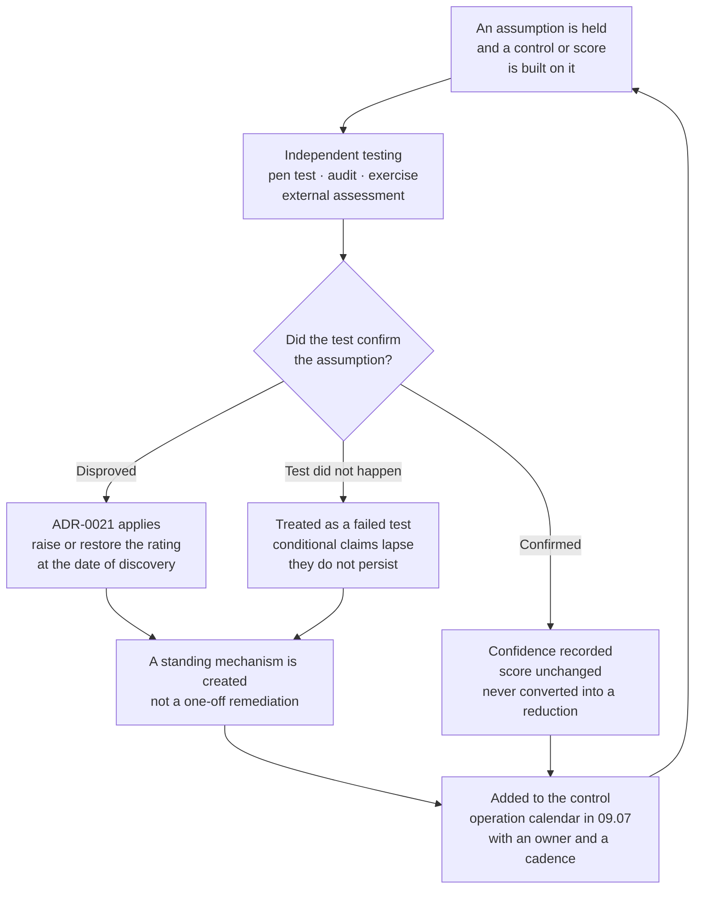

# 09.10 — Lessons Learned &amp; Retrospective

| Field | Value |
|---|---|
| Document ID | MBH-ERM-LSN-2026-910 |
| Program | MercyBridge Health Network — HIPAA Security Program |
| Phase | 09 — Executive Reporting, Program Maturity &amp; Continuous Compliance |
| Version | 1.0 |
| Date | 2026-07-15 |
| Classification | Confidential — Electronic Protected Health Information (ePHI) // Illustrative Portfolio Sample |
| Owner | Daniel Cho, Chief Information Security Officer &amp; HIPAA Security Official |
| Co-Owner | Priya Anand, Director of Internal Audit · Michelle Tran, VP Enterprise Risk |
| Approver | Dr. Helen Marsh, President &amp; Chief Executive Officer |
| Author | Advisory Team (Healthcare GRC / HIPAA) |
| Status | Approved |

## Purpose

A retrospective with no failures in it is not a retrospective. It is a summary written by the people being assessed, and everyone reading it knows that.

This document is the honest account of an eleven-month programme that achieved what it set out to achieve and got several important things wrong on the way. It records what worked, what did not, the specific assumptions MercyBridge held that independent testing destroyed, the workstreams that ran late and why, the places where the organisation was **lucky rather than good**, what the headline numbers concealed, and the cultural shift — which is the outcome least visible in any metric and most likely to determine whether any of this survives to 2029.

> **The single most useful finding: every workstream that overran by more than 50% had a dependency on a party MercyBridge does not employ. Every workstream delivered on time was one the organisation could execute unilaterally. The programme's estimation was not bad at estimating work. It was bad at estimating other people.**

## 1. How This Retrospective Was Run

| Element | Approach |
|---|---|
| Method | Structured interviews plus a facilitated blameless review per phase, held between 2026-12-08 and 2026-12-19 |
| Participants | **31 individuals** — the executive team, all control owners, clinical representatives from three hospitals and four clinics, HIM, Clinical Engineering, Facilities, and the internal audit function |
| External input | Ironwood and Beacon debrief notes; the internal audit private session with Robert Feldman held without management present |
| Ground rule | **Failures are attributed to decisions, not to people.** Every misjudgement in §4 is named with the decision that produced it and the person accountable for the decision, because anonymised lessons do not get learned |
| Facilitation | Priya Anand, deliberately, so that the CISO was a participant rather than the chair |
| What is excluded | Nothing that was raised. Two items participants asked to have recorded — the ambulatory estate being under-resourced, and the evidence repository being started too late — appear in §7 as recommendations rather than being softened into observations |

## 2. Planned Versus Actual

| # | Workstream | Planned | Actual | Variance | Principal cause of variance |
|---|---|---|---|---|---|
| 1 | Programme foundation and HIPAA scoping | 3 weeks | 4 weeks | **+33%** | Governance sequencing; committee calendars |
| 2 | ePHI asset inventory across 210 systems | 4 weeks | 7 weeks | **+75%** | Three discovery passes required; departmental system ownership unclear |
| 3 | Medical device and IoMT catalogue — 6,120 devices | 2 weeks | 5 weeks | **+150%** | No single source of truth; biomedical and IT records disagreed on ~1,900 devices |
| 4 | Risk analysis — 56 risks across 68 systems | 6 weeks | 6 weeks | **On plan** | Fully within programme control |
| 5 | Administrative safeguards and 15 policies | 8 weeks | 11 weeks | **+38%** | Clinical review cycles on policies touching workflow |
| 6 | Physical and technical safeguards and 9 policies | 8 weeks | 9 weeks | **+13%** | Minor; facility access survey at ~30 sites |
| 7 | MFA rollout to 68 of 68 systems | 10 weeks | 10 weeks | **On plan** | Executive mandate and no clinical workflow change at the point of care |
| 8 | Encryption at rest, 51 → 68 systems | 10 weeks | 16 weeks | **+60%** | Three vendor-hosted systems required vendor-side change windows |
| 9 | Shared clinical logins, 96 → 0 | 6 weeks | 12 weeks | **+100%** | Every removal required a clinical workflow redesign first |
| 10 | Business associate programme and BAA remediation | 6 weeks | 11 weeks | **+83%** | Counterparty response times across ~180 organisations |
| 11 | IR plan, playbooks and TTX-2026-01 | 5 weeks | 5 weeks | **On plan** | Internal exercise; no external dependency |
| 12 | Penetration test and full remediation | 8 weeks | 13 weeks | **+63%** | Remediation of PT-06, PT-08 and PT-09 required change windows in clinical areas |
| 13 | HITRUST i1 validated assessment | 8 weeks | 10 weeks | **+25%** | Evidence clarification rounds with Beacon; two requirements re-evidenced |
| 14 | Evidence repository build to 8,412 artefacts | 6 weeks | 14 weeks | **+133%** | Started too late; retrospective indexing of artefacts created in Phases 01–05 |
| 15 | **M-2 joint restoration test with Halcyon** | 2026-09 | **Not performed** | **Unbounded** | Vendor sequencing. Re-baselined once to 2027-02-28 |

| Estimation statistic | Value |
|---|---|
| Workstreams delivered on plan | **3 of 15** |
| Workstreams delivered late | **11 of 15** |
| Workstreams not delivered | **1** — M-2 |
| Median overrun among the late workstreams | **+63%** |
| Largest overrun on a delivered workstream | **+150%** — the medical device catalogue |
| Overall programme milestone position | **Kickoff 2026-02-02 to HITRUST certification 2026-11-30 — approximately on plan**, achieved by absorbing overruns into float and pushing 23 items into 2027 |
| Workstreams with **no** third-party dependency | 4 — of which **3 delivered on plan** and the fourth (#6) overran by 13% |
| Workstreams with a third-party dependency | 11 — of which **0 delivered on plan** |

**What that last pair of rows means.** The programme was not late because it estimated the work badly. It was late because it estimated the *responsiveness of other organisations* as though they shared its deadlines. Vendors, business associates, device manufacturers and clinical departments each have their own change calendars, and none of them was consulted before dates were set. That is a planning defect, not a vendor defect, and it is the reason 09.08 §8 now separates dates that MercyBridge controls from dates it merely hopes for.

## 3. What Worked

| What worked | Evidence that it worked | Why it worked |
|---|---|---|
| **Doing the inventory before the risk analysis** | The risk analysis was the only major workstream to land exactly on plan | The analysis had a real estate to analyse. Programmes that risk-assess an imagined environment produce imagined risks |
| **Implementing every addressable specification** (ADR-0008) | 21 of 21 §164.308 specifications addressed; **0** HITRUST requirements Non-Compliant; requirement 1 of the NPRM gap analysis needs no work | It removed an entire class of argument with assessors and pre-empted the NPRM's removal of the distinction |
| **Encrypting the whole estate** (ADR-0010) | 68 of 68 at rest and in transit; **INC-2026-0031 turned on the unencrypted paper list, not the encrypted laptop** | Safe harbour is the highest-leverage control in the Rule. It converts a category of incident into a non-event |
| **Designing authentication around clinical reality** (ADR-0011) | Badge-tap on 3,550 endpoints; logoff graded by care area; shared logins 96 → 0 | The control that clinicians can actually use is the control that stays implemented |
| **The CMIO's containment veto** (ADR-0017) | Exercised and recorded in TTX-2026-01 | It made security decisions survivable in a clinical setting, and it bought the security function credibility it could not have earned any other way |
| **Writing conditional risk reductions with their reversion rule attached** | 07.11 stated the R-23 condition in writing; when the test slipped, the reversion was mechanical rather than a negotiation | The rule was agreed before anyone knew who it would embarrass |
| **Giving the findings tracker to Internal Audit, not Security** | 0 findings downgraded, disputed or quietly withdrawn — confirmed independently | Closure attested by the function being measured is not closure |
| **Four independent lenses rather than one** | 33 findings resolving to 26 issues; **ISS-14 found by three separate lenses** | Convergence is the strongest available signal. One assessor's opinion is an opinion |
| **Reporting the bad number first** | 48% detection published before the 74% re-measure existed | It is the only reason anyone should believe the good numbers in this portfolio |

## 4. What Did Not Work — the Named Misjudgements

Eight. Each is stated as the belief MercyBridge held, why it held it, what destroyed it, and what it cost.

| ID | The belief | Why it was held | What destroyed it | What it cost |
|---|---|---|---|---|
| **L-1** | **Discovery scanning had bounded the ePHI sprawl.** The inventory of 68 systems was complete | Three discovery passes, credentialed scanning, and departmental attestation all agreed | **PT-03.** An internet-facing appointment application, live since 2018, superseded in 2023, never decommissioned, holding **6,880 records** — no owner, no BAA dependency, no logging, no patching path | **R-41 raised Low → Moderate.** A risk score that had been published to the Board on a false premise for seven months. The application is gone; the misjudgement is that MercyBridge believed a negative result from tools that had never been pointed at the external estate |
| **L-2** | **Downtime documentation reconciliation would keep pace with a clinical outage** | The HIM surge model had been built for a historical 72-hour scenario and never re-based | **TTX-2026-01.** Under a 10-day ransomware scenario the reconciliation backlog outran capacity | R-43 held rather than reduced for a full phase; an agency surge contract that should have been in place a year earlier. **The exercise was worth more than the plan it tested** |
| **L-3** | **A conditional risk reduction is a reduction** | The controls were real; the confirming test was scheduled; the reduction felt earned | **M-2 did not happen.** Vendor sequencing pushed a 2026-09 test into 2027-02, and the condition lapsed exactly as written | **R-23 raised 8 → 10.** A risk that had been reported as improving was reported as worse, to the same Board, four months later. Uncomfortable, correct, and the reason ADR-0021 now exists as a standing rule |
| **L-4** | **Manual evidence filing would hold once people were trained** | Control owners were diligent and the volumes looked manageable | **IA-F-02, IA-F-07, IA-F-08 and CAP-04** — four findings, all of them about evidence that was not retained rather than a control that did not operate | Four findings that were entirely avoidable. **Every one of them is now a workflow-enforced step.** The lesson is that a filing instruction is not a control |
| **L-5** | **The business associate programme was deep enough** | 24 critical BAs assessed, 47 of 47 BAAs in place, R-28 treated with a nine-measure plan | **IA-F-03 and CAP-02** independently: 3 of 40 sampled BAAs lacked §164.314(a)(2)(iii) flow-down; monitoring below the critical tier was thin | R-30 held; **~118 of ~180** BAs still outside tiered monitoring at year end. The programme optimised for the top 13% of the population and called it done |
| **L-6** | **Physical safeguards were uniform because the policy was uniform** | The policy applied network-wide and the hospitals were strong | **Three lenses** found the same thing — PT-15, IA-F-04, CAP-08. Alarm testing lapsed at one site; two sites still logged visitors on paper | The hardest defect class to close, found by everybody, and the one MercyBridge had least visibility of. **A uniform policy across 34 sites is a uniform policy, not a uniform practice** |
| **L-7** | **Detection was adequate because the tooling was in place** | SIEM coverage, EDR, and a 24×7 capability all existed | **A 48% detection rate** against tester actions, a 41-minute median escalation against a 30-minute target, and **PT-02 and PT-03 entirely undetected** | The most sobering number in the programme. It produced IV-09 and 34 new analytics, and a re-measure at 74% — which is better and still means one action in four goes unseen |
| **L-8** | **The ambulatory estate is a scaled-down hospital** | Same policies, same systems, same training | Downtime kits absent at multiple sites; the read-only clinical viewer still missing at 4 sites (F-2a); physical inconsistency concentrated in ambulatory locations | ~30 clinics were resourced as an afterthought for most of the programme. They hold real ePHI, they have no on-site IT, and they were the source of a disproportionate share of the findings |

## 5. Where MercyBridge Was Lucky Rather Than Good

This section exists because the difference between a good year and a lucky year is invisible from inside, and a programme that cannot tell them apart will draw the wrong conclusions from both.

| The good outcome | The luck in it |
|---|---|
| **The 6,880-record orphan application was found by a penetration tester** | It had been internet-facing and unmonitored since 2023. A commissioned tester found it in week one of a three-week engagement. There is no version of this story in which MercyBridge's own controls found it, and no reason to assume an adversary could not have found it first |
| **No ransomware event occurred during the eleven months** | Enterprise-scale recoverability was unproven for the entire programme and remains unproven today. The organisation was not protected from that scenario by its controls; it was not subjected to that scenario |
| **INC-2026-0031 was not a reportable breach** | The determination turned on a **printed clinic list** — paper, which can never be safe-harboured — being recovered intact within 26 hours. Twenty-six hours is not a control. It is a piece of luck that happened to fall inside the assessment window |
| **INC-2026-0044 involved 3,318 individuals and no ePHI compromise** | Forensics showed the actor was pursuing payment redirection and never searched the mailbox. **The same access, in the hands of an actor interested in health data, produces a different determination and a different year** |
| **Ironwood did not obtain Domain Administrator** | True, and genuinely creditable. It is also true that the engagement was time-boxed to three weeks with seven stop conditions and a passive-only rule for patient-connected devices. A real adversary has no stop conditions and no end date |
| **The i1 assessment produced 0 Non-Compliant requirements** | Eight CAPs sat at 25% to 50%, and the requirement scored 25% is the one covering the organisation's largest known gap. A slightly different sampling or a slightly stricter assessor and the narrative reads differently at the same underlying facts |

## 6. What the Numbers Hid

| Headline number | What it concealed |
|---|---|
| **0 reportable breaches** | Three incidents affecting **3,961 individuals** were assessed. Zero reportable is a statement about the four-factor analysis, not a statement that nothing happened |
| **HITRUST 93.1%** | An average across 182 requirements. **CAP-01 scored 25%** — the single most important control area in the organisation's own risk register, averaged into a number that reads like an A grade |
| **Encryption at 68 of 68** | Systems, not devices. **3,170 ePHI-bearing medical devices sit on platforms that cannot encrypt**, and no amount of estate coverage changes that |
| **0 High risks, sustained for three phases** | Reached in Phase 06, **before any independent lens had tested anything**. It survived independent testing, which is the meaningful part — but the milestone was declared on self-assessment |
| **8,412 evidence artefacts** | **36% of them depend on a human remembering to file something.** Every evidence-related finding in the programme came from that 36% |
| **Training completion 96.4%** | **3.6% of ~6,500 people is roughly 234 workforce members** who did not complete required training. In a phishing context that is not a rounding error, it is a target list |
| **Termination revocation at 98.1%** | **6 of 412 terminations were late.** The mitigating fact — 0 accesses used post-termination — is genuine and is also luck, not control |
| **KEV instances 148 → 0** | Alongside **1,284 open vulnerability exceptions**, each with an owner and an expiry. The KEV number is real; it is not the whole vulnerability position |
| **Detection 48% → 74%** | Measured against one tester's actions in one purple-team run. **One action in four still goes unseen**, and the re-measure has not yet been repeated by an independent party |

## 7. What Would Be Done Differently

| # | Change | Why |
|---|---|---|
| 1 | **Point external attack-surface discovery at the estate in week two, not month eight** | L-1. The orphan application would have been found by MercyBridge, in Phase 02, at a fraction of the cost and none of the embarrassment |
| 2 | **Build the evidence repository in Phase 01, not Phase 08** | The +133% overrun on workstream 14 was almost entirely retrospective indexing. Artefacts created in Phases 01–05 had to be found, dated and attributed months after the fact |
| 3 | **Set every date with the third party in the room** | 11 of 11 workstreams with an external dependency ran late. Dates set unilaterally and communicated to vendors are not commitments |
| 4 | **Exercise before building, not after** | TTX-2026-01 disproved the reconciliation assumption in a single afternoon. Had it run in Phase 04 rather than Phase 07, the HIM surge contract would have been in place before the plan was written around it |
| 5 | **Resource the ambulatory estate as its own programme** | L-8. ~30 sites with no on-site IT, real ePHI and a disproportionate share of findings cannot be run as an annex to the hospital workstream |
| 6 | **Treat "we cannot evidence it" as a control failure from day one** | L-4. Four findings, all avoidable, all produced by the belief that doing the work and proving the work are the same activity |
| 7 | **Assess the whole BA population by tier from the start** | L-5. Assessing the top 24 was the right first move and the wrong stopping point. The tiered monitoring model built in Q4 2026 should have been the Phase 06 design |
| 8 | **Measure detection before claiming detective controls** | L-7. R-35 and R-36 were scored on the presence of tooling. The first honest number arrived from an adversary, in month eight |
| 9 | **Put the medical device reconciliation between biomedical and IT records at the front** | Workstream 3 overran 150% because two internal systems disagreed about ~1,900 devices, and nobody had ever had a reason to reconcile them |

## 8. The Cultural Change

The measurable outputs of this programme will be superseded. Certificates expire, scores move, and the 2027 penetration test will produce a new list. What is more likely to persist is a change in how three groups of people relate to each other.

**Clinical staff stopped experiencing security as an obstacle — mostly.** The evidence is not the training completion rate; it is the **phishing click rate falling from 11.4% to 4.2% while the report rate rose to 22.4%**, which means people are not just avoiding the bait, they are telling somebody. It is also the fact that **96 shared clinical logins reached zero** without a clinical revolt, which happened only because each removal was preceded by a workflow redesign rather than a policy announcement. The counter-evidence is equally real: **two unattended logged-in workstations found by the penetration tester and four of sixty by Internal Audit.** Culture moved. It did not finish moving.

**The CMIO's containment veto changed the security function's standing more than any control did.** ADR-0017 gave Dr. Samuel Ortega authority to overrule a containment action that would itself harm patients. On paper it looks like a constraint on security. In practice it was the moment the security function stopped being the department that shuts systems down and became a participant in a clinical risk decision — and it was exercised in TTX-2026-01, on the record, which is what makes it real rather than decorative. Clinical leaders who have a genuine veto engage; clinical leaders who have none escalate.

**Security's relationship with clinical operations became bidirectional.** Automatic logoff graded by care area was co-signed by the CISO and the CMIO rather than issued by IT. Break-glass access requires no pre-approval, because refusing a clinician access in an emergency is a patient-safety decision that a security policy has no business making — and the compensating control is 100% retrospective review, which moved from 62% to 100%. Neither of those designs would have been produced by a security function operating alone.

| Cultural indicator | Baseline | At close | The honest reading |
|---|---|---|---|
| Phishing click rate | 11.4% | **4.2%** | Genuine improvement, sustained across two campaign cycles |
| Phishing report rate | Not measured | **22.4%** against a 20% target | People are actively reporting, which is the harder behaviour |
| Training completion | 91% | **96.4%** | ~234 people still outstanding |
| Shared clinical logins | 96 | **0** | Achieved through workflow redesign, at double the planned effort |
| Break-glass post-hoc review | 62% | **100%** | The compensating control for an intentionally permissive access model |
| Unattended workstations | Not measured | 2 found by pen test; 4 of 60 by audit | **Not reduced in the register.** Two lenses found it independently |
| Clinical containment veto | Did not exist | Exercised in TTX-2026-01 | The most consequential governance change in the programme |
| Security in clinical governance forums | Ad hoc | Standing membership | Enables the next three years; guarantees nothing |

## 9. Lessons Converted into Mechanisms

A lesson that is only written down is not learned. Each of the eight misjudgements in §4 exits this programme attached to a standing mechanism.

| Lesson | The mechanism it produced | Where it now lives |
|---|---|---|
| L-1 — inventory completeness was assumed | **IV-05** quarterly ePHI inventory reconciliation against DNS, certificate transparency and external attack-surface data | 09.07 §2.4 Q-02 |
| L-2 — reconciliation capacity was assumed | Annual tabletop with a re-based scenario; HIM surge contract; TTX-2027-01 against a 10-day outage | 09.07 §2.6 A-10 |
| L-3 — a conditional reduction was treated as a reduction | **ADR-0021** as a standing scoring rule, plus mandatory written reversion conditions on every conditional score | 08.11 §1; the risk register |
| L-4 — manual filing was trusted | Workflow-enforced evidence capture; the 80% automation target; ingestion QC with named rejection reasons | 09.07 §3 and §7 |
| L-5 — BA depth was assumed from the critical tier | Tiered monitoring across ~180 BAs; annual attestation with evidence sampling | 09.07 §2.6 A-08 |
| L-6 — policy uniformity was read as practice uniformity | Quarterly physical walkthroughs with alarm testing at sampled sites; electronic visitor logging | 09.07 §2.4 Q-08 |
| L-7 — detection was assumed from tooling | **IV-09** detection engineering; quarterly purple-team validation; detection rate as a reported KRI | 09.07 §2.4 Q-03 |
| L-8 — the ambulatory estate was under-resourced | Quarterly downtime and emergency-mode spot checks at two sites; a named Ambulatory Director owner | 09.07 §2.4 Q-09 |

**The closing observation of this retrospective.** MercyBridge ends the programme with a register that reports **0 High, 16 Moderate and 40 Low** — the same totals it held entering Phase 08, with two risks raised and two reduced inside them. The temptation was to present that as stability. It is not stability; it is the arithmetic of an organisation that found out two things it believed were wrong and said so. If the 2027 cycle produces a similar pattern, the programme is working. If it produces a register in which risk only ever falls, the programme has stopped testing itself, and this document should be read again.

## Cross-References

| Reference | Relevance |
|---|---|
| 01.10 — Assessment Roadmap &amp; Milestones | The original plan against which §2 measures actuals |
| 02.02 — ePHI System Inventory | The 68-system inventory whose completeness L-1 disproved |
| 02.04 — Medical Devices &amp; IoMT | The 6,120-device catalogue behind the +150% overrun |
| 04.06 — Security Awareness &amp; Training | The training and phishing figures in §8 |
| 05.03 — Workstation Use &amp; Security | The unattended-workstation observations |
| 06.03 — Risk Tiering &amp; Criticality | The critical-tier focus that L-5 criticises |
| 07.09 — Incident Response Tabletop Exercise | TTX-2026-01 and the L-2 disproof |
| 07.10 — Incident Register &amp; Case Studies | INC-2026-0031 and INC-2026-0044, cited in §5 |
| 08.03 — Penetration Test Results | PT-03, the 48% detection rate, and the L-1 and L-7 disproofs |
| 08.05 — Internal Audit of the Security Program | IA-F-02 to IA-F-09 behind L-4, L-5 and L-6 |
| 08.11 — Control-to-Risk Traceability | ADR-0021 and the R-23 and R-41 movements |
| 09.07 — Continuous Compliance Operating Model | Where every mechanism in §9 now runs |
| 09.11 — Program Closeout &amp; Transition to Operations | The handover this retrospective informs |

---
[⬅ Previous](09.09-hitrust-recertification-and-2025-nprm-readiness.md) · [🏠 Phase 09 Home](09.00-README.md) · [Next ➡](09.11-program-closeout-and-transition-to-operations.md)
