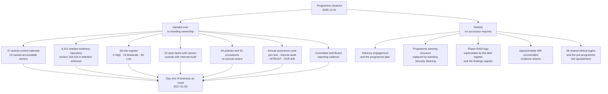

# 09.11 — Program Closeout &amp; Transition to Operations

| Field | Value |
|---|---|
| Document ID | MBH-ERM-CLO-2026-911 |
| Program | MercyBridge Health Network — HIPAA Security Program |
| Phase | 09 — Executive Reporting, Program Maturity &amp; Continuous Compliance |
| Version | 1.0 |
| Date | 2026-07-15 |
| Classification | Confidential — Electronic Protected Health Information (ePHI) // Illustrative Portfolio Sample |
| Owner | Daniel Cho, Chief Information Security Officer &amp; HIPAA Security Official |
| Co-Owner | Karen Boyd, Chief Compliance Officer · Priya Anand, Director of Internal Audit |
| Approver | Dr. Helen Marsh, President &amp; Chief Executive Officer |
| Author | Advisory Team (Healthcare GRC / HIPAA) |
| Status | Approved |

## Purpose

This document closes the MercyBridge HIPAA Security Program.

It records what nine phases produced, who accepted it, where every artefact and every open item goes, what the organisation stops doing on the day the programme ends, and what it must not stop doing. It states the residual obligations that survive closure — because a covered entity cannot close its obligations, only its projects — and it fixes the document control and retention position under §164.316(b).

> **Closure means the delivery vehicle stops. It does not mean the work stops, the risk stops, or the evidence stops. The distinction is the entire content of this document, and getting it wrong is how organisations end up with an excellent programme and a poor 2029.**

| Closure fact | Position |
|---|---|
| Programme start | **2026-02-02** |
| Programme close | **2026-12-31**; operating model live **2027-01-05** |
| Phases delivered | **9 of 9** |
| Numbered documents delivered | **118** |
| Register at close | **0 High · 16 Moderate · 40 Low** across 56 risks |
| Certification held | **HITRUST i1**, 93.1%, valid to **2027-11-29** |
| Open items transitioning to operations | **23**, each with a named operational owner |
| Overdue items transitioning | **1 — M-2**, Board Committee visible |

## 1. Deliverables Register Across All Nine Phases

| Phase | Title | Docs | Keystone artefacts | Status |
|---|---|---|---|---|
| **01** | Program Foundation &amp; HIPAA Scoping | **14** | Security Official designation under §164.308(a)(2); programme charter; RACI; obligations calendar; ADR-0001 to ADR-0003 | Accepted |
| **02** | ePHI Asset Inventory &amp; Data-Flow Mapping | **12** | 210-system discovery and the **68 ePHI systems**; 6,120-device register; data-flow maps; four-tier classification; ADR-0004 to ADR-0005 | Accepted |
| **03** | HIPAA Security Risk Analysis | **12** | **The 56-risk register** and the §164.308(a)(1)(ii)(A) analysis; risk management plan; the periodic-review process; ADR-0006 to ADR-0007 | Accepted |
| **04** | Administrative Safeguards | **14** | 9 of 9 standards and 21 of 21 specifications; **15 of the 24 policies**; the §164.308(a)(8) evaluation programme; ADR-0008 to ADR-0009 | Accepted |
| **05** | Physical &amp; Technical Safeguards | **14** | MFA, encryption and audit logging at **68 of 68**; policies POL-16 to POL-24; the breach safe-harbour position; ADR-0010 to ADR-0012 | Accepted |
| **06** | Business Associate &amp; Third-Party Risk | **13** | **~180-BA** register with 24 critical; BAA coverage 47 of 47; the R-28 nine-measure treatment; ADR-0013 to ADR-0015 | Accepted |
| **07** | Incident Response &amp; Breach Notification | **13** | IR plan and ransomware playbook; **3 four-factor determinations, 0 reportable breaches**; TTX-2026-01; ADR-0016 to ADR-0018 | Accepted |
| **08** | HITRUST &amp; Independent Assessment / OCR Audit Readiness | **13** | Ironwood report with 16 findings retested; **IA-2026-14 Satisfactory**; **HITRUST i1 at 93.1%**; 91-inquiry OCR mapping; **8,412-artefact repository**; ADR-0019 to ADR-0021 | Accepted |
| **09** | Executive Reporting, Program Maturity &amp; Continuous Compliance | **13** | Board reporting pack; maturity assessment; KRI programme; **the 47-activity control calendar**; the 2027–2029 roadmap; this closeout | Accepted |
| — | **Total** | **118** | — | — |

| Supporting artefact class | Volume | Custodian at close |
|---|---|---|
| Architecture decision records | **ADR-0001 … ADR-0021** recorded through Phase 08, continuous numbering | Daniel Cho |
| Trackers and registers (Excel) | Risk register, ePHI inventory, medical device register, BA register, BAA coverage, incident register, consolidated findings register, evidence index, OCR protocol mapping | Named per register in §3 |
| Mermaid diagrams | Governance, data flows, network zones, risk process, safeguards maps, BA chain, IR lifecycle, closure discipline, this roadmap | Marcus Reed |
| Governance minutes | Board Committee, steering, workshops, policy approvals, calibration sessions, assessor debriefs | Karen Boyd |
| Logs | Decision, risk, RAID and action-item logs per phase | Karen Boyd |
| Templates | Policy, risk entry, risk acceptance, BAA outline, access recertification, exception, meeting minutes | Karen Boyd |
| **Controlled evidence artefacts** | **8,412** across 18 index nodes | Marcus Reed as evidence custodian |

## 2. Acceptance and Sign-Off

Each signatory accepts a defined scope. Nobody signs for the whole programme, because nobody in the organisation is competent to attest to all of it — and a single omnibus signature is worth less than nine specific ones.

| Signatory | Role | What is accepted | Forum | Date |
|---|---|---|---|---|
| **Daniel Cho** | CISO &amp; HIPAA Security Official | The security programme in its entirety as delivered; the residual risk position; the §164.308(a)(8) evaluation for 2026 | Security Steering Committee | **2026-12-15** |
| **Karen Boyd** | Chief Compliance Officer | The 24-policy suite, the §164.316(b) documentation and retention position, and the continuous compliance operating model | Security Steering Committee | **2026-12-15** |
| **Anthony Ruiz** | Chief Information Officer | Technical and infrastructure safeguards; the contingency position **including the explicit statement that enterprise-scale restoration is not yet validated** | Security Steering Committee | **2026-12-15** |
| **Rebecca Stern** | Chief Privacy Officer | Breach determination methodology, the three determinations, and notification readiness | Security Steering Committee | **2026-12-15** |
| **Lisa Coleman** | General Counsel | BAA coverage, §164.314 organisational requirements, legal holds and the retention position | Executive Leadership review | **2026-12-17** |
| **Michelle Tran** | VP Enterprise Risk | The 56-risk register at **0 High · 16 Moderate · 40 Low**, and the movement record including the two raised risks | Executive Leadership review | **2026-12-17** |
| **Dr. Samuel Ortega** | CMIO | Clinical usability of every implemented safeguard; the containment veto; break-glass access model | Executive Leadership review | **2026-12-17** |
| **Priya Anand** | Director of Internal Audit | The consolidated findings register and independent verification of closures. **Accepts custody of the 23 open items** | Audit &amp; Compliance Committee | **2026-12-22** |
| **Dr. Helen Marsh** | President &amp; CEO | Programme completion, the residual risk acceptance, and the 2027 funding position **including the ~$1.14M requested and not yet approved** | Executive Leadership review | **2026-12-17** |
| **Robert Feldman** | Board Audit &amp; Compliance Committee Chair | Board-level acceptance; the open-item position; **explicit acknowledgement of M-2 as overdue with no second re-baseline authorised** | Board Audit &amp; Compliance Committee | **2026-12-22** |

| Acceptance condition | Statement |
|---|---|
| Conditional acceptances | **None.** Every signatory accepted the position as stated, including the parts that are unfavourable |
| Dissents recorded | **None.** Two clarifications were requested and incorporated: the funding status column in 09.08 §7, and the explicit M-2 statement in the CIO's acceptance |
| What acceptance does **not** mean | It is not a statement that MercyBridge is free of risk, that the controls are permanent, or that HITRUST certification constitutes HIPAA compliance. **OCR recognises no certification as a compliance determination** |
| Re-affirmation | The residual risk position is re-affirmed annually at the Board report under calendar activity A-12 |

## 3. Transition of Artefacts to Operational Owners

| Artefact | Operational owner from 2027-01-05 | Review cadence | Repository node |
|---|---|---|---|
| 24-policy HIPAA suite (POL-01 … POL-24) | Karen Boyd | Annual, rolling quarterly queue | EV-01 |
| 61 supporting procedures | Karen Boyd with each control owner | Annual plus change-triggered | EV-01 |
| §164.308(a)(1)(ii)(A) risk analysis and the 56-risk register | **Michelle Tran** | Annual plus T-E1 to T-E5 triggers | EV-02 |
| ePHI system inventory — 68 systems | Marcus Reed | **Quarterly under IV-05** | EV-02 |
| Medical device register — 6,120 devices | Clinical Engineering | Continuous; annual reconciliation with IT records | EV-15 |
| Data-flow maps and network zone maps | Anthony Ruiz | Annual plus on material change | EV-02 |
| Business associate register — ~180, 24 critical | **Lisa Coleman** | Quarterly for critical; annual for the population | EV-07 |
| BAA repository and flow-down evidence | Lisa Coleman | On execution and amendment | EV-07 |
| Incident register and four-factor determination files | **Rebecca Stern** | Per event; register reviewed weekly | EV-08 |
| Contingency plan, DR plan and emergency-mode procedures | Anthony Ruiz | Annual test; quarterly restore verification | EV-09 |
| Consolidated findings register — 45 items | **Priya Anand** | Monthly | EV-16 |
| Evidence repository — 8,412 artefacts, 18 nodes | **Marcus Reed** as custodian, Karen Boyd accountable | Continuous | All |
| OCR protocol mapping and standing production set | Karen Boyd | Semi-annual drill; refreshed on change | EV-18 |
| Vulnerability exception register — 1,284 entries | Marcus Reed | Quarterly with expiry enforcement | EV-14 |
| KRI and KPI definitions and thresholds | Marcus Reed | Monthly production; annual threshold review | EV-17 |
| ADR-0001 … ADR-0021 | Daniel Cho | Reviewed when superseded; never deleted | EV-01 |
| HITRUST certificate, MyCSF object and CAP schedule | Daniel Cho | At recertification | EV-16 |
| Compliance debt register — 9 entries | Karen Boyd | Monthly | EV-17 |

## 4. Transition of Every Open Item

All 23 open items pass to a named operational owner and a named governance forum on 2027-01-05. Nothing transitions to "the security team".

| Open items | Operational owner | Governance forum | Verification body |
|---|---|---|---|
| **CAP-01**, **M-2**, CAP-05, CAP-06, V-24, IA-F-08 | **Anthony Ruiz** | Security Steering monthly; **Audit &amp; Compliance Committee quarterly for M-2 and CAP-01** | Beacon at recertification; Internal Audit for IA-F-08 |
| CAP-03, CAP-04, CAP-07, IA-F-01, IA-F-02, IA-F-05, IA-F-07, D-14 | **Marcus Reed** | Security Steering monthly | Internal Audit follow-up Q2 2027; Beacon at recertification |
| CAP-02, IA-F-03, O-6 | **Lisa Coleman** | BA Oversight Committee; Steering monthly | Internal Audit follow-up; Beacon at recertification |
| CAP-08, IA-F-04 | **Facilities Director** | Steering monthly | Internal Audit follow-up; Beacon at recertification |
| IA-F-06 | **Karen Boyd** | Steering monthly | Internal Audit follow-up |
| IA-F-09 | **Dr. Samuel Ortega** | Steering monthly | Internal Audit follow-up |
| F-2a | **Ambulatory Director** | Steering monthly | Internal Audit |
| MIN-1 | **Rebecca Stern** | Steering monthly | Internal Audit |
| *R-41 reconciliation condition* (not one of the 23) | Marcus Reed | Quarterly register review with Michelle Tran | Two clean IV-05 cycles |

| Transition rule | Statement |
|---|---|
| Single custodian | **Priya Anand** retains the consolidated register. Ownership of an item is operational; custody of the register is independent |
| No re-dating on transfer | Every item carries its existing date across the boundary. Handover is not an occasion to re-baseline |
| Re-baseline discipline | One re-baseline per item with a documented reason. **M-2 has used its one** |
| Escalation on the critical path | Any slip on a critical-path item is reported to Robert Feldman in the next Committee cycle, with days of float remaining to 2027-11-29 |
| Orphan protection | An item whose owner leaves the organisation reverts to that owner's accountable executive within 5 business days, not to a queue |

## 5. What Is Handed Over, and What Is Retired

| Retired | Why it is retired | Successor |
|---|---|---|
| The programme plan and its milestone tracker | The work it sequenced is delivered or transferred | The 47-activity control calendar and the 2027–2029 roadmap |
| The programme steering structure and weekly status report | A programme forum for a programme that has ended | Monthly Security Steering; quarterly Audit &amp; Compliance Committee |
| Phase-level RAID logs | Nine parallel logs with overlapping content | The consolidated findings register and the compliance debt register |
| The advisory engagement | Delivery complete; targeted support retained only for the 2027 recertification | Internal capability plus 2.0 incremental FTE, of which 1.0 is approved |
| ~900 uncontrolled evidence artefacts on departmental shares | Uncontrolled, unattributed, unindexed and unretained | The 8,412-artefact controlled repository |
| The pre-programme risk spreadsheet | Superseded by the §164.308(a)(1)(ii)(A) analysis and the 56-risk register | 03.07 and its annual refresh |
| 96 shared clinical login accounts | Eliminated; unique identification restored under §164.312(a)(2)(i) | Named accounts with badge-tap authentication |
| Manual evidence filing instructions for four control areas | Replaced with workflow enforcement following IA-F-02, IA-F-07, IA-F-08 and CAP-04 | GRC workflow steps that cannot be skipped |

## 6. Day One of Business as Usual — 2027-01-05

| # | Check | Owner | Evidence of completion | Status at closeout |
|---|---|---|---|---|
| 1 | All 47 calendar activities exist as recurring entries with owner and deputy | Karen Boyd | GRC calendar export | Ready |
| 2 | Every one of the 23 open items shows its operational owner and unchanged date | Priya Anand | Consolidated register extract | Ready |
| 3 | Monthly Security Steering scheduled through 2027 with a standing agenda | Daniel Cho | Meeting series and agenda template | Ready |
| 4 | Quarterly Audit &amp; Compliance Committee slot confirmed with Robert Feldman | Daniel Cho | Committee calendar | Ready |
| 5 | Evidence repository ingestion connectors operating at 64% automated capture | Marcus Reed | Ingestion report | Ready |
| 6 | Retention clocks set on 100% of the 8,412 artefacts | Marcus Reed | Retention audit extract | Ready |
| 7 | Legal holds confirmed in force on the PT-03 database and three incident files | Lisa Coleman | Hold register | Ready |
| 8 | Standing OCR production set current and refreshed | Karen Boyd | Production set index | Ready |
| 9 | Beacon recertification engagement diarised for 2027-04-30 | Daniel Cho | Roadmap milestone | Ready |
| 10 | Ironwood 2027 penetration test booked for 2027-09 | Marcus Reed | Engagement schedule | Ready |
| 11 | Internal audit follow-up scheduled for Q2 2027 | Priya Anand | Audit plan | Ready |
| 12 | Compliance debt register live with 9 entries and monthly reporting | Karen Boyd | Debt register | Ready |
| 13 | 2027 funding position documented, **including the ~$1.14M requested and unapproved** | Anthony Ruiz with Daniel Cho | Capital and operating submission | **Open — Q1 2027 capital review** |
| 14 | Incremental headcount requisitions raised — 2.0 FTE, 1.0 approved | Daniel Cho | Requisition records | **Partially open** |
| 15 | M-2 vendor window confirmed in writing with Halcyon | Anthony Ruiz | Vendor commitment | **Open — the single most important item on this list** |

**Two of the fifteen are open, and both are the ones that matter.** Item 15 is the predecessor of the lowest-scoring requirement in the HITRUST assessment and the condition on the highest-scoring residual in the risk register. Item 13 determines whether four of the 2027 dates are commitments or aspirations. Listing them as ready would have made this a cleaner document and a false one.

## 7. Residual Obligations Statement

Programme closure extinguishes no obligation. The following survive intact and are stated so that no future reader mistakes the end of the engagement for the end of the duty.

| Obligation | Citation | Owner | Cadence |
|---|---|---|---|
| Maintain an accurate and thorough risk analysis | §164.308(a)(1)(ii)(A) | Michelle Tran with Daniel Cho | Annual plus triggers |
| Implement measures sufficient to reduce risk to a reasonable and appropriate level | §164.308(a)(1)(ii)(B) | Daniel Cho | Continuous |
| Maintain the Security Official designation | §164.308(a)(2) | Dr. Helen Marsh | On change |
| Periodic technical and non-technical evaluation | §164.308(a)(8) | Daniel Cho | Annual |
| Obtain and maintain satisfactory assurances from business associates | §164.308(b)(1); §164.314(a) | Lisa Coleman | Continuous |
| Implement and maintain the physical and technical safeguards | §164.310; §164.312 | Facilities Director; Marcus Reed | Continuous |
| Maintain policies and procedures and retain documentation for **six years** | §164.316(a)–(b) | Karen Boyd | Continuous |
| Review and update documentation in response to environmental or operational change | §164.316(b)(2)(iii) | Karen Boyd | Annual plus triggers |
| Investigate security incidents and determine breach status | §164.308(a)(6); §164.402; §164.414(b) | Rebecca Stern | Per event |
| Notify individuals, HHS and media within statutory deadlines | §164.404–408 | Rebecca Stern with Lisa Coleman | Per event |
| Sustain the residual risk position and report it to the Board | §164.308(a)(1)(i) | Daniel Cho | Annual |

**The statement itself.** MercyBridge accepts a residual risk position of **0 High, 16 Moderate and 40 Low** across 56 risks, with the Moderate band concentrated in availability, recovery and third-party assurance. It accepts that **enterprise-scale restoration remains unvalidated**, that **3,170 ePHI-bearing medical devices cannot be encrypted**, and that **~118 business associates are not yet under tiered monitoring**. It does not accept these as permanent: each is dated in 09.08, and each is reported to the Board Audit &amp; Compliance Committee until it is closed. Acceptance of a residual is a decision to carry it knowingly, not a decision to stop looking at it.

## 8. Document Control and Retention Position

| Element | Position |
|---|---|
| Governing standard | **§164.316(b)** — written form, six-year retention from creation or last effective date, availability to implementers, periodic review |
| Population under control | **118 numbered documents**, 24 policies, 61 procedures, 21 ADRs, and **8,412 evidence artefacts** |
| Version state at closeout | All numbered documents at **Version 1.0, Status Approved**, dated **2026-07-15** with assessment evidence appended through 2026-12-31 |
| Retention clock | Set automatically at ingestion from artefact class and effective date. **No manual destruction dates exist** |
| Policies in force | Clock **has not started**; it begins on supersession. A policy in force for four years is retained for ten |
| Superseded versions | Retained with the version chain intact; never deleted, never edited in place |
| Legal holds | In force on the PT-03 archived database and all three incident files; applied by Lisa Coleman; override destruction entirely |
| Earliest destruction eligibility | **2032** — no artefact created by this programme becomes eligible before then |
| Availability | Role-based read access for every control operator; the 24 policies published to the workforce portal |
| Integrity | SHA-256 recorded at ingestion, re-verified on every production; immutable write; production log records requester, date, artefact list and hash |
| Independent verification | Priya Anand sampled 40 artefacts across the four retention cases in IA-2026-14 — **0 exceptions** |
| Next review | Annual, under calendar activity A-06; event-driven under T-E1 to T-E5 |
| Change control after closeout | Amendments to any numbered document require a new version, an approver, and a documented reason. **This document set is not editable in place** |

## Cross-References

| Reference | Relevance |
|---|---|
| 01.05 — Security Official Designation &amp; Governance | The designation that survives closure |
| 01.06 — Program Charter &amp; Objectives | The commitments measured in §1 |
| 03.07 — Risk Register | The 56 risks whose residual position is accepted in §7 |
| 03.10 — Periodic Review &amp; Update | The annual re-analysis obligation carried forward |
| 04.09 — Evaluation | The §164.308(a)(8) obligation that does not close |
| 04.11 — Policy Suite &amp; Documentation | The 24 policies transitioning to Karen Boyd |
| 08.09 — Evidence Repository &amp; Documentation | The retention machinery confirmed in §8 |
| 08.10 — Findings Remediation Tracker | The 45-item register and the 23 items transitioning in §4 |
| 08.12 — Phase Summary &amp; Transition | The baseline received into Phase 09 |
| 09.07 — Continuous Compliance Operating Model | The 47-activity calendar handed over in §5 |
| 09.08 — Remediation Roadmap 2027–2029 | The dated plan behind the transitioning open items |
| 09.09 — HITRUST Recertification &amp; 2025 NPRM Readiness | The forward obligations named in §7 |
| 09.10 — Lessons Learned &amp; Retrospective | The honest account informing this handover |
| 09.12 — Portfolio Index &amp; Navigation | Where the 118 documents are located |

---
[⬅ Previous](09.10-lessons-learned-and-retrospective.md) · [🏠 Phase 09 Home](09.00-README.md) · [Next ➡](09.12-portfolio-index-and-navigation.md)
