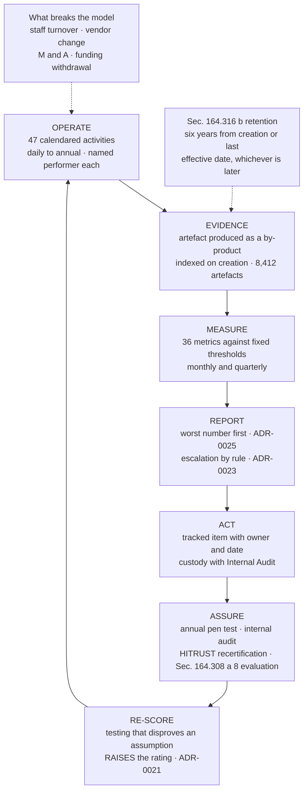

# The Continuous Compliance Cycle

## The property that matters

Evidence is generated **by operating the control**, not by preparing for an audit. That is the difference between a programme that can answer a regulator in 1.5 business days and one that spends six weeks assembling a response. The cycle closes at RE-SCORE: assurance feeds the register, and the register is permitted to move **up**.

## Source
`09.07`, `09.06`, `08.09`, `adr/ADR-0021`.
