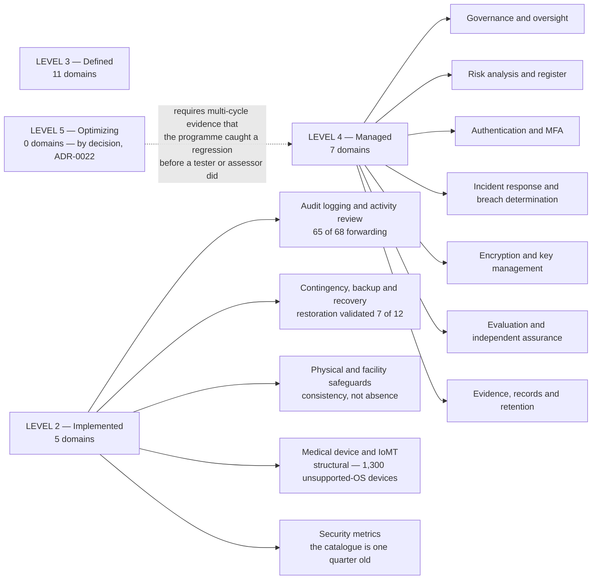

# Program Maturity — Domain Profile

## The shape of the profile is the finding

Mean maturity moved **1.61 → 3.09** across the programme. The seven Level 4 domains are those where an independent party validated the position. Four of the five Level 2 domains are the same underlying story — **scope not yet complete** — and the fifth is the measurement capability itself, which is the newest thing the programme owns and is scored accordingly.

## Source
`09.04`, `trackers/program-maturity-assessment.xlsx`, `adr/ADR-0022`.
