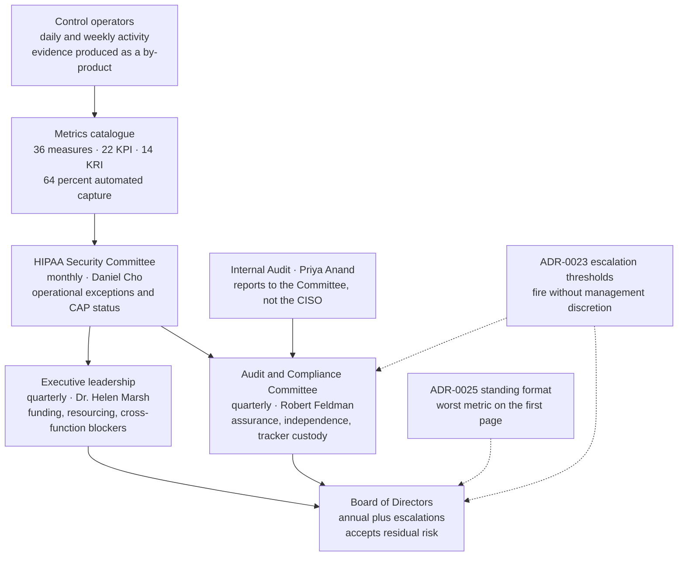

# Reporting Architecture

## The two mechanisms that make this more than an org chart

**ADR-0023** removes discretion from escalation: an overdue item, a second re-baseline, a raised risk or a twice-red KRI reaches the agenda by rule. **ADR-0025** fixes the order of the pack so the exceptions occupy the page that gets read. Without both, a reporting architecture is a diagram of who *could* be told.

## Source
`09.02`, `adr/ADR-0023`, `adr/ADR-0025`.
