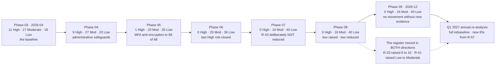

# Risk Trajectory Across the Program

## Why flat is the right answer for Phases 08 and 09

The register fell hard in Phase 05, because that is where technology closed risk. It has been essentially flat since Phase 07 — three consecutive phases at 0 High, two at exactly 0/16/40. **Phases 08 and 09 tested and reported; they did not build.** A register that kept falling through a validation phase would mean the validation was not validating anything.

## Source
`09.05`, `08.11`, `07.11`, `trackers/risk-posture-at-close.xlsx`.
