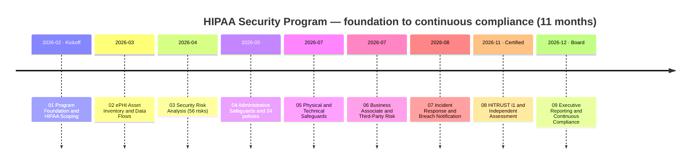
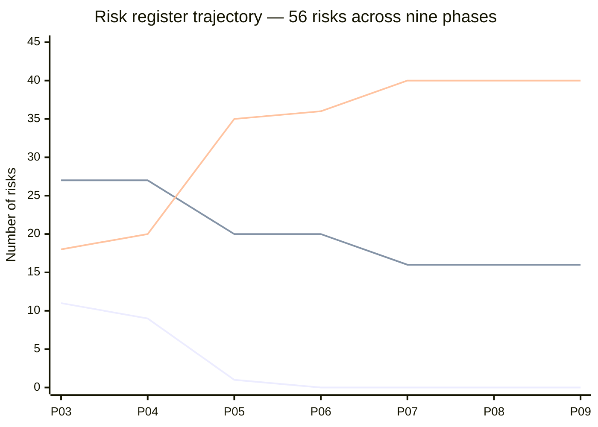

# Regional Hospital Network — HIPAA Security Rule Compliance Program

### 📊 [**View the Executive Dashboard →**](docs/DASHBOARD.md) &nbsp;·&nbsp; 🗂️ [Jump to full repository map](#️-repository-map--links-to-every-folder)

> An end-to-end, illustrative **HIPAA Security Rule compliance program** for a fictitious four-hospital non-profit health system — **MercyBridge Health Network** — taken from program foundation through independent penetration testing, internal audit, **HITRUST i1 certification**, OCR audit-protocol readiness, and handover to continuous compliance. A **covered entity** under HHS OCR jurisdiction, with a **vendor-hosted EHR** business associate holding ~2.1 million patient records.
>
> **All names, data, figures, and findings are fictional**, produced as a professional portfolio demonstration of healthcare GRC / privacy / information-security capability. Nothing here represents a real health system, a real patient, a real assessment, or a real regulator interaction.

---

## The one thing worth knowing about this portfolio

Two risks in this program went **up**, not down.

An independent penetration test found an internet-facing application holding **6,880 patient records** that appeared in no inventory — so **R-41 was raised from Low to Moderate**, even though the application was remediated, because the Low score had expressed a belief about inventory completeness that the test destroyed. And a risk reduction recorded *conditionally* in Phase 07 **lapsed** in Phase 08 when the vendor restoration test it depended on slipped — so **R-23 went back from 8 to 10**, exactly as the condition said it would.

That behaviour is codified as a standing rule in **[ADR-0021](08-hitrust-independent-assessment-audit-readiness/adr/ADR-0021-raise-risk-on-disproved-assumption.md)**: where independent testing disproves an assumption, raise or restore the rating rather than only closing the finding. A risk register that only ever falls is one nobody should believe — and that principle is the spine of the whole nine-phase story.

---

## Program at a glance

| Attribute | Value |
|---|---|
| Organization | **MercyBridge Health Network** — non-profit integrated delivery network |
| Regulatory status | **Covered entity** under HIPAA; **HHS Office for Civil Rights** enforcement |
| Size | 4 hospitals · ~30 ambulatory sites · ~1,200 beds · ~6,500 workforce members |
| Data at stake | **~2.1M patient records** · **68 of 210 systems handle ePHI** · **6,120 medical devices** |
| Frameworks | **45 CFR Part 164 Subpart C** · Breach Notification Rule §164.400–414 · HITECH · **NIST SP 800-66 Rev. 2** · NIST SP 800-30 · NIST SP 800-88 · **HITRUST CSF** |
| Forward-looking | **2025 HIPAA Security Rule NPRM** — proposed, not in force; **9 of 16** proposed requirements already met |
| Risk | **56 risks** · baseline 11 High / 27 Moderate / 18 Low → close **0 High / 16 Moderate / 40 Low** |
| Third parties | **~180 business associates**, 24 critical · vendor-hosted EHR (**Halcyon Health**) |
| Independent validation | Pen test **16 findings, 16 remediated, 16 independently re-tested** · internal audit **Satisfactory** · **HITRUST i1 certified 93.1%** · OCR protocol **91 inquiries, 0 new findings** |
| Maturity | **1.61 → 3.09** of 5 across 23 domains · **no domain scored Level 5** |
| Scale | **9 phases · 305 documents · 36 Excel trackers · 36 diagrams · 25 ADRs · 27 templates** |

*Lines, top to bottom at Phase 03: **High** (11 → 0) · **Moderate** (27 → 16) · **Low** (18 → 40). Flat from Phase 07 onward is the correct result — Phases 08 and 09 tested and reported; they did not build.*

---

## 🗂️ Repository map — links to every folder

Each phase is a top-level folder containing a numbered document set (`NN.00`–`NN.NN`) in execution order, plus six artifact sub-folders. Click any cell to open that folder on GitHub.

| Phase | Overview | 🖼️ Diagrams | 📈 Trackers (Excel) | 📝 Logs | 🏛️ Governance | 🧭 ADRs | 📋 Templates |
|---|---|---|---|---|---|---|---|
| **01 — Program Foundation & HIPAA Scoping** | [README](01-program-foundation-hipaa-scoping/01.00-README.md) | [diagrams](01-program-foundation-hipaa-scoping/diagrams) | [trackers](01-program-foundation-hipaa-scoping/trackers) | [logs](01-program-foundation-hipaa-scoping/logs) | [governance](01-program-foundation-hipaa-scoping/governance) | [adr](01-program-foundation-hipaa-scoping/adr) | [templates](01-program-foundation-hipaa-scoping/templates) |
| **02 — ePHI Asset Inventory & Data Flows** | [README](02-ephi-asset-inventory-data-flows/02.00-README.md) | [diagrams](02-ephi-asset-inventory-data-flows/diagrams) | [trackers](02-ephi-asset-inventory-data-flows/trackers) | [logs](02-ephi-asset-inventory-data-flows/logs) | [governance](02-ephi-asset-inventory-data-flows/governance) | [adr](02-ephi-asset-inventory-data-flows/adr) | [templates](02-ephi-asset-inventory-data-flows/templates) |
| **03 — HIPAA Security Risk Analysis** | [README](03-hipaa-security-risk-analysis/03.00-README.md) | [diagrams](03-hipaa-security-risk-analysis/diagrams) | [trackers](03-hipaa-security-risk-analysis/trackers) | [logs](03-hipaa-security-risk-analysis/logs) | [governance](03-hipaa-security-risk-analysis/governance) | [adr](03-hipaa-security-risk-analysis/adr) | [templates](03-hipaa-security-risk-analysis/templates) |
| **04 — Administrative Safeguards** | [README](04-administrative-safeguards/04.00-README.md) | [diagrams](04-administrative-safeguards/diagrams) | [trackers](04-administrative-safeguards/trackers) | [logs](04-administrative-safeguards/logs) | [governance](04-administrative-safeguards/governance) | [adr](04-administrative-safeguards/adr) | [templates](04-administrative-safeguards/templates) |
| **05 — Physical & Technical Safeguards** | [README](05-physical-technical-safeguards/05.00-README.md) | [diagrams](05-physical-technical-safeguards/diagrams) | [trackers](05-physical-technical-safeguards/trackers) | [logs](05-physical-technical-safeguards/logs) | [governance](05-physical-technical-safeguards/governance) | [adr](05-physical-technical-safeguards/adr) | [templates](05-physical-technical-safeguards/templates) |
| **06 — Business Associate & Third-Party Risk** | [README](06-business-associate-third-party-risk/06.00-README.md) | [diagrams](06-business-associate-third-party-risk/diagrams) | [trackers](06-business-associate-third-party-risk/trackers) | [logs](06-business-associate-third-party-risk/logs) | [governance](06-business-associate-third-party-risk/governance) | [adr](06-business-associate-third-party-risk/adr) | [templates](06-business-associate-third-party-risk/templates) |
| **07 — Incident Response & Breach Notification** | [README](07-incident-response-breach-notification/07.00-README.md) | [diagrams](07-incident-response-breach-notification/diagrams) | [trackers](07-incident-response-breach-notification/trackers) | [logs](07-incident-response-breach-notification/logs) | [governance](07-incident-response-breach-notification/governance) | [adr](07-incident-response-breach-notification/adr) | [templates](07-incident-response-breach-notification/templates) |
| **08 — HITRUST & Independent Assessment** | [README](08-hitrust-independent-assessment-audit-readiness/08.00-README.md) | [diagrams](08-hitrust-independent-assessment-audit-readiness/diagrams) | [trackers](08-hitrust-independent-assessment-audit-readiness/trackers) | [logs](08-hitrust-independent-assessment-audit-readiness/logs) | [governance](08-hitrust-independent-assessment-audit-readiness/governance) | [adr](08-hitrust-independent-assessment-audit-readiness/adr) | [templates](08-hitrust-independent-assessment-audit-readiness/templates) |
| **09 — Executive Reporting & Program Maturity** | [README](09-executive-reporting-program-maturity/09.00-README.md) | [diagrams](09-executive-reporting-program-maturity/diagrams) | [trackers](09-executive-reporting-program-maturity/trackers) | [logs](09-executive-reporting-program-maturity/logs) | [governance](09-executive-reporting-program-maturity/governance) | [adr](09-executive-reporting-program-maturity/adr) | [templates](09-executive-reporting-program-maturity/templates) |

**Top-level:** [`docs/`](docs) (dashboard) · [`docs/DASHBOARD.md`](docs/DASHBOARD.md) (renders on GitHub) · [`docs/index.html`](docs/index.html) (interactive)

Every phase folder also contains: `CHANGELOG.md`, `STRUCTURE.md`, `MANIFEST.md` (SHA-256 checksums), and `install.sh`.

A complete document-by-document index of all nine phases, plus a **HIPAA Security Rule citation index** mapping every standard and implementation specification to the document that addresses it, lives in **[09.12 — Portfolio Index & Navigation](09-executive-reporting-program-maturity/09.12-portfolio-index-and-navigation.md)**.

---

## ⭐ Marquee documents (jump straight to the highlights)

| Document | Phase | What it is |
|---|---|---|
| [Executive Summary](09-executive-reporting-program-maturity/09.01-executive-summary.md) | 09 | The whole eleven-month program in one page |
| [Annual Evaluation — §164.308(a)(8)](09-executive-reporting-program-maturity/09.06-annual-evaluation-164-308-a-8.md) | 09 | The regulatory evaluation report, written to be handed to OCR |
| [Lessons Learned & Retrospective](09-executive-reporting-program-maturity/09.10-lessons-learned-and-retrospective.md) | 09 | Eight named misjudgements; +63% median schedule overrun; where the program was lucky |
| [HITRUST i1 Assessment Results](08-hitrust-independent-assessment-audit-readiness/08.07-hitrust-i1-assessment-results.md) | 08 | Certified 93.1% · 174/182 at threshold · 0 Non-Compliant · 8 CAPs |
| [Penetration Test Results](08-hitrust-independent-assessment-audit-readiness/08.03-penetration-test-results.md) | 08 | 16 findings (3H/7M/6L) · 0 ePHI extracted · every fix independently re-tested |
| [Control-to-Risk Traceability](08-hitrust-independent-assessment-audit-readiness/08.11-control-to-risk-traceability.md) | 08 | **The two risks that were raised**, and why |
| [OCR Audit Protocol Readiness](08-hitrust-independent-assessment-audit-readiness/08.08-ocr-audit-protocol-readiness.md) | 08 | 91 inquiries mapped · a simulated data request answered in a median 1.5 days |
| [Breach Risk Assessment — Four Factor](07-incident-response-breach-notification/07.06-breach-risk-assessment-four-factor.md) | 07 | The §164.402(2) analysis, and why the burden sits with the covered entity |
| [Incident Register & Case Studies](07-incident-response-breach-notification/07.10-incident-register-and-case-studies.md) | 07 | 3 incidents, 3,961 individuals assessed, **0 reportable breaches** |
| [Business Associate Agreements](06-business-associate-third-party-risk/06.04-business-associate-agreements.md) | 06 | ~180 associates; the §164.314(a)(2) required elements |
| [Encryption & Key Management](05-physical-technical-safeguards/05.10-encryption-and-key-management.md) | 05 | The safe harbor that decided a live incident |
| [Contingency Plan](04-administrative-safeguards/04.08-contingency-plan.md) | 04 | §164.308(a)(7) — and the one thing this program still cannot prove |
| [Risk Register](03-hipaa-security-risk-analysis/03.07-risk-register.md) | 03 | All 56 risks, scored and owned |
| [ePHI System Inventory](02-ephi-asset-inventory-data-flows/02.02-ephi-system-inventory.md) | 02 | 210 systems assessed, 68 in ePHI scope |

---

## The nine phases

| Phase | Focus | Signature outcome |
|---|---|---|
| [01 Program Foundation & HIPAA Scoping](01-program-foundation-hipaa-scoping/01.00-README.md) | Covered-entity status, OCR landscape, Security Official designation, charter, RACI | Program foundation baselined; §164.308(a)(2) accountability named |
| [02 ePHI Asset Inventory & Data Flows](02-ephi-asset-inventory-data-flows/02.00-README.md) | 210 systems, ePHI flows, medical devices, cloud, designated record set | **68 ePHI systems** · **6,120 devices** mapped |
| [03 HIPAA Security Risk Analysis](03-hipaa-security-risk-analysis/03.00-README.md) | §164.308(a)(1)(ii)(A) analysis to NIST SP 800-30; healthcare threat profile | **56 risks** — 11 High · 27 Moderate · 18 Low |
| [04 Administrative Safeguards](04-administrative-safeguards/04.00-README.md) | §164.308 — 9 standards, 21 implementation specifications; 24-policy suite | 9 High risks remaining; policies board-approved |
| [05 Physical & Technical Safeguards](05-physical-technical-safeguards/05.00-README.md) | §164.310 and §164.312 — access, audit, integrity, authentication, transmission | **MFA and encryption to 68 of 68**; 6 High risks closed |
| [06 Business Associate & Third-Party Risk](06-business-associate-third-party-risk/06.00-README.md) | §164.308(b) and §164.314(a); ~180 associates; the EHR concentration | **The last High risk closed** |
| [07 Incident Response & Breach Notification](07-incident-response-breach-notification/07.00-README.md) | §164.308(a)(6) and §164.400–414; four-factor assessment; ransomware playbook | 3 incidents · **0 reportable breaches** · TTX-2026-01 |
| [08 HITRUST & Independent Assessment](08-hitrust-independent-assessment-audit-readiness/08.00-README.md) | Five independent lenses: pen test, vuln, internal audit, HITRUST, OCR protocol | **i1 certified 93.1%** · **two risks raised on evidence** |
| [09 Executive Reporting & Program Maturity](09-executive-reporting-program-maturity/09.00-README.md) | Board reporting, 36-metric program, maturity, annual evaluation, roadmap, closeout | Maturity **3.09/5** · 23 open items handed to named owners |

---

## How each phase is organized

Every phase contains a numbered document set (`NN.00`–`NN.NN`) in the logical order a real engagement produces them, plus consulting artifacts:

- **`diagrams/`** — Mermaid architecture, process, and status diagrams
- **`trackers/`** — formatted, filterable Excel workbooks (inventories, risk register, safeguard matrices, findings, metrics)
- **`logs/`** — decision, risk, RAID, and action-item logs
- **`governance/`** — committee minutes, assessment readouts, and board reports
- **`adr/`** — Architecture / program Decision Records, numbered continuously across the portfolio (**0001–0025**)
- **`templates/`** — reusable program templates

The Excel trackers are **generated by parsing the narrative documents** — the risk register from `03.07`, the pen test findings from `08.03`, the metric catalogue from `09.03` — with assertions on every count. A workbook therefore cannot silently drift from the prose it summarises.

---

## Continuity threads (traceable across phases)

A single storyline traces cleanly across all nine phases — a risk discovered at analysis, treated by a safeguard, tested independently, and reported to the board:

- **Ransomware against clinical operations:** `R-23` identified (Phase 03) → contingency plan and immutable backups (Phase 04) → ransomware playbook and TTX-2026-01 (Phase 07, reduced 10 → 8 **conditionally**) → the condition **lapsed** when the vendor restoration test slipped (Phase 08, **raised back to 10**) → the single overdue item on the board agenda (Phase 09).
- **Unaccounted ePHI:** `R-41` rated Low on an assumption about discovery scanning (Phase 03) → `PT-03` found an orphaned internet-facing application holding 6,880 records (Phase 08) → **raised Low → Moderate** under ADR-0021 → returns to Low only after two clean quarterly reconciliations (Phase 09).
- **The vendor-hosted EHR:** Halcyon identified as a business associate holding 2.1M records (Phase 02) → BAA and §164.314(a)(2) elements (Phase 06) → SOC 2 reliance tested, customer-managed keys still open (Phase 08) → `R-28` explicitly **not reduced** while `O-6` remains open (Phase 09).
- **Detection capability:** estimated in the register (Phase 03) → SIEM and audit controls built (Phase 05) → **measured at 48%** against a live adversary and reported before remediation (Phase 08) → re-measured at 74%, still amber, still reported (Phase 09).

---

## Key parties (all fictitious)

- **Health system:** MercyBridge Health Network — CEO Dr. Helen Marsh, **CISO / HIPAA Security Official Daniel Cho**, Privacy Officer Rebecca Stern, CIO Anthony Ruiz, Chief Compliance Officer Karen Boyd, CMIO Dr. Samuel Ortega, VP Risk Michelle Tran, Information Security Manager Marcus Reed, Internal Audit Priya Anand, General Counsel Lisa Coleman, Audit Committee Chair Robert Feldman.
- **Regulator:** U.S. Department of Health and Human Services, **Office for Civil Rights (OCR)**.
- **Business associate (EHR):** Halcyon Health — vendor-hosted electronic health record.
- **Independent assessor:** Beacon Assurance (HITRUST authorised external assessor) · **Penetration testing:** Ironwood Security Labs.

## Standards referenced

HIPAA Security Rule **45 CFR §164.302–318** (Administrative §164.308 · Physical §164.310 · Technical §164.312 · Organizational §164.314 · Documentation §164.316) · Breach Notification Rule **§164.400–414** including the §164.402(2) four-factor risk assessment · HIPAA Privacy Rule interfaces (§164.501 designated record set, §164.514 de-identification) · **HITECH** direct business associate liability · **NIST SP 800-66 Rev. 2** · NIST SP 800-30 Rev. 1 · NIST SP 800-53 Rev. 5 · NIST SP 800-88 Rev. 1 · **HITRUST CSF** (e1 / i1 / r2) · CISA KEV · the **2025 HIPAA Security Rule NPRM** (proposed, not in force).

---

*Illustrative portfolio sample — "Confidential — Electronic Protected Health Information (ePHI)" formatting used for realism only. Not a real health system, not real patients, not a real assessment. No certification referenced here constitutes a determination of HIPAA compliance by OCR or any other regulator.*
