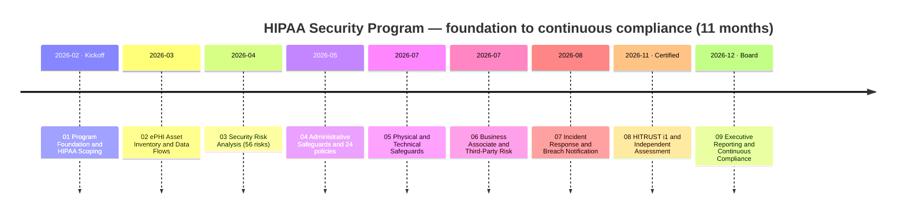
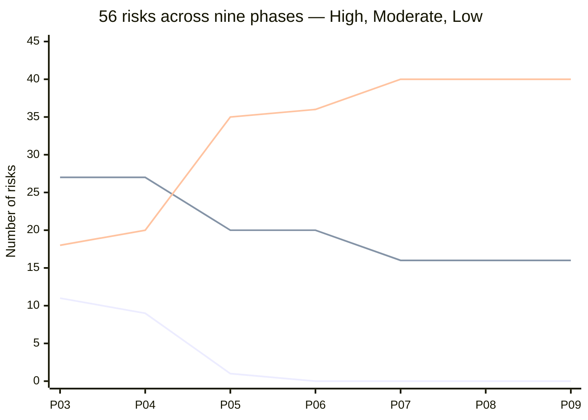
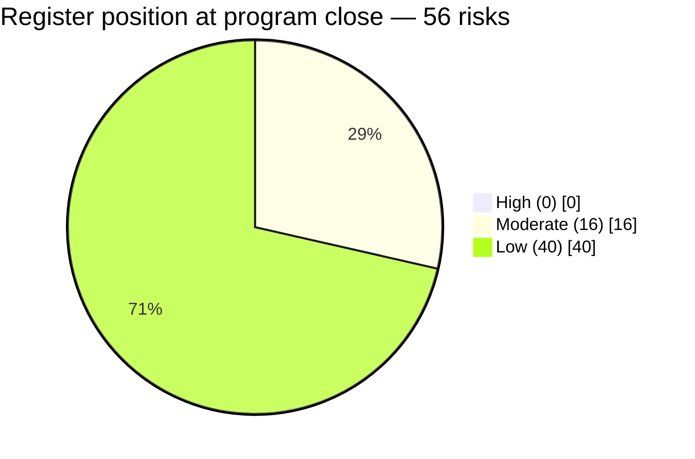
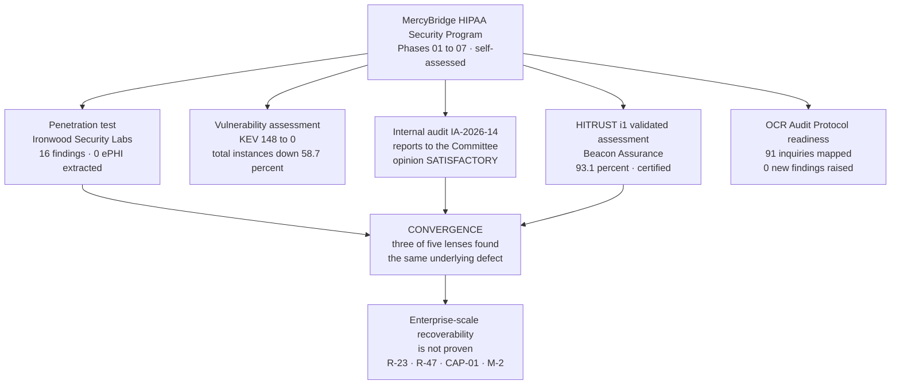
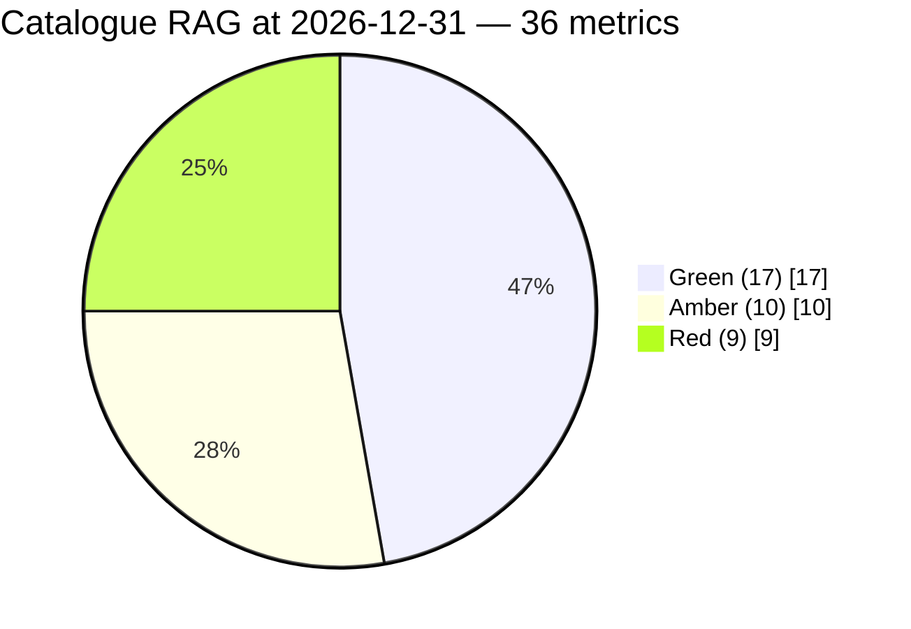
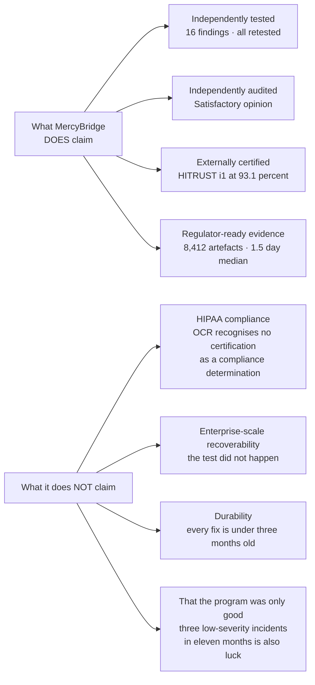

# 📊 Executive Dashboard — MercyBridge Health Network HIPAA Security Program

> **This page renders directly on GitHub** — the charts below are [Mermaid](https://github.blog/2022-02-14-include-diagrams-markdown-files-mermaid/) diagrams that GitHub draws inline, so the dashboard is visible with no setup.
> For the fully interactive version (light/dark toggle, hover detail), open [`index.html`](index.html) locally or enable **GitHub Pages**.
>
> *Illustrative portfolio sample · "Confidential — Electronic Protected Health Information (ePHI)" formatting for realism only · all names and figures fictional.*

---

## Program scorecard

| Dimension | Result | Status |
|---|---|:--:|
| **Organization** | MercyBridge Health Network · 4 hospitals · ~30 clinics · ~6,500 workforce · covered entity under HHS OCR | 🟢 |
| **Scope** | **~2.1M patient records** · **68 of 210 systems** handle ePHI · **6,120 medical devices** | 🟢 |
| **Frameworks** | 45 CFR Part 164 Subpart C · §164.400–414 · HITECH · **NIST SP 800-66 Rev. 2** · **HITRUST CSF** | 🟢 |
| **Risk register** | 56 risks · baseline 11 High → **0 High · 16 Moderate · 40 Low** at close | 🟢 |
| **Residuals outside appetite** | **3** — R-11, R-23, R-28 · each knowingly accepted with named treatment and dates | 🟡 |
| **Penetration test** | **16 findings** (3H/7M/6L) · 16 remediated · **16 independently re-tested** · **0 ePHI extracted** | 🟢 |
| **Internal audit** | **IA-2026-14 — Satisfactory** · 9 recommendations · **0 Critical or High** | 🟢 |
| **HITRUST i1** | **CERTIFIED at 93.1%** · 174/182 at threshold · **0 Non-Compliant** · 8 CAPs · expires 2027-11-29 | 🟢 |
| **OCR audit readiness** | 91 protocol inquiries mapped · 78 evidenced · 10 dated gap · 3 not evidenced · **0 new findings** | 🟡 |
| **Program maturity** | **3.09 of 5** across 23 domains · **no domain at Level 5**, by decision | 🟡 |
| **Enterprise restoration** | **NOT PROVEN.** Validated for 7 of 12 Tier 1 systems · the joint vendor test is **overdue** | 🔴 |
| **Breaches** | 3 incidents · 3,961 individuals assessed · **0 reportable breaches** | 🟢 |

**The red line is the honest headline.** MercyBridge cannot yet demonstrate that it can restore its Tier 1 clinical systems at enterprise scale. The test that would prove it slipped, the risk attached to it was **raised** rather than quietly left alone, and it is the one overdue item on the board agenda.

---

## The nine-phase journey

---

## Risk register — the trajectory, and the two risks that went up

The register fell hard in **Phase 05**, where technology closed risk, and has been flat since **Phase 07**. Flatness is the correct result: Phases 08 and 09 tested and reported — they did not build. A register that kept falling through a validation phase would mean the validation was not validating anything.

| Risk | Movement | Why |
|---|---|---|
| **R-23** — enterprise ransomware | **8 → 10 · RAISED** | The Phase 07 reduction was written as conditional on a joint restoration test in 2026-09. The test did not fail — **it did not happen**. The condition lapsed exactly as drafted |
| **R-41** — unaccounted ePHI | **Low → Moderate · RAISED** | PT-03 found an internet-facing application, superseded in 2023 and never decommissioned, holding **6,880 records** and present in no inventory |
| R-24 — double-extortion exfiltration | 9 → 8 · reduced | Detection against a live adversary measured up from 48% to 74% |
| R-43 — post-downtime integrity | Moderate → Low · reduced | The surge model was re-based and **Internal Audit verified the closure** |

Both raises follow **ADR-0021**: where independent testing disproves an assumption, raise or restore the rating rather than only closing the finding.

---

## Independent assessment — five lenses, one program

The value is not in any single report. It is in the **overlap** — where independent assessors working separately land on the same defect. Three of the five converged on one finding, and that finding is the program's honest headline.

---

## Program maturity — 23 domains, and nothing at Level 5

```mermaid
xychart-beta
    title "Maturity by level — Phase 01 baseline vs Phase 09 close"
    x-axis ["L0 Absent", "L1 Initial", "L2 Implemented", "L3 Defined", "L4 Managed", "L5 Optimizing"]
    y-axis "Domains" 0 --> 14
    bar [4, 9, 8, 2, 0, 0]
    bar [0, 0, 5, 11, 7, 0]
```

*First series: Phase 01 baseline (mean **1.61**). Second series: Phase 09 close (mean **3.09**).*

**No domain is scored Level 5, by decision.** Level 5 means the domain improves itself from its own data and can show it did so before an external party pointed at the problem. Encryption is the clearest illustration of why nothing qualifies: coverage is 68 of 68, verified by two independent lenses — and **PT-05 found the last legacy path, the metric did not.** See [ADR-0022](../09-executive-reporting-program-maturity/adr/ADR-0022-no-domain-at-level-five.md).

| Level | Domains | Examples |
|---|---|---|
| **4 — Managed** | 7 | Governance · risk register · MFA · incident response · encryption · independent assurance · evidence and retention |
| **3 — Defined** | 11 | Policy · workforce security · access management · training · workstation · media · technical access · transmission · integrity · business associates · vulnerability management |
| **2 — Implemented** | 5 | **Audit logging** (65 of 68 forwarding) · **contingency and recovery** (7 of 12 validated) · **physical consistency** · **medical device and IoMT** · **security metrics** (one quarter old) |

---

## Metrics program — 36 measures, worst first

| Board scorecard measure | 2026-Q2 | 2026-Q3 | 2026-Q4 | Threshold |
|---|---|---|---|---|
| 🔴 Tier 1 validated restoration | 7 of 12 | 7 of 12 | **7 of 12** | 12 of 12 |
| 🔴 Overdue tracked items | 0 | 0 | **1 (M-2)** | 0 |
| 🔴 Central audit-log coverage | 62 of 68 | 62 of 68 | **65 of 68** | 68 of 68 |
| 🔴 BA population under monitoring | 24 of ~180 | 41 of ~180 | **62 of ~180** | ≥90% |
| 🟡 Adversary detection rate | Not measured | **48%** | **74%** | ≥85% |
| 🟢 Open KEV instances | 37 | 11 | **0** | 0 |
| 🟢 MFA / encryption at rest / in transit | 68/68/68 | 68/68/68 | **68/68/68** | 68 of 68 |
| 🟢 Reportable breaches | 0 | 0 | **0** | 0 |

Reds print first in every pack, in every quarter, under **[ADR-0025](../09-executive-reporting-program-maturity/adr/ADR-0025-report-worst-metric-first.md)** — a standing format, not a gesture in a good year. Every metric in the catalogue carries a **gaming-resistance analysis**; a metric without one is not admitted.

---

## What the program does not claim

---

## 2027 obligations already on the calendar

| Obligation | Date | Owner |
|---|---|---|
| SIEM onboarding for the final 3 of 68 ePHI systems (CAP-03) | 2027-01-31 | Marcus Reed |
| **Joint full-scale restoration test with the EHR vendor (M-2) — overdue** | **2027-02-28** | Anthony Ruiz |
| Validated 24-hour restoration for the remaining 5 of 12 Tier 1 systems (CAP-01) | 2027-03-31 | Anthony Ruiz |
| Annual risk re-analysis under 03.10 | 2027-03-31 | Michelle Tran |
| Business associate monitoring below the critical tier (CAP-02) | 2027-04-30 | Lisa Coleman |
| HITRUST rapid recertification evidence freeze | 2027-07-15 | Daniel Cho |
| **HITRUST i1 certificate expires** | **2027-11-29** | Daniel Cho |

**No second re-baseline of M-2 is authorised.** A further slip goes to the Audit & Compliance Committee Chair with a recovery plan, not a new date.

---

## Navigate the portfolio

[🏠 Repository home](../README.md) · [Phase 01](../01-program-foundation-hipaa-scoping/01.00-README.md) · [Phase 02](../02-ephi-asset-inventory-data-flows/02.00-README.md) · [Phase 03](../03-hipaa-security-risk-analysis/03.00-README.md) · [Phase 04](../04-administrative-safeguards/04.00-README.md) · [Phase 05](../05-physical-technical-safeguards/05.00-README.md) · [Phase 06](../06-business-associate-third-party-risk/06.00-README.md) · [Phase 07](../07-incident-response-breach-notification/07.00-README.md) · [Phase 08](../08-hitrust-independent-assessment-audit-readiness/08.00-README.md) · [Phase 09](../09-executive-reporting-program-maturity/09.00-README.md)

**Full document index:** [09.12 — Portfolio Index & Navigation](../09-executive-reporting-program-maturity/09.12-portfolio-index-and-navigation.md), including a HIPAA Security Rule citation index down to implementation-specification level.
